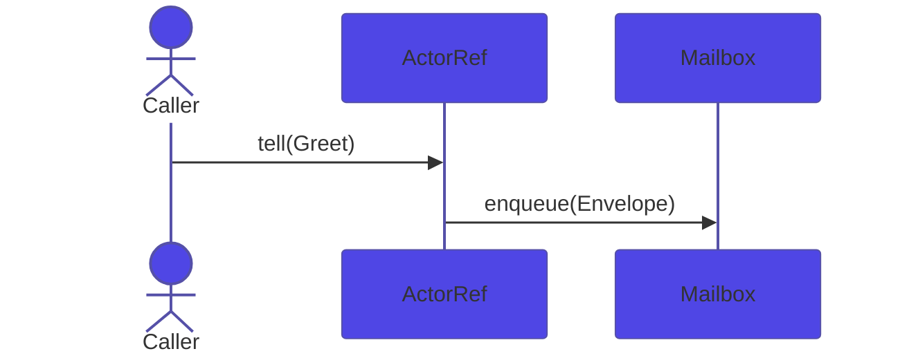

# Nexus Documentation Style Guide

**Audience:** anyone writing or rewriting pages under `website/docs/`.  
**Authority:** binds every page in V1. Sub-spec 5 Phase 2 enforces it page by page.  
**Last updated:** 2026-06-19

---

## 1. Voice and tone

### Core register

- **Second person, present tense, technical-confident.** Write to the reader who is sitting at a terminal right now. They are competent. They want to know what to do and why, not how hard the problem was to solve.
- **Direct statements over hedged suggestions.** Every hedge adds words and subtracts trust. Cut them.
- **Prefer active voice.** Actors process messages. The supervisor restarts children. Reserve passive voice for cases where the agent is unknown or unimportant.

### In-voice vs out-of-voice examples

| Out of voice | In voice | Why |
|---|---|---|
| "It might be useful to consider using `Behavior::withState()` when your actor needs to maintain some form of mutable data across message invocations." | "Use `Behavior::withState()` when your actor needs per-message state." | Direct, present-tense; no hedge. |
| "We believe that supervision is one of the more powerful features that Nexus has to offer." | "Supervision is the mechanism by which Nexus keeps partial failures from cascading." | No "we believe"; states the fact. |
| "This can sometimes lead to unexpected behavior if you are not careful." | "Enqueuing to a closed mailbox throws `MailboxClosedException`. Catch it or let the supervisor handle it." | Names the failure; gives the recovery. |
| "Simply call `tell()` to send a message." | "Call `tell()` to send a message." | "Simply" condescends; drop it. |
| "In this tutorial we learned how to build a counter actor and explored the concepts of behaviors, messages, and actor context." | *(no trailing summary; close with "Next steps" links instead)* | Trailing summaries are filler; use structured next-steps. |

### Drawn from the existing docs

The welcome page opens: *"PHP has long been treated as a request-response language."* — strong, direct, states the problem as fact. Preserve this pattern.

The best-practices page opens: *"Actors are a hammer. Some of your nails are screws."* — short, confident, memorable. This register is the ceiling: deploy it on pages where impact matters; don't reach for it on reference pages where precision is more valuable.

The quick-start page opens: *"This tutorial walks through building a counter actor … By the end you will have…"* — canonical tutorial opening. Reproduce this structure verbatim in every tutorial.

---

## 2. Terminology

Canonical spellings. The first column is the form to use in prose; the second is the exact form in code context (backticks). Anti-patterns are listed in the third column — never use them.

| Canonical prose form | Code/class form | Anti-patterns |
|---|---|---|
| actor system | `ActorSystem` | "actor framework", "actor engine", "the Nexus system" |
| actor reference | `ActorRef` | "ActorRef instance", "actor ref object", "ref" (unless context is obvious) |
| actor cell | `ActorCell` | "actor container", "actor wrapper" |
| actor context | `ActorContext` | "context object", "the ctx" in prose |
| actor path | `ActorPath` | "actor URL", "actor address" |
| behavior | `Behavior` | "behaviour" (British spelling is wrong here), "handler function" |
| behavior with state | `BehaviorWithState` | "stateful behavior class" |
| props | `Props` | "actor props object", "configuration", "spawn config" |
| mailbox | `Mailbox` | "message queue", "inbox" |
| envelope | `Envelope` | "message wrapper", "message container" |
| supervision strategy | `SupervisionStrategy` | "supervisor strategy", "supervision policy", "supervisor config" |
| directive | `Directive` | "supervision directive object" |
| dead letters | `DeadLetterRef` | "dead letter queue", "DLQ", "dead letter channel" |
| ask pattern | — | "ask/tell pattern", "request-response pattern" (use "ask pattern" or "request-reply") |
| tell | `tell()` | "send", "fire", "dispatch" in actor context |
| ask | `ask()` | "request", "await", "query" in actor context |
| signal | `Signal` | "lifecycle event", "lifecycle hook", "actor event" |
| lifecycle signal | — | "actor lifecycle event", "system signal" |
| `PreStart` | `PreStart` | "pre-start hook", "on-start callback" |
| `PostStop` | `PostStop` | "post-stop hook", "on-stop callback" |
| `Terminated` | `Terminated` | "actor stopped event", "death watch event" |
| death watch | — | "actor monitoring", "actor watching" |
| supervision tree | — | "actor hierarchy", "actor tree" |
| parent actor | — | "supervisor", "parent" in prose |
| child actor | — | "subordinate actor", "sub-actor" |
| runtime | `Runtime` | "executor", "event loop backend", "scheduler" |
| Fiber runtime | `FiberRuntime` | "PHP fiber runtime", "fiber executor" |
| Swoole runtime | `SwooleRuntime` | "Swoole executor", "Swoole backend" |
| Step runtime | `StepRuntime` | "test runtime", "deterministic runtime" |
| fiber | — | "PHP fiber", "coroutine" (only acceptable when comparing to Swoole) |
| coroutine | — | "Swoole coroutine" when Swoole-specific; never "coroutine" for Fiber context |
| worker pool | `WorkerPool` | "worker thread pool", "thread pool" |
| worker node | `WorkerNode` | "worker", "thread worker" |
| persistence ID | `PersistenceId` | "entity ID", "aggregate ID", "actor ID" in persistence context |
| event store | `EventStore` | "event log", "event journal" |
| snapshot store | `SnapshotStore` | "state snapshot", "snapshot repository" |
| durable state | `DurableStateBehavior` | "durable behavior", "persistent state" |
| event-sourced behavior | `EventSourcedBehavior` | "event sourcing behavior", "ES behavior" |
| effect | `Effect` | "command result", "handler output" |
| duration | `Duration` | "time duration", "timeout value" in Duration context |
| NexusApp | `NexusApp` | "Nexus application", "app bootstrap" |
| location transparency | — | "actor transparency", "remote transparency" |
| message | — | "event" (unless it is a domain event), "command" (unless it is a CQRS command) |
| `readonly class` | `readonly class` | "immutable class", "value object" (unless it is also a value object by domain meaning) |
| Psalm | — | "static analysis", "type checker" (prefer "Psalm" when Nexus-specific) |
| `#[MessageType]` | `#[MessageType]` | "message attribute", "message annotation" |

### Formatting rules derived from the table

- Class names in prose: always in backticks — `ActorSystem`, `Behavior`, `Props`.
- Method names in prose: always in backticks with parentheses — `tell()`, `ask()`, `spawn()`.
- Interface names: same as class names — `Runtime`, `Mailbox`.
- Attribute names: backticks including the `#[…]` — `#[MessageType]`.
- Package names: code-formatted only when referencing the Composer package; otherwise plain prose — "the serialization package" but `` `nexus-serialization` `` in a table.

---

## 3. Page-structure templates per Diataxis quadrant

### Tutorial template (Getting Started, Tutorials)

Use for: learning-oriented pages that walk a beginner through building something working.

```
---
title: <action noun phrase>
related:
  - <2-4 related slugs>
---

# <Title>

<Goal sentence: "This tutorial walks through building X.">
<"By the end you will have" sentence: 1-2 concrete outcomes.>

## Step 1: <Verb phrase>

<1-3 sentences. Explain why before showing the code.>

```php title="src/Messages/MyMessage.php"
// minimal runnable snippet ≤30 lines
```

## Step 2: <Verb phrase>

…

## Step N: Run it

<Show the exact command and expected output.>

## What we built

<3-5 bullet summary of what was created and the key concepts touched.
NOT a prose recap of every step — links instead of words.>

## Next steps

- [<Next tutorial or how-to>](<../path>)
- [<Core concept that was demonstrated>](<../path>)
- [<Reference page for the main class used>](<../path>)
```

**Rules:**
- Minimum three numbered steps.
- Each step explains the *why* in one sentence before showing code.
- "What we built" uses bullets, not prose paragraphs.
- "Next steps" links are mandatory; three links is the target.
- No step should be longer than one screen (≈40 lines of rendered markdown).

### How-to / Recipe template (Guides)

Use for: task-oriented pages that solve one specific problem for a reader who already knows the concept.

```
---
title: How to <verb phrase>
related:
  - <2-4 related slugs>
---

# How to <verb phrase>

<Problem statement: one sentence stating the situation ("When your actor needs…").>

## Solution

```php title="src/Actors/MyActor.php"
// Minimal, complete solution ≤30 lines
```

## How it works

<2-4 sentences explaining the mechanism, not re-reading the code.>

## Variations

### <Variation A>

<When to choose this + code if needed.>

### <Variation B>

…

## Caveats

<Footguns and limits as a short bulleted list. Use :::caution for anything dangerous.>

## Related

- [<concept that underpins this>](<path>)
- [<how-to that is commonly paired with this>](<path>)
```

**Rules:**
- Opening is a problem statement, not a description of the page.
- "Solution" section is first; explanation follows.
- "Variations" section is optional; include only when ≥2 meaningful alternatives exist.
- "Caveats" is not "Gotchas" — list limits and known failure modes, not personality quirks.
- No numbered steps unless the task is genuinely sequential; use prose + code instead.

### Reference template (Reference, Packages, Architecture/ADRs)

Use for: information-oriented pages that describe what something is, what it accepts, and what it does.

```
---
title: <ClassName or concept name>
related:
  - <2-4 related slugs>
---

# <ClassName or concept name>

<Synopsis: one sentence — what it is and what it does.>

## What it does

<3-6 sentences. Behavioral contract: inputs, outputs, side effects, error conditions.
Not a feature list — a description of observable behavior.>

## Example

```php title="src/MyApp.php"
// Complete, runnable minimal example
```

## Parameters / configuration

| Parameter | Type | Default | Description |
|---|---|---|---|
| … | … | … | … |

## Methods

- `methodName(params): ReturnType` — one-line description of the contract.

## Errors and exceptions

List exceptions the class throws and the conditions that trigger them.

## See also

- [<related class or concept>](<path>)
```

**Rules:**
- Synopsis is exactly one sentence. If you need two, your synopsis is a paragraph.
- "What it does" describes observable behavior, not implementation details.
- Parameter tables must have a Default column (use `—` when there is no default).
- "See also" not "Related" for reference pages — keeps it distinct from `related:` frontmatter.

### Explanation template (Core Concepts, Architecture/Design)

Use for: understanding-oriented pages that explain why something works the way it does.

```
---
title: <Concept name>
related:
  - <2-4 related slugs>
---

# <Concept name>

<Opening: state the problem this concept solves — 2-3 sentences.>

## The design

<What the design is and how it works. Diagrams live here.
This section can be 200-600 words. Use subsections freely.>

## Tradeoffs

<What you gain and what you give up. Short paragraph or 2-column table.>

## When to reach for it

<Decision criteria — when does this concept apply? When does it not?
3-6 bullets or a short decision-tree block (see §10).>

## Failure modes

*(Required on the 8 listed pages — see §9. Omit on pages not in the list.)*

## See also / Next

- [<how-to that applies this concept>](<path>)
- [<reference page for the main class>](<path>)
```

**Rules:**
- "The problem" is implicit in the opening paragraph — do not use it as a heading.
- "The design" may contain Mermaid diagrams (see §8 for when they are required).
- "When to reach for it" is not a feature list — it is decision criteria.
- "Failure modes" subsection is mandatory on the 8 pages listed in §9.

---

## 4. Code-example conventions

### File-path titles — mandatory

Every fenced PHP block **must** have a `title="..."` attribute specifying a plausible file path relative to the project root:

```
```php title="src/Actor/OrderActor.php"
```

No exceptions. A snippet with no title fails the per-page DoD checklist (§13).

### Verification markers

Three markers control `bin/verify-doc-snippets` behavior:

| Marker | When to use |
|---|---|
| *(no marker — default)* | Snippet is verified with `php -l` + Psalm. Use for all positive-example code. |
| `verify:lint-only` | Snippet is verified with `php -l` only. Use for "don't do this" counter-examples that would fail Psalm intentionally. |
| `verify:skip` | Snippet is not verified. Requires an HTML comment immediately above the block explaining why. |

Example of `verify:skip` usage:

```markdown
<!-- verify:skip: illustrates a runtime interaction that requires a running actor system -->
```php title="examples/ask-pattern.php" verify:skip
$result = $ref->ask(fn($replyTo) => new GetCount($replyTo), Duration::seconds(5))->await();
```
```

### Size limits

- Standard snippet: **≤30 lines**. If your example requires more, split it into steps.
- Full file example: **≤80 lines**, wrapped in a `<details>` block with a summary line.
- Shell commands (non-PHP): no file-path title required, but keep them ≤10 lines.

### Completeness rules

- **Imports are always shown.** A snippet with use-statement magic (where `ActorSystem` appears without a `use` declaration) is unusable by a reader.
- **`declare(strict_types=1)` and `<?php` are required** on any snippet that is a complete file. They may be omitted on snippets that show a fragment (e.g., a method body extracted from a class).
- **Error handling is shown** when the code path can fail in a way the reader must handle — do not hide exceptions from examples.
- **Namespace declarations** are included in complete-file snippets.

### Counter-example snippets

Mark counter-examples visually:

```markdown
:::caution Don't do this
```php title="src/Actor/BadActor.php" verify:lint-only
// blocking call inside actor handler — starves the fiber scheduler
$data = file_get_contents('https://example.com/api');
```
:::
```

The `verify:lint-only` marker prevents Psalm from failing the snippet while still validating syntax.

### 4.X Runtime-specific examples

Where the same example differs between Fiber and Swoole, wrap in synced Tabs with `groupId="runtime"`. Selecting a runtime tab on any page persists that choice site-wide.

```mdx
import Tabs from '@theme/Tabs';
import TabItem from '@theme/TabItem';

<Tabs groupId="runtime">
  <TabItem value="fiber" label="Fiber">
    ```php title="src/bootstrap.php"
    use Monadial\Nexus\Runtime\Fiber\FiberRuntime;
    $system = ActorSystem::create('app', new FiberRuntime());
    ```
  </TabItem>
  <TabItem value="swoole" label="Swoole">
    ```php title="src/bootstrap.php"
    use Monadial\Nexus\Runtime\Swoole\SwooleRuntime;
    $system = ActorSystem::create('app', new SwooleRuntime(new SwooleConfig()));
    ```
  </TabItem>
</Tabs>
```

**Rules:**
- Always use `groupId="runtime"` (exact string) so all runtime tabs sync together.
- Always include both `fiber` and `swoole` tab items. Add `step` only when the test runtime example is meaningfully different.
- Keep each tab's snippet self-contained (full imports shown).

---

## 5. Linking conventions

### Internal cross-references

Use Docusaurus path syntax with explicit labels. Prefer relative paths:

```markdown
See [supervision strategies](../core-concepts/supervision.md) for how to configure restart behavior.
```

Avoid bare URLs. Avoid "click here" labels — the label must describe the destination.

### Class names and auto-linking

Class names in prose are written as `` `ActorSystem` `` (backticks). The sub-spec 6 remark plugin auto-links them to their API reference page using `api-classes.json` from sub-spec 4a. You do not need to add the link manually — just use the backtick form.

Do not write `[ActorSystem](../reference/classes/actor-system.md)` in prose when `` `ActorSystem` `` achieves the same result via auto-link. Manual links for class names are only needed in tables and callout blocks where the plugin does not fire.

### `related:` frontmatter — required on every page

Every page must include a `related:` frontmatter key with 2–4 slugs:

```yaml
---
title: Supervision
related:
  - core-concepts/actors
  - core-concepts/lifecycle
  - reference/classes/supervision-strategy
  - guides/supervision-recipes
---
```

The sub-spec 6 Docusaurus swizzle renders these slugs as a card grid at the top and bottom of the page. Empty or missing `related:` fails the per-page DoD (§13).

Slug format: path from `website/docs/` without `.md` extension, no leading slash.

### Anchor links

When linking to a specific section within a page, use lowercase kebab-case anchors matching Docusaurus's auto-generated IDs:

```markdown
See [failure modes](./supervision.md#failure-modes) for exception recovery paths.
```

---

## 6. Headings, lists, and callouts

### Headings

- **Sentence case** throughout. "What it does" not "What It Does". "Failure modes" not "Failure Modes".
- H1 (`#`) is the page title — one per page, matching `title:` frontmatter.
- H2 (`##`) is a major section. Use for the named structural sections in the Diataxis templates.
- H3 (`###`) is a subsection within a major section — for methods, variations, sub-topics.
- H4 (`####`) is used sparingly, only when H3 nesting is genuinely needed. If you reach H5, restructure.
- No heading should be a question in a how-to or reference page. Questions are acceptable in explanation pages ("Why not just use a queue?") when the heading introduces an argument.

### Lists

- **Parallel grammar.** Every item in a list must begin with the same part of speech. If item 1 is a verb phrase, items 2–N are verb phrases.
- Bulleted lists for unordered items. Numbered lists for genuinely sequential steps only.
- Keep list items to 1–2 sentences. A "list item" with three sentences is a paragraph; make it one.
- Nested lists: one level of nesting maximum.
- No list should be the only content of a section — at least one sentence of prose before the list.

### Callout types

Use Docusaurus admonition syntax. Four types are sanctioned:

| Admonition | Use for |
|---|---|
| `:::note` | Context or aside that enriches but is not critical to the task. |
| `:::tip` | A shortcut, a pro-tip, a faster path — something the reader will thank you for. |
| `:::caution` | A footgun: something that looks right but will burn them. Always state the consequence. |
| `:::danger` | Data loss, security, irrecoverable state. Rare — use only when the harm is severe. |

Do not use `:::info` or `:::warning` — they are aliases that our theme maps inconsistently. Stick to the four above.

**Callout copy rules:**
- The title (after `:::`) is a noun phrase or imperative, not a question.
- The body is ≤3 sentences. If you need more, the callout should be a section.
- Every `:::caution` must state the consequence ("throws `MailboxClosedException`", "silently drops messages").

---

## 7. Lengths per Diataxis quadrant

| Quadrant | Typical length | Max before splitting |
|---|---|---|
| Tutorial | 800–1500 words | 2500 words |
| How-to | 300–800 words | 1500 words |
| Reference | 200–1000 words | 2000 words |
| Explanation | 800–2000 words | 3000 words |

"Words" here means prose words — code snippets are excluded from the count.

**Splitting a page:** when a page exceeds its max, split at a natural H2 boundary. Create a sibling page and link the two with `related:` frontmatter. Do not exceed the max by arguing that the topic requires it — if the topic requires more words, the topic needs better structure.

**Short pages are fine.** A reference page at 300 words that covers everything the reader needs is a good reference page. Length is not quality.

---

## 8. Mermaid diagrams

### When to add a diagram

Diagrams are required on the 10 targets listed in spec §7.6 (17 Mermaid + 1 SVG). Outside that mandatory set, the rule is: **add a diagram only when prose and code cannot adequately convey the structure or sequence.**

A diagram is not decoration. Do not add a diagram because:
- "It looks professional."
- "Other docs have diagrams."
- "It shows the flow." (Prose can also show the flow.)

Add a diagram when:
- The sequence involves three or more parties passing messages and prose requires re-reading to follow.
- The state machine has four or more states and the transitions form a non-linear graph.
- The topology (how things connect) cannot be described clearly in ≤3 sentences.

### Required diagrams (spec §7.6)

| Page | Diagrams required | Count |
|---|---|---|
| `core-concepts/actors.md` | Message-flow sequence | 1 |
| `core-concepts/supervision.md` | Exception-propagation flowchart; restart-lifecycle sequence; OneForOne-vs-AllForOne state | 3 |
| `core-concepts/lifecycle.md` | Actor-state diagram; graceful-shutdown sequence | 2 |
| `core-concepts/ask-pattern.md` | Request-reply sequence | 1 |
| `persistence/event-sourcing.md` | Recovery sequence; command-path flowchart; writer-conflict sequence; replay sequence | 4 |
| `scaling/overview.md` | Topology flowchart; cross-worker tell/ask sequence | 2 |
| `http/overview.md` | Request-lifecycle diagram | 1 |
| `http/actors-in-http.md` | Actor-mode tree | 1 |
| `doctrine/entity-behavior.md` | `EntityRefFactory` lifecycle; passivation sequence | 2 |
| Landing `/` | Architecture banner SVG | 1 SVG |

**Total: 17 Mermaid + 1 SVG.**

### Diagram format rules

**Caption and alt text are mandatory:**

```markdown


_Figure 1: The `tell()` path from caller through the actor reference to the mailbox._
```

The italic line immediately after the closing fence is the caption. It doubles as screen-reader accessible text.

**Dark-mode color overrides:** use the shared color tokens from `website/src/css/mermaid-tokens.css`. Do not hard-code hex colors outside that token file. If you must override, add the token to the shared file, not inline to the diagram.

**Diagram size:** fit within 800px width at 1x zoom. If a diagram needs to be wider, it should be split into two diagrams or redesigned.

---

## 9. Failure-modes subsection (spec rule #7)

### Required pages

The following eight pages **must** include a "Failure modes" subsection:

1. `core-concepts/actors.md`
2. `core-concepts/behaviors.md`
3. `core-concepts/supervision.md`
4. `core-concepts/mailboxes.md`
5. `core-concepts/lifecycle.md`
6. `core-concepts/ask-pattern.md`
7. `core-concepts/dead-letters.md`
8. `core-concepts/passivation.md`

Pages explicitly **excluded** (philosophical or pure-data; no runtime failure surface):
`nexus-thesis.md`, `core-concepts/props.md`, `core-concepts/envelopes.md`, `core-concepts/futures.md`.

All other pages: include a "Failure modes" subsection only if the page covers a mechanism with observable runtime failures that the reader must handle. If in doubt, omit it.

### Required format

```markdown
## Failure modes

| Symptom | Cause | Recovery |
|---|---|---|
| `XException` thrown in handler | Actor behavior returned `null` instead of a `Behavior` | Return `Behavior::same()` or `Behavior::stopped()` |
| Messages silently disappear | Mailbox closed before `tell()` call | Check `isAlive()` before sending; handle dead letters |
| … | … | … |
```

**Rules:**
- The section heading is exactly `## Failure modes` (sentence case, no "common").
- The table has exactly three columns: Symptom, Cause, Recovery.
- Minimum 3 rows. Typical table: 3–8 rows.
- "Symptom" is what the reader observes, not the internal cause.
- "Recovery" is actionable — what the reader does, not what Nexus does internally.
- Exception class names in Symptom/Cause cells are backtick-formatted.
- The section is 50–200 prose words + the table. A sentence of context before the table is acceptable; a paragraph of prose instead of the table is not.

---

## 10. Decision-tree blocks (spec rule #8)

### Required pages

The following five pages **must** open with a decision-tree block (after the H1 and the opening paragraph):

1. `core-concepts/actors.md`
2. `persistence/overview.md`
3. `doctrine/overview.md`
4. `runtimes/overview.md`
5. `http/handlers.md`

### Required format

```markdown
## Choosing between X and Y

- **Use X when** you need [property A — one clause].
- **Use Y when** you need [property B — one clause].
- **Use Z when** you need [property C — one clause].
```

**Rules:**
- The section heading follows the pattern "Choosing between [X] and [Y]" or "Choosing a [concept]".
- 3–5 bullets, no more.
- Each bullet follows the exact pattern `**Use [X] when** you need [...]` — bold the choice, follow with the condition.
- The condition is a single clause — not a nested list, not a multi-sentence explanation.
- Place this section immediately after the opening paragraph of the page, before any other H2 sections.
- The block is informational, not an exhaustive comparison. Link to a dedicated comparison guide if deeper comparison is needed.

Example (from `runtimes/overview.md`):

```markdown
## Choosing a runtime

- **Use `FiberRuntime` when** you are running unit tests, development servers, or applications on standard PHP without Swoole.
- **Use `SwooleRuntime` when** you need true async I/O, WebSocket connections, or production throughput beyond what fibers provide.
- **Use `StepRuntime` when** you are writing deterministic tests that need message-by-message control over actor execution order.
```

---

## 11. UTF-8 and smart-quote ban (spec rule #9)

### Encoding

All `.md` files must be UTF-8 encoded with no BOM. The `.editorconfig` enforces:

```ini
[*.md]
charset = utf-8
end_of_line = lf
insert_final_newline = true
trim_trailing_whitespace = false
```

`trim_trailing_whitespace = false` is intentional: Markdown requires two trailing spaces for a hard line break.

### Smart quotes inside code blocks

Smart (curly) quotes are banned inside fenced code blocks. This is enforced by markdownlint rule `MD049`/custom rule in `.markdownlint.json`.

| Banned | Correct |
|---|---|
| `"string value"` (curly double quotes) | `"string value"` (straight double quotes) |
| `'string value'` (curly single quotes) | `'string value'` (straight single quotes) |

Smart quotes in prose are permitted. Em-dashes (`—`) in prose are permitted and encouraged over spaced double-hyphens (` -- `).

**In the existing docs,** the welcome page uses ` -- ` (spaced double-hyphen) in one place: *"lightweight concurrent entities communicating through asynchronous message passing -- to the PHP ecosystem."* This should be corrected to `—` on rewrite.

### What to check

Before committing a page:

1. Run `file -I <file.md>` and confirm `charset=utf-8`.
2. Run `markdownlint <file.md>` — the smart-quote rule will flag curly quotes inside fences.
3. Grep for `&ldquo;`, `&rdquo;`, `&lsquo;`, `&rsquo;`, `“`, `”`, `‘`, `’` inside fenced blocks.

---

## 12. What NOT to write

### Marketing language in docs pages

The docs are for people who have already decided to try Nexus or are evaluating it technically. Do not write copy that belongs on the landing page.

| Banned in docs | Where it belongs |
|---|---|
| "Nexus is the most powerful actor framework for PHP." | Landing page |
| "Experience the full power of the actor model." | Landing page |
| "Nexus makes concurrent PHP easy." | Landing page |
| "Proven in production by leading teams." | Landing page |

The welcome page (`welcome.md`) is the one exceptions boundary — it may frame the problem and position Nexus. All pages under `core-concepts/`, `guides/`, `reference/`, `runtimes/`, `persistence/`, `http/`, `doctrine/`, `scaling/` are pure technical content.

### Aspirational or "coming soon" claims

Do not write about features that do not yet exist in the codebase. Do not hedge with "in a future release" or "coming soon" — those phrases become stale immediately and erode trust. If a feature is not implemented, do not document it.

The existing docs include a `:::caution Under active development` callout on the welcome page. That callout is the single sanctioned place to communicate API stability status. It must not be duplicated across pages.

### Apologies and softening language

Do not apologise for complexity:

| Banned | Instead |
|---|---|
| "We know this might be confusing at first, but…" | State the complexity directly; then resolve it. |
| "Unfortunately, this requires…" | "This requires…" |
| "This is a known limitation." | Describe the limitation and the workaround. |

### Condescension words

These words are banned because they imply the reader should already know something or that the task is trivial when it may not be:

- "simply" — delete it
- "just" (as a minimizer) — delete it
- "obviously" — delete it
- "of course" — delete it
- "easy" / "easily" — delete it; if something is easy, the reader will discover that; stating it is patronizing
- "straightforward" — delete it

### Emoji

No emoji in documentation pages unless the user explicitly requests them. The existing docs contain no emoji — maintain that.

### Trailing summaries

Do not close a page or a major section with a prose recap of what was just covered. Use "Next steps" or "See also" links instead.

| Banned | Instead |
|---|---|
| "In this guide, we explored behaviors, learned how `withState` threads state through handlers, and saw how to compose multiple behaviors." | Add a "Next steps" section with 2–3 links. |

---

## 13. Per-page DoD checklist

Reproduces spec §7.4 verbatim. Phase 2 verifies each page against this checklist before commit.

- [ ] Opening sentence ≤2 sentences stating what + who-for.
- [ ] Closing section: cross-links + next read.
- [ ] `related:` frontmatter populated.
- [ ] Code blocks have `title="..."` file paths.
- [ ] Code blocks ≤30 lines (≤80 max with `<details>` for full file).
- [ ] If page is in §2 rule #7 list: has "Failure modes" subsection.
- [ ] If page covers ≥2 equivalent APIs (§7.5): has decision-tree block.
- [ ] If listed in §7.6: has Mermaid diagram(s).
- [ ] Passes `bin/verify-doc-snippets`.
- [ ] Reading time estimate (sub-spec 6 plugin).
- [ ] UTF-8 encoded; no smart quotes inside code blocks.
- [ ] Slug unchanged from sub-spec 2's IA (no rename).

---

## Appendix: quick-reference card

Paste this at the top of your editor when rewriting a page.

```
VOICE: 2nd person, present tense, direct. No hedges. No apologies. No "simply".
TEMPLATE: Tutorial → steps+recap+next | How-to → problem+solution+variations+caveats | Reference → synopsis+methods+errors+see-also | Explanation → problem+design+tradeoffs+when
CODE: title="path/file.php" on every PHP block. ≤30 lines. Imports shown. verify:skip needs a comment.
LINKS: related: frontmatter on every page, 2-4 slugs. Class names auto-link via backticks.
HEADINGS: Sentence case. H1=page title. H2=major section. H3=subsection.
CALLOUTS: :::note (aside) | :::tip (shortcut) | :::caution (footgun) | :::danger (data loss)
FAILURE MODES: required on 8 pages. Table: Symptom|Cause|Recovery, ≥3 rows.
DECISION TREES: required on 5 pages. "Use X when" bullets, 3-5 items, right after opening.
UTF-8: no BOM, LF line endings, no curly quotes inside code fences.
DOD: §13 checklist — all 12 items before committing.
```
