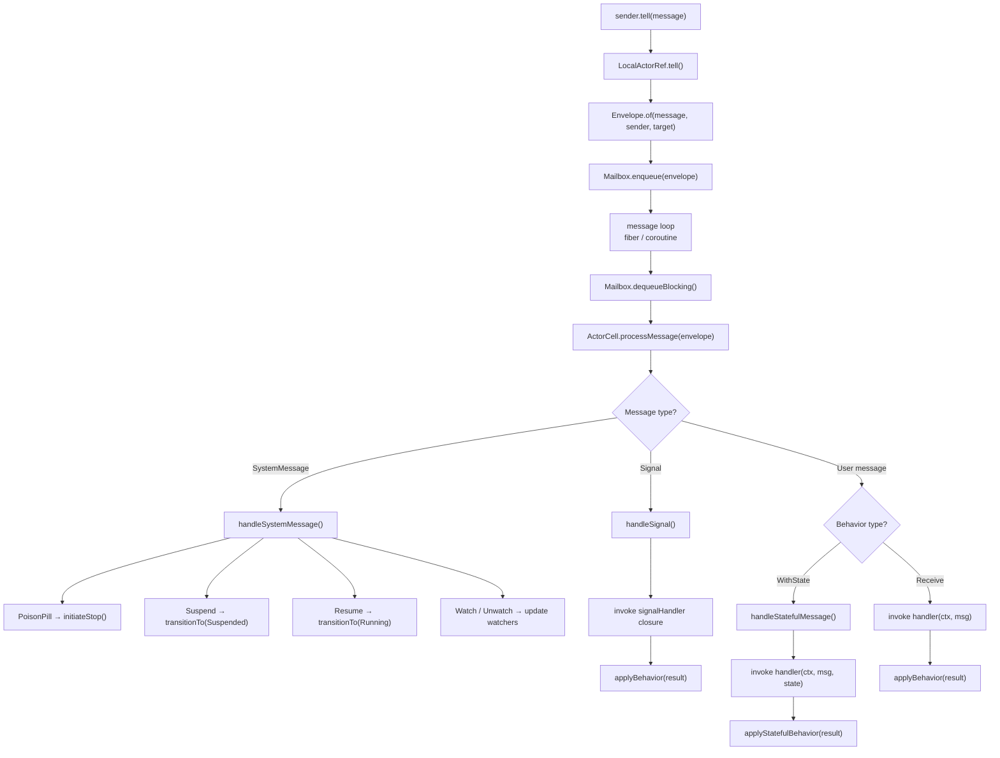
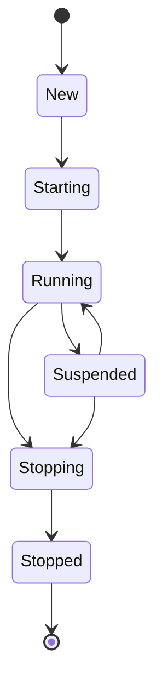

# Internals

This page describes the internal architecture of Nexus -- how messages flow
through the system, how actor state is managed, and how the pieces fit
together.

## ActorCell

`ActorCell<T>` is the internal engine for each actor. It implements
`ActorContext<T>` and manages:

- **Behavior** -- The current `Behavior<T>` that defines how messages are handled.
- **State machine** -- Transitions through `ActorState` (see below).
- **Children map** -- An array of child `ActorRef` instances keyed by name.
- **Stash buffer** -- A list of `Envelope` objects that have been stashed for later processing.
- **Supervision** -- A `SupervisionStrategy` that determines how child failures are handled.
- **Watchers** -- A map of actors watching this actor for termination.
- **Current envelope** -- The envelope being processed, used by `stash()` and `sender()`.

Each `ActorCell` is created with a `Behavior`, an `ActorPath`, a `Mailbox`, a
`Runtime`, an optional parent ref, a `SupervisionStrategy`, a `ClockInterface`,
a `LoggerInterface`, and a `DeadLetterRef`.

## Message processing flow

When a message arrives at an actor, it follows this path:



### Behavior application

After a handler returns a `Behavior<T>`, `applyBehavior()` determines the
next step:

- `Behavior::same()` -- No change. The current behavior is retained.
- `Behavior::stopped()` -- The actor initiates shutdown via `initiateStop()`.
- `Behavior::unhandled()` -- The message is forwarded to dead letters.
- Any other behavior -- The current behavior is swapped to the new one. If the
  new behavior is `WithState`, its initial state is extracted.

For stateful behaviors, `applyStatefulBehavior()` handles `BehaviorWithState`
results:

- `BehaviorWithState::same()` -- No change to behavior or state.
- `BehaviorWithState::next($state)` -- Keep the same behavior, update state.
- `BehaviorWithState::stopped()` -- Initiate shutdown.
- `BehaviorWithState::withBehavior($behavior, $state)` -- Swap both behavior and state.

## State machine

Each actor progresses through a defined set of states:



Valid transitions:

| From | To |
|---|---|
| `New` | `Starting` |
| `Starting` | `Running` |
| `Running` | `Suspended`, `Stopping` |
| `Suspended` | `Running`, `Stopping` |
| `Stopping` | `Stopped` |
| `Stopped` | (terminal) |

The `ActorState` enum enforces these transitions via `canTransitionTo()`.
Attempting an invalid transition throws `InvalidActorStateTransition`.

### Lifecycle during transitions

1. **New -> Starting** -- `ActorCell::start()` is called. If the behavior is
   `Setup`, the factory closure is invoked with the `ActorContext` to produce
   the initial behavior. If `WithState`, the initial state is extracted.
2. **Starting -> Running** -- The `PreStart` signal is delivered to the signal
   handler (if one is registered).
3. **Running -> Stopping** -- `initiateStop()` is called. All children receive
   a `PoisonPill`. The `PostStop` signal is delivered. The mailbox is closed.
4. **Stopping -> Stopped** -- Terminal state. The actor is no longer alive.

## Message loop

Each actor gets its own fiber (Fiber runtime) or coroutine (Swoole runtime)
that runs a message processing loop:

```php
while ($cell->isAlive()) {
    try {
        $envelope = $mailbox->dequeueBlocking(Duration::seconds(1));
        $cell->processMessage($envelope);
    } catch (MailboxClosedException) {
        break;
    }
}
```

The loop blocks on `dequeueBlocking()` -- in the Fiber runtime this suspends
the fiber, in the Swoole runtime this suspends the coroutine, and in the Step
runtime the fiber always suspends to give the test control over when each
message is processed. When the mailbox is closed (during actor shutdown), a
`MailboxClosedException` breaks the loop.

This loop is spawned by `ActorSystem` (for top-level actors) and by
`ActorCell` (for child actors) via `$runtime->spawn()`.

## Dead letters

Messages that cannot be delivered are captured by the `DeadLetterRef`:

- Messages sent to a stopped actor's `LocalActorRef` are silently dropped
  (the mailbox is closed, so `enqueue()` throws `MailboxClosedException`,
  which `LocalActorRef::tell()` catches and discards).
- Messages that a behavior returns `Behavior::unhandled()` for are forwarded
  to the dead letter ref.
- Messages sent to actors with empty behaviors (no handler) are forwarded to
  dead letters.

The `DeadLetterRef` lives at the path `/system/deadLetters` and captures all
received messages in an internal list accessible via `captured()`. This is
useful for debugging and testing.

The `DeadLetterRef::ask()` method immediately throws `AskTimeoutException`,
and `isAlive()` always returns `false`.
