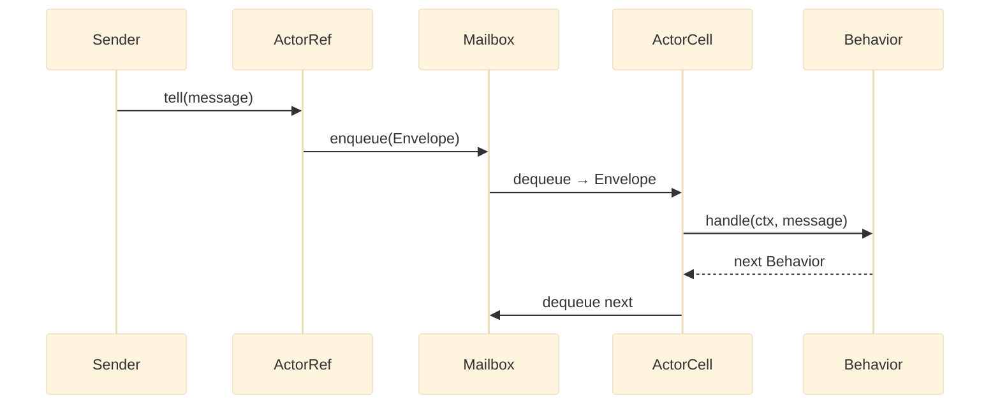

# Actors

An actor is a lightweight concurrent entity that encapsulates state, processes messages one at a time from its mailbox, and communicates exclusively through asynchronous message passing. This page covers the definition patterns, core types, and the message-flow model that connects them.

## Choosing an actor definition style

- **Use `Behavior::receive()`** when your actor is stateless or manages state via closures — the common case for simple actors.
- **Use `Behavior::withState()`** when your actor needs per-message state without mutable class properties — the preferred form for explicit state management.
- **Use `Behavior::setup()`** when your actor needs initialization work before it starts processing messages — spawning children, starting timers, or acquiring resources.
- **Use `Props::fromFactory()` with a class** when your actor benefits from dependency injection, named methods, or lifecycle hooks (`onPreStart`, `onPostStop`).

## Message flow

When you call `tell()`, the message travels from sender through the `ActorRef` into the mailbox, where `ActorCell` dequeues it and dispatches to the current behavior. The behavior returns the next behavior, and the cell moves to the next message.



_Figure 1: The `tell()` path from caller through `ActorRef` into the mailbox, dispatched by `ActorCell` to the current `Behavior`._

## ActorRef

`ActorRef<T>` is the only way to interact with an actor. You never access actor state directly — all communication passes through the reference.

```php title="src/Actor/ActorRef.php"
use Monadial\Nexus\Core\Actor\ActorRef;
use Monadial\Nexus\Core\Actor\ActorPath;
use Monadial\Nexus\Runtime\Duration;

/** @template T of object */
interface ActorRef
{
    /** @param T $message */
    public function tell(object $message): void;

    /**
     * @template R of object
     * @param T $message
     * @return Future<R>
     * @throws AskTimeoutException
     */
    public function ask(object $message, Duration $timeout): object;

    public function path(): ActorPath;

    public function isAlive(): bool;
}
```

`tell()` enqueues the message and returns immediately. `ask()` returns a `Future` — call `->await()` to block the current fiber until the reply arrives or the timeout expires. See [Ask pattern](./ask-pattern.md) for the full request-reply model.

## ActorContext

`ActorContext<T>` is available inside every message handler. It gives the actor its own reference, its parent, and the ability to spawn children, watch other actors, schedule messages, and stash work for later.

### Spawning children

```php title="src/Actor/ParentActor.php"
use Monadial\Nexus\Core\Actor\Behavior;
use Monadial\Nexus\Core\Actor\Props;

readonly class StartWorker
{
    public function __construct(public string $name) {}
}

$behavior = Behavior::receive(
    function (ActorContext $ctx, object $msg): Behavior {
        if ($msg instanceof StartWorker) {
            $workerBehavior = Behavior::receive(
                static fn (ActorContext $c, object $m): Behavior => Behavior::same(),
            );
            $child = $ctx->spawn(Props::fromBehavior($workerBehavior), $msg->name);
            $ctx->log()->info('Spawned worker at ' . $child->path());
        }

        return Behavior::same();
    },
);
```

`spawn()` requires a unique name within the parent. Passing a name that already belongs to a living child throws `ActorNameExistsException`. Use `spawnAnonymous()` when the name does not matter.

### Watching actors

`watch()` registers the current actor to receive a `Terminated` signal when the target stops.

```php title="src/Actor/WatchingActor.php"
use Monadial\Nexus\Core\Lifecycle\Terminated;
use Monadial\Nexus\Core\Lifecycle\Signal;

$behavior = Behavior::setup(function (ActorContext $ctx): Behavior {
    $child = $ctx->spawn($childProps, 'worker');
    $ctx->watch($child);

    return Behavior::receive(
        static fn (ActorContext $c, object $msg): Behavior => Behavior::same(),
    )->onSignal(
        static function (ActorContext $c, Signal $signal): Behavior {
            if ($signal instanceof Terminated) {
                $c->log()->warning('Child terminated: ' . $signal->ref->path());
            }

            return Behavior::same();
        },
    );
});
```

### Scheduling messages

`scheduleOnce()` delivers a message to `self()` after a delay. `scheduleRepeatedly()` fires on an interval. Both return a `Cancellable`.

```php title="src/Actor/TickingActor.php"
readonly class Tick {}

$behavior = Behavior::setup(function (ActorContext $ctx): Behavior {
    $cancellable = $ctx->scheduleRepeatedly(
        Duration::seconds(0),
        Duration::seconds(1),
        new Tick(),
    );

    return Behavior::receive(
        static fn (ActorContext $c, object $msg): Behavior => Behavior::same(),
    );
});
```

### Stashing messages

When an actor cannot handle a message in its current state, stash it and replay later.

```php title="src/Actor/InitActor.php"
readonly class Initialize
{
    public function __construct(public string $config) {}
}

readonly class Work
{
    public function __construct(public string $payload) {}
}

$behavior = Behavior::receive(
    static function (ActorContext $ctx, object $msg): Behavior {
        if ($msg instanceof Initialize) {
            $ctx->unstashAll();

            return Behavior::receive(
                static fn (ActorContext $c, object $m): Behavior => Behavior::same(),
            );
        }

        $ctx->stash();

        return Behavior::same();
    },
);
```

## ActorSystem

`ActorSystem` is the root of the actor hierarchy. It manages top-level actors, owns the dead-letter endpoint, and delegates scheduling to the injected `Runtime`.

```php title="src/Bootstrap/main.php"
use Monadial\Nexus\Core\Actor\ActorSystem;
use Monadial\Nexus\Core\Actor\Behavior;
use Monadial\Nexus\Core\Actor\Props;
use Monadial\Nexus\Runtime\Duration;

readonly class Ping
{
    public function __construct(public string $from) {}
}

$behavior = Behavior::receive(
    static function (ActorContext $ctx, object $msg): Behavior {
        if ($msg instanceof Ping) {
            $ctx->log()->info("Ping from {$msg->from}");
        }

        return Behavior::same();
    },
);

$system = ActorSystem::create('example', $runtime);
$ref = $system->spawn(Props::fromBehavior($behavior), 'pinger');
$ref->tell(new Ping('main'));

$runtime->scheduleOnce(Duration::millis(500), static function () use ($system): void {
    $system->shutdown(Duration::seconds(5));
});
$system->run();
```

`run()` blocks until the runtime has no more work. `shutdown()` sends `PoisonPill` to all top-level actors, waits for their mailboxes to drain, then stops the runtime.

## ActorPath

`ActorPath` is the fully-qualified, immutable address of an actor in the hierarchy. Paths look like `/user/orders/order-123`.

```php title="src/Actor/PathExample.php"
use Monadial\Nexus\Core\Actor\ActorPath;

$root   = ActorPath::root();               // "/"
$user   = $root->child('user');            // "/user"
$orders = $user->child('orders');          // "/user/orders"
$order  = $orders->child('order-123');     // "/user/orders/order-123"

$order->name();                            // "order-123"
$order->depth();                           // 3
$order->isDescendantOf($user);             // true

$a = ActorPath::fromString('/user/orders');
$b = ActorPath::fromString('/user/orders');
$a->equals($b);                            // true
```

Segment names may contain letters, digits, underscores, hyphens, and dots. Anything else throws `InvalidActorPathException` at construction time.

## Class-based actors

When an actor needs dependency injection, named methods, or lifecycle hooks, use a class-based definition.

### ActorHandler

`ActorHandler<T>` is the minimal interface: implement `handle()` and return a `Behavior`.

```php title="src/Actor/OrderActor.php"
use Monadial\Nexus\Core\Actor\ActorHandler;
use Monadial\Nexus\Core\Actor\ActorContext;
use Monadial\Nexus\Core\Actor\Behavior;

readonly class PlaceOrder
{
    public function __construct(public string $orderId, public float $amount) {}
}

/** @implements ActorHandler<PlaceOrder> */
final class OrderActor implements ActorHandler
{
    public function handle(ActorContext $ctx, object $message): Behavior
    {
        if ($message instanceof PlaceOrder) {
            $ctx->log()->info("Placing order {$message->orderId}");
        }

        return Behavior::same();
    }
}

$ref = $system->spawn(Props::fromFactory(fn () => new OrderActor()), 'order-processor');
```

### AbstractActor

`AbstractActor` adds optional lifecycle hooks. Override `onPreStart()` and `onPostStop()` for initialization and cleanup.

```php title="src/Actor/WorkerActor.php"
use Monadial\Nexus\Core\Actor\AbstractActor;
use Monadial\Nexus\Core\Actor\ActorContext;
use Monadial\Nexus\Core\Actor\Behavior;

readonly class ProcessJob
{
    public function __construct(public string $payload) {}
}

/** @extends AbstractActor<ProcessJob> */
final class WorkerActor extends AbstractActor
{
    public function onPreStart(ActorContext $ctx): void
    {
        $ctx->log()->info('Worker starting at ' . $ctx->self()->path());
    }

    public function handle(ActorContext $ctx, object $message): Behavior
    {
        if ($message instanceof ProcessJob) {
            $ctx->log()->info("Processing: {$message->payload}");
        }

        return Behavior::same();
    }

    public function onPostStop(ActorContext $ctx): void
    {
        $ctx->log()->info('Worker stopped');
    }
}
```

### StatefulActorHandler

`StatefulActorHandler<T, S>` threads state through each call as an explicit argument. No mutable class properties needed.

```php title="src/Actor/CartActor.php"
use Monadial\Nexus\Core\Actor\StatefulActorHandler;
use Monadial\Nexus\Core\Actor\ActorContext;
use Monadial\Nexus\Core\Actor\BehaviorWithState;

readonly class AddItem
{
    public function __construct(public string $item) {}
}

/** @implements StatefulActorHandler<AddItem, list<string>> */
final class CartActor implements StatefulActorHandler
{
    /** @return list<string> */
    public function initialState(): array
    {
        return [];
    }

    public function handle(ActorContext $ctx, object $message, mixed $state): BehaviorWithState
    {
        if ($message instanceof AddItem) {
            return BehaviorWithState::next([...$state, $message->item]);
        }

        return BehaviorWithState::same();
    }
}

$ref = $system->spawn(Props::fromStatefulFactory(fn () => new CartActor()), 'cart');
```

## DeadLetterRef

`DeadLetterRef` is the catch-all for messages that cannot be delivered. It implements `ActorRef` but never forwards messages to a live actor.

```php title="src/Actor/DeadLetterExample.php"
$deadLetters = $system->deadLetters();

$deadLetters->isAlive();  // false
$deadLetters->tell(new SomeMessage());  // captured, not delivered

// Inspect captured messages in tests
$captured = $deadLetters->captured();  // list<object>

echo $deadLetters->path(); // "/system/deadLetters"
```

Any `ask()` to `DeadLetterRef` immediately throws `AskTimeoutException`. Use `captured()` in tests to verify that no messages were silently lost.

## Failure modes

Runtime problems with actors surface from a small set of root causes. The table below covers the most common ones.

| Symptom | Cause | Recovery |
|---|---|---|
| `ActorNameExistsException` thrown during `spawn()` | A living child with the same name already exists under this parent | Use a unique name, call `spawnAnonymous()`, or stop the existing child first |
| `ActorInitializationException` thrown on startup | `Behavior::setup()` factory threw before returning the initial behavior | Fix the factory; exceptions during setup are not retried by default — the actor transitions to `Stopped` |
| `InvalidActorStateTransition` thrown | An internal lifecycle operation was applied to an actor in an incompatible state (e.g., starting an already-running actor) | This signals a framework or integration bug; do not catch it — investigate the spawn or shutdown sequence |
| `AskTimeoutException` thrown on `ask()` to `DeadLetterRef` | `ask()` was called on a reference whose actor had already stopped | Check `isAlive()` before calling `ask()`; handle the exception at the call site |
| Messages routed to dead letters unexpectedly | Actor stopped between `tell()` and message processing, or the actor returned `Behavior::unhandled()` | Inspect `$system->deadLetters()->captured()` in tests; review the actor's message protocol coverage |

## Next steps

- [Behaviors](./behaviors.md) — how to define and compose actor behaviors
- [Lifecycle](./lifecycle.md) — the state machine every actor follows
- [Props](./props.md) — configuring mailboxes and supervision at spawn time
- [Supervision](./supervision.md) — how parent actors respond to child failures
