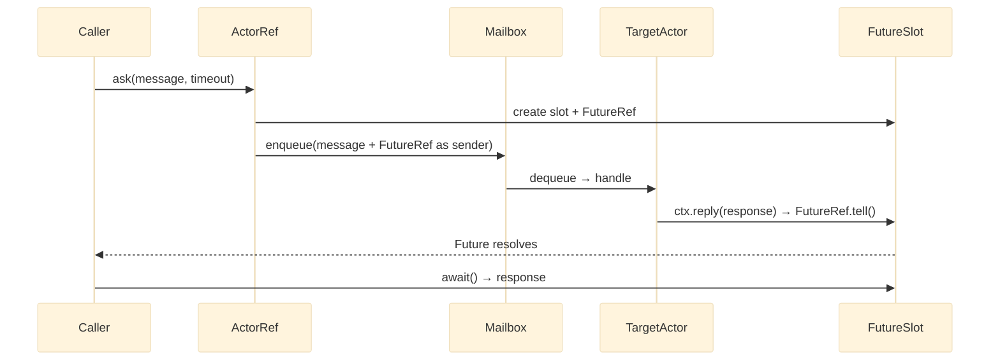

# Ask pattern

The ask pattern bridges the actor world — asynchronous and message-driven — with code that needs a response. Call `ask()` on an `ActorRef`, get a `Future`, and block on `await()` when you need the result.

## Request-reply sequence



_Figure 1: The ask pattern. `ask()` creates a `FutureSlot` and a single-use `FutureRef`. The target actor replies via `ctx->reply()`, which routes through the `FutureRef` to resolve the slot._

## How it works

1. `ask()` creates a `FutureSlot` (a runtime-specific suspension primitive) and a lightweight `FutureRef` — a single-use `ActorRef` whose `tell()` resolves the slot.
2. The message is enqueued to the target's mailbox with the `FutureRef` carried as the envelope's sender reference.
3. The target processes the message and calls `$ctx->reply($response)`, which routes the response back through the `FutureRef`.
4. `Future::await()` suspends the current fiber or coroutine until the reply arrives or the timeout fires.
5. If the timeout expires before a reply, `AskTimeoutException` is thrown.

## Signature

```php title="src/Actor/ActorRef.php"
/**
 * @template R of object
 * @param T $message
 * @return Future<R>
 * @throws AskTimeoutException
 */
#[NoDiscard]
public function ask(object $message, Duration $timeout): Future;
```

The `#[NoDiscard]` attribute causes static analysis to warn if you discard the return value.

## Usage

```php title="src/Http/AccountController.php"
use Monadial\Nexus\Runtime\Duration;

final readonly class GetBalance {}

final readonly class Balance
{
    public function __construct(public float $amount) {}
}

$future = $accountRef->ask(new GetBalance(), Duration::seconds(5));
$balance = $future->await();

echo $balance->amount;
```

The target actor replies via `$ctx->reply()`. No `$replyTo` field is needed on the message — routing is automatic through the envelope's sender reference.

```php title="src/Actor/AccountActor.php"
use Monadial\Nexus\Core\Actor\Behavior;
use Monadial\Nexus\Core\Actor\ActorContext;

$behavior = Behavior::receive(
    static function (ActorContext $ctx, object $msg): Behavior {
        if ($msg instanceof GetBalance) {
            $ctx->reply(new Balance(amount: 42.50));
        }

        return Behavior::same();
    },
);
```

## Future combinators

`Future` supports `map()` and `flatMap()` for transforming results without blocking until `await()`.

```php title="src/Service/CurrencyService.php"
$future = $accountRef
    ->ask(new GetBalance(), Duration::seconds(5))
    ->flatMap(static function (object $balance) use ($exchangeRef): Future {
        assert($balance instanceof Balance);

        return $exchangeRef->ask(
            new ConvertCurrency($balance->amount, 'USD'),
            Duration::seconds(5),
        );
    });

$converted = $future->await();
```

Both `map()` and `flatMap()` are lazy — the transformation runs only when `await()` is called.

## Timeout handling

```php title="src/Service/AccountService.php"
use Monadial\Nexus\Core\Exception\AskTimeoutException;
use Monadial\Nexus\Runtime\Duration;

try {
    $balance = $accountRef
        ->ask(new GetBalance(), Duration::seconds(3))
        ->await();
} catch (AskTimeoutException $e) {
    $logger->warning("Ask to {$e->target} timed out after {$e->timeout}");
}
```

`AskTimeoutException` exposes the target actor path and the elapsed `Duration`.

## When to use ask vs tell

| | `tell()` | `ask()` |
|---|---|---|
| **Direction** | Fire-and-forget | Request-response |
| **Blocking** | No | Yes — blocks the calling fiber on `await()` |
| **Return** | `void` | `Future<R>` |
| **Throughput** | Higher | Lower — allocates `FutureSlot`, suspends fiber |
| **Coupling** | Loose | Tighter — sender depends on timely response |
| **Error model** | Handled by supervision | Surfaces as `AskTimeoutException` |

Prefer `tell()` for actor-to-actor communication. Reserve `ask()` for:

- **Edge of the actor system** — when non-actor code (HTTP controllers, CLI commands) needs a result.
- **Orchestration** — when a coordinator must gather replies from several children before proceeding.
- **Testing** — to assert that an actor produces the expected reply.

## Runtime support

| Runtime | FutureSlot | Suspension mechanism |
|---|---|---|
| `FiberRuntime` | `FiberFutureSlot` | `Fiber::suspend()` / resume on next tick |
| `SwooleRuntime` | `SwooleFutureSlot` | `Swoole\Coroutine\Channel(1)` |
| `StepRuntime` | `StepFutureSlot` | `Fiber::suspend()` (deterministic, test-controlled) |

## Failure modes

Ask failures fall into three categories: timeouts, dead targets, and missing reply paths.

| Symptom | Cause | Recovery |
|---|---|---|
| `AskTimeoutException` thrown | The target actor did not call `$ctx->reply()` within the timeout | Verify the handler covers the message type and calls `reply()`; increase `Duration` only after diagnosing the actual latency |
| `AskTimeoutException` thrown immediately | `ask()` was sent to `DeadLetterRef` or a stopped actor | Check `$ref->isAlive()` before calling `ask()`; handle the exception at the call site |
| `Future` resolves with the wrong type | The handler called `$ctx->reply()` with an unexpected message type | Align the reply type with the `Future<R>` type parameter; use Psalm generics to catch this at analysis time |
| Reply arrives but `await()` never returns | The calling fiber is not inside the runtime event loop | Call `await()` only from within a fiber managed by the runtime — not from a plain PHP script outside `$system->run()` |

## Next steps

- [Actors](./actors.md) — `ActorRef`, `tell()`, and the message-flow model
- [Behaviors](./behaviors.md) — `$ctx->reply()` and signal handling
- [Mailboxes](./mailboxes.md) — how messages are buffered and enqueued
