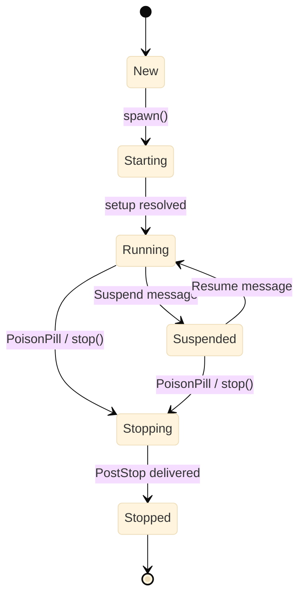
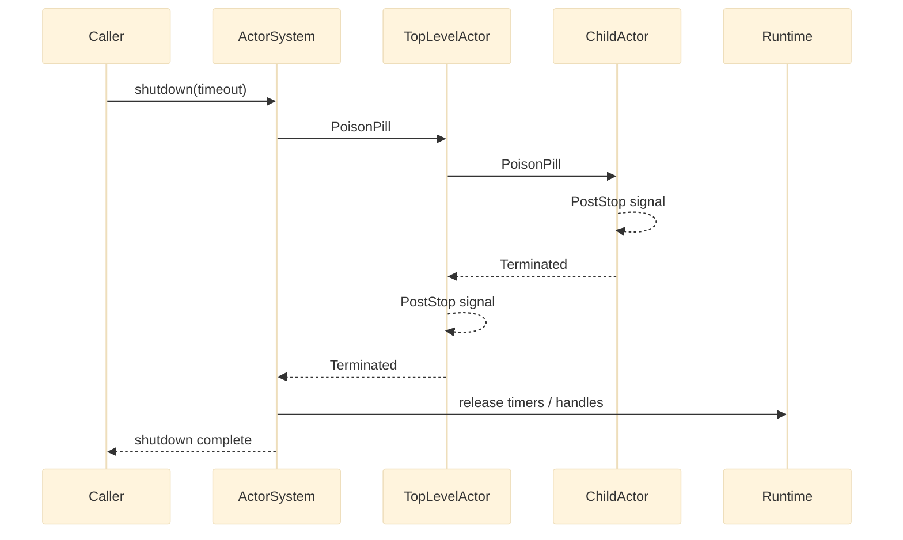

# Lifecycle

Every actor in Nexus follows a well-defined lifecycle expressed as a state machine. Transitions are enforced at runtime — invalid transitions throw `InvalidActorStateTransition`.

## Actor states



_Figure 1: The actor state machine. `Suspended` and `Running` are the only states that accept user messages. `Stopped` is terminal._

| State | Description |
|---|---|
| `New` | Actor constructed but not yet started. |
| `Starting` | `start()` called; setup behavior resolving. |
| `Running` | Actor processing messages from its mailbox. |
| `Suspended` | Actor paused; messages queue but are not processed. |
| `Stopping` | Shutting down; children receive `PoisonPill`, `PostStop` delivers. |
| `Stopped` | Terminal. Mailbox closed. No further messages processed. |

## Lifecycle signals

Signals are delivered to an actor's signal handler at key lifecycle moments. All signals implement `Signal`.

| Signal | When it fires |
|---|---|
| `PreStart` | After the actor reaches `Running`, before any user messages |
| `PostStop` | After the actor enters `Stopping`, before the mailbox closes |
| `PreRestart` | Before the actor restarts due to a supervision decision |
| `PostRestart` | After the actor restarts with a fresh behavior |
| `ChildFailed` | When a child actor throws an unhandled exception |
| `Terminated` | When a watched actor stops, regardless of reason |
| `ReceiveTimeout` | When no user message arrives within the configured duration |

Attach a signal handler with `->onSignal()`:

```php title="src/Actor/SignalHandlerExample.php"
use Monadial\Nexus\Core\Actor\Behavior;
use Monadial\Nexus\Core\Actor\ActorContext;
use Monadial\Nexus\Core\Lifecycle\Signal;
use Monadial\Nexus\Core\Lifecycle\PreStart;
use Monadial\Nexus\Core\Lifecycle\PostStop;
use Monadial\Nexus\Core\Lifecycle\Terminated;

$behavior = Behavior::receive(
    fn (ActorContext $ctx, object $msg): Behavior => Behavior::same(),
)->onSignal(function (ActorContext $ctx, Signal $signal): Behavior {
    return match ($signal::class) {
        PreStart::class   => handleStart($ctx),
        PostStop::class   => handleStop($ctx),
        Terminated::class => handleTerminated($ctx, $signal),
        default           => Behavior::same(),
    };
});
```

Return `Behavior::same()` from the signal handler to keep the current behavior. Return `Behavior::stopped()` to initiate shutdown.

## Graceful shutdown sequence

`ActorSystem::shutdown()` is deadline-driven. It works top-down through the supervision tree.



_Figure 2: The graceful shutdown sequence. `PoisonPill` propagates down the tree; `PostStop` delivers bottom-up before the runtime releases resources._

The shutdown steps in order:

1. Marks the system as stopping (idempotent).
2. Sends `PoisonPill` to every top-level child.
3. Yields cooperatively until every child has stopped or the deadline expires.
4. Force-stops any survivors by closing their mailbox, which unblocks the message loop so `PostStop` delivers naturally.
5. Signals the runtime to release timers and handles.

## Lifecycle example

An actor that acquires a database connection on start and releases it on stop:

```php title="src/Actor/DatabaseWorker.php"
use Monadial\Nexus\Core\Actor\Behavior;
use Monadial\Nexus\Core\Actor\ActorContext;
use Monadial\Nexus\Core\Lifecycle\Signal;
use Monadial\Nexus\Core\Lifecycle\PostStop;

function databaseWorker(ConnectionPool $pool): Behavior
{
    return Behavior::setup(function (ActorContext $ctx) use ($pool): Behavior {
        $conn = $pool->acquire();
        $ctx->log()->info('Connection acquired');

        return Behavior::receive(
            function (ActorContext $ctx, object $msg) use ($conn): Behavior {
                if ($msg instanceof Query) {
                    $result = $conn->execute($msg->sql);
                    $ctx->reply($result);
                }

                return Behavior::same();
            },
        )->onSignal(function (ActorContext $ctx, Signal $signal) use ($pool, $conn): Behavior {
            if ($signal instanceof PostStop) {
                $pool->release($conn);
                $ctx->log()->info('Connection released');
            }

            return Behavior::same();
        });
    });
}
```

## ReceiveTimeout

`ReceiveTimeout` fires when no user message arrives within a configured duration. Arm it from any handler with `$ctx->setReceiveTimeout()`.

```php title="src/Actor/PassivatingActor.php"
use Monadial\Nexus\Core\Actor\Behavior;
use Monadial\Nexus\Core\Actor\ActorContext;
use Monadial\Nexus\Core\Lifecycle\ReceiveTimeout;
use Monadial\Nexus\Runtime\Duration;

$behavior = Behavior::setup(static function (ActorContext $ctx): Behavior {
    $ctx->setReceiveTimeout(Duration::seconds(120));

    return Behavior::receive(
        static fn (ActorContext $ctx, object $msg): Behavior => Behavior::same(),
    )->onSignal(static function (ActorContext $ctx, object $signal): Behavior {
        if ($signal instanceof ReceiveTimeout) {
            return Behavior::stopped();
        }

        return Behavior::same();
    });
});
```

The timer resets on every user message. System messages (`Watch`, `Unwatch`, `PoisonPill`) do not reset. Call `$ctx->setReceiveTimeout(null)` to disable. See [Passivation](./passivation.md) for the full pattern.

## System messages

System messages are handled by the actor infrastructure before user-defined handlers see them.

| Message | Effect |
|---|---|
| `PoisonPill` | Graceful stop after the current message. Delivers `PostStop`. |
| `Kill` | Immediate stop. No further messages processed. |
| `Suspend` | Transitions to `Suspended`. Messages queue but are not processed. |
| `Resume` | Transitions from `Suspended` back to `Running`. |
| `Watch` | Registers a watcher to receive `Terminated` when this actor stops. |
| `Unwatch` | Removes a previously registered watcher. |

## Failure modes

Lifecycle failures are usually caused by exceptions during setup or by incorrect shutdown ordering.

| Symptom | Cause | Recovery |
|---|---|---|
| `ActorInitializationException` on startup | `Behavior::setup()` factory threw before returning the initial behavior | Fix the factory; the exception is not retried — the actor goes to `Stopped` |
| `InvalidActorStateTransition` thrown | A lifecycle operation was applied to an actor in an incompatible state | This is a framework or integration bug; investigate the spawn/shutdown sequence rather than catching the exception |
| `PostStop` not delivered; resources not released | Actor was force-stopped because the shutdown deadline elapsed before graceful drain | Increase the `Duration` passed to `shutdown()`, or reduce the work in handlers to drain faster |
| `Terminated` signal never received by watcher | `watch()` was called after the target already stopped | Call `watch()` immediately after `spawn()`; a `Terminated` for a pre-stopped actor is still delivered if you watch it |
| Child actors still running after `shutdown()` returns | Children have infinite loops or blocked I/O that prevent `PostStop` from completing | Ensure all blocking calls are interruptible; use `Duration` timeouts on external I/O inside handlers |

## Next steps

- [Supervision](./supervision.md) — how parent actors handle child failures and restarts
- [Passivation](./passivation.md) — using `ReceiveTimeout` to release idle resources
- [Behaviors](./behaviors.md) — signal handling via `->onSignal()` on any behavior
