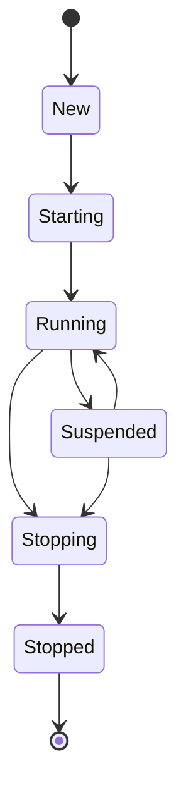

# Lifecycle

Every actor in Nexus follows a well-defined lifecycle expressed as a state
machine. Transitions between states are enforced at runtime -- invalid
transitions throw `InvalidActorStateTransition`.

## Actor states



| State | Description |
|---|---|
| `New` | Actor has been constructed but not yet started. |
| `Starting` | `start()` has been called. Setup behavior is being resolved. |
| `Running` | Actor is processing messages from its mailbox. |
| `Suspended` | Actor is paused. Messages accumulate in the mailbox but are not processed. |
| `Stopping` | Actor is shutting down. Children receive `PoisonPill`, `PostStop` is delivered. |
| `Stopped` | Terminal state. The mailbox is closed. The actor will not process any more messages. |

Valid transitions:

- `New` -> `Starting`
- `Starting` -> `Running`
- `Running` -> `Suspended`, `Stopping`
- `Suspended` -> `Running`, `Stopping`
- `Stopping` -> `Stopped`

## Lifecycle signals

Signals are delivered to an actor's signal handler at key lifecycle moments. All
signals implement the `Signal` interface.

### PreStart

Delivered after the actor transitions to `Running`, before it processes any user
messages. Use it to initialize resources, spawn children, or schedule timers.

```php
use Monadial\Nexus\Core\Lifecycle\PreStart;
```

`PreStart` carries no data.

### PostStop

Delivered when the actor enters `Stopping`. Use it to release resources, close
connections, or notify watchers.

```php
use Monadial\Nexus\Core\Lifecycle\PostStop;
```

`PostStop` carries no data.

### PreRestart

Delivered before the actor is restarted due to a supervision decision. Gives the
actor a chance to clean up before its state is discarded.

```php
use Monadial\Nexus\Core\Lifecycle\PreRestart;

// Access the failure cause:
$signal->cause; // Throwable
```

### PostRestart

Delivered after the actor has been restarted with a fresh behavior. The actor can
re-initialize resources here.

```php
use Monadial\Nexus\Core\Lifecycle\PostRestart;

// Access the failure cause:
$signal->cause; // Throwable
```

### ChildFailed

Delivered to a parent when one of its children throws an unhandled exception.
The supervision strategy determines the response, but the parent's signal handler
can observe and log the failure.

```php
use Monadial\Nexus\Core\Lifecycle\ChildFailed;

// Access the failed child and cause:
$signal->child; // ActorRef
$signal->cause; // Throwable
```

### Terminated

Delivered when a watched actor stops, regardless of the reason (graceful stop,
failure, or kill). You must call `$ctx->watch()` on the target before you receive
this signal.

```php
use Monadial\Nexus\Core\Lifecycle\Terminated;

// Access the stopped actor's ref:
$signal->ref; // ActorRef
```

## Handling signals

Attach a signal handler to any behavior with `onSignal()`. The handler receives
the `ActorContext` and the `Signal`, and must return a `Behavior`:

```php
use Monadial\Nexus\Core\Actor\Behavior;
use Monadial\Nexus\Core\Actor\ActorContext;
use Monadial\Nexus\Core\Lifecycle\Signal;
use Monadial\Nexus\Core\Lifecycle\PreStart;
use Monadial\Nexus\Core\Lifecycle\PostStop;
use Monadial\Nexus\Core\Lifecycle\Terminated;

$behavior = Behavior::receive(
    fn(ActorContext $ctx, object $msg): Behavior => Behavior::same(),
)->onSignal(function (ActorContext $ctx, Signal $signal): Behavior {
    return match ($signal::class) {
        PreStart::class => handleStart($ctx),
        PostStop::class => handleStop($ctx),
        Terminated::class => handleTerminated($ctx, $signal),
        default => Behavior::same(),
    };
});
```

Return `Behavior::same()` from the signal handler to keep the current behavior
unchanged. Return `Behavior::stopped()` to initiate shutdown.

## Lifecycle example

An actor that acquires a database connection on start and releases it on stop:

```php
use Monadial\Nexus\Core\Actor\Behavior;
use Monadial\Nexus\Core\Actor\ActorContext;
use Monadial\Nexus\Core\Actor\Props;
use Monadial\Nexus\Core\Lifecycle\Signal;
use Monadial\Nexus\Core\Lifecycle\PreStart;
use Monadial\Nexus\Core\Lifecycle\PostStop;

function databaseWorker(ConnectionPool $pool): Behavior
{
    return Behavior::setup(function (ActorContext $ctx) use ($pool): Behavior {
        $conn = $pool->acquire();
        $ctx->log()->info('Connection acquired');

        return Behavior::receive(
            function (ActorContext $ctx, object $msg) use ($conn): Behavior {
                if ($msg instanceof Query) {
                    $result = $conn->execute($msg->sql);
                    $ctx->sender()->map(fn($sender) => $sender->tell($result));
                    return Behavior::same();
                }
                return Behavior::unhandled();
            },
        )->onSignal(function (ActorContext $ctx, Signal $signal) use ($pool, $conn): Behavior {
            if ($signal instanceof PostStop) {
                $pool->release($conn);
                $ctx->log()->info('Connection released');
            }
            return Behavior::same();
        });
    });
}
```

## Watching actors

Use `$ctx->watch()` to observe another actor's lifecycle. When the watched actor
stops, you receive a `Terminated` signal containing its `ActorRef`.

```php
$ctx->watch($otherRef);
```

To stop watching:

```php
$ctx->unwatch($otherRef);
```

Watching is commonly used to detect when a dependency goes down and either
restart it or switch to a degraded mode.

## Stashing

Stashing lets an actor defer messages it cannot handle in its current state. When
the actor is ready, it re-enqueues all stashed messages for processing.

- `$ctx->stash()` -- saves the message currently being processed into an
  internal buffer.
- `$ctx->unstashAll()` -- re-enqueues all stashed messages back into the actor's
  mailbox, in the order they were stashed.

### Stashing example

An actor that must complete initialization before handling work. During init,
incoming work messages are stashed and replayed once initialization is complete:

```php
use Monadial\Nexus\Core\Actor\Behavior;
use Monadial\Nexus\Core\Actor\ActorContext;
use Monadial\Nexus\Core\Actor\Props;

final readonly class InitComplete {}
final readonly class WorkItem {
    public function __construct(public string $payload) {}
}

function initializingWorker(): Behavior
{
    return Behavior::setup(function (ActorContext $ctx): Behavior {
        // Kick off async initialization
        $ctx->scheduleOnce(
            Duration::seconds(1),
            new InitComplete(),
        );

        // While initializing, stash everything except InitComplete
        return Behavior::receive(
            function (ActorContext $ctx, object $msg): Behavior {
                if ($msg instanceof InitComplete) {
                    $ctx->log()->info('Initialization complete, unstashing messages');
                    $ctx->unstashAll();
                    return ready();
                }

                // Not ready yet -- stash the message
                $ctx->stash();
                return Behavior::same();
            },
        );
    });
}

function ready(): Behavior
{
    return Behavior::receive(
        function (ActorContext $ctx, object $msg): Behavior {
            if ($msg instanceof WorkItem) {
                $ctx->log()->info("Processing: {$msg->payload}");
                return Behavior::same();
            }
            return Behavior::unhandled();
        },
    );
}
```

In this example, if three `WorkItem` messages arrive before `InitComplete`, all
three are stashed. When `InitComplete` arrives, `unstashAll()` re-enqueues them
into the mailbox and the behavior swaps to `ready()`, which processes them in
order.

## System messages

System messages implement the `SystemMessage` interface and are handled by the
actor infrastructure before user-defined handlers see them. They control the
actor's lifecycle from the outside.

| Message | Effect |
|---|---|
| `PoisonPill` | Graceful stop. The actor finishes processing the current message, delivers `PostStop`, then shuts down. |
| `Kill` | Immediate stop. No further messages are processed. |
| `Suspend` | Transitions the actor to `Suspended` state. Messages queue but are not processed. |
| `Resume` | Transitions the actor from `Suspended` back to `Running`. |
| `Watch` | Registers a watcher to receive `Terminated` when this actor stops. Sent internally by `$ctx->watch()`. |
| `Unwatch` | Removes a previously registered watcher. Sent internally by `$ctx->unwatch()`. |

System messages are all `final readonly class` types in the
`Monadial\Nexus\Core\Message` namespace. `PoisonPill`, `Kill`, `Suspend`, and
`Resume` carry no data. `Watch` and `Unwatch` carry the watcher's `ActorRef`.

```php
use Monadial\Nexus\Core\Message\PoisonPill;
use Monadial\Nexus\Core\Message\Kill;

// Graceful shutdown
$ref->tell(new PoisonPill());

// Immediate shutdown
$ref->tell(new Kill());
```
