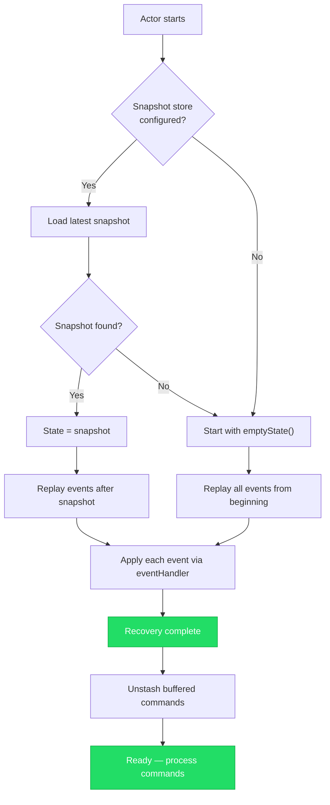
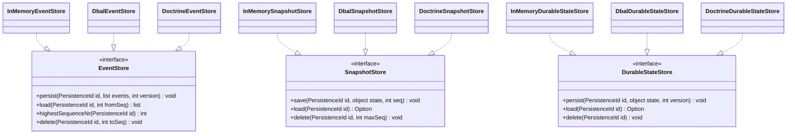

# Persistence

Actors are inherently stateless across restarts. When an actor stops -- whether
due to a failure, a deployment, or a system shutdown -- its in-memory state is
lost. Persistence solves this by automatically saving and recovering state so
that an actor can pick up exactly where it left off.

Nexus supports two persistence models. **Event Sourcing** persists a sequence of
events and rebuilds state by replaying them. **Durable State** persists the
current state directly as a single value. Both models share the same
`PersistenceId` addressing scheme, storage backend abstraction, and recovery
lifecycle.

Choose the model that fits your domain. Event Sourcing gives you a full audit
trail and temporal queries; Durable State gives you simplicity and lower storage
overhead. Both can be mixed within the same actor system.

## Event Sourcing

Event Sourcing follows the pattern: commands arrive, the command handler
produces effects, effects persist events, and events are applied to the state.
The actor's state is never persisted directly -- it is always derived by
replaying the event log from the beginning (or from a snapshot).

```mermaid
sequenceDiagram
    participant Sender
    participant Actor as EventSourcedActor
    participant CH as Command Handler
    participant ES as Event Store
    participant EH as Event Handler
    participant State

    Sender->>Actor: tell(command)
    Actor->>CH: handleCommand(state, ctx, command)
    CH-->>Actor: Effect::persist(event1, event2)
    Actor->>ES: persist(events)
    ES-->>Actor: ok
    loop For each event
        Actor->>EH: applyEvent(state, event)
        EH-->>State: new state
    end
    Actor->>Actor: thenReply / thenRun callbacks
```

```php
use Monadial\Nexus\Persistence\EventSourced\EventSourcedBehavior;
use Monadial\Nexus\Persistence\EventSourced\Effect;
use Monadial\Nexus\Persistence\Event\InMemoryEventStore;
use Monadial\Nexus\Persistence\PersistenceId;
use Monadial\Nexus\Core\Actor\ActorContext;
use Monadial\Nexus\Core\Actor\Props;

// Messages
readonly class AddItem
{
    public function __construct(public string $item) {}
}

readonly class ItemAdded
{
    public function __construct(public string $item) {}
}

// State
readonly class ShoppingCart
{
    public function __construct(public array $items = []) {}
}

$behavior = EventSourcedBehavior::create(
    PersistenceId::of('cart', 'cart-1'),
    new ShoppingCart(),
    // Command handler: receives (state, context, command), returns Effect
    static function (object $state, ActorContext $ctx, object $command): Effect {
        if ($command instanceof AddItem) {
            return Effect::persist(new ItemAdded($command->item));
        }
        return Effect::none();
    },
    // Event handler: receives (state, event), returns new state
    static function (object $state, object $event): object {
        if ($event instanceof ItemAdded) {
            return new ShoppingCart([...$state->items, $event->item]);
        }
        return $state;
    },
)
->withEventStore(new InMemoryEventStore())
->toBehavior();

$ref = $system->spawn(Props::fromBehavior($behavior), 'cart');
$ref->tell(new AddItem('apple'));
```

The command handler must be pure -- it inspects the current state and the
incoming command, then returns an `Effect` describing what should happen. The
event handler is also pure: it takes the current state and an event, and returns
the new state. Side effects belong in `thenRun` callbacks (see below).

## Effects

The `Effect` class describes what the actor system should do after a command is
handled. Effects are composable -- you can chain persistence with replies and
side effects.

| Effect | Description |
|---|---|
| `Effect::persist(new Event1(), new Event2())` | Persist one or more events, then apply them to the state |
| `Effect::none()` | Do nothing |
| `Effect::reply($ref, new Response())` | Send a reply without persisting anything |
| `Effect::stash()` | Buffer the current message for later replay |
| `Effect::stop()` | Stop the actor |

Effects can be chained with `thenReply` and `thenRun`:

```php
// Persist events, then reply with the updated state
Effect::persist(new OrderPlaced($orderId))
    ->thenReply($replyTo, fn(object $state) => new OrderConfirmation($state->id));

// Persist events, then run a side effect
Effect::persist(new PaymentReceived($amount))
    ->thenRun(fn(object $state) => $ctx->log()->info("Payment processed: {$state->total}"));
```

## Durable State

Durable State is the simpler alternative. Instead of persisting events and
replaying them, the actor persists its entire current state as a single value.
On recovery, the latest state is loaded directly -- no replay step.

```php
use Monadial\Nexus\Persistence\State\DurableStateBehavior;
use Monadial\Nexus\Persistence\State\DurableEffect;
use Monadial\Nexus\Persistence\State\InMemoryDurableStateStore;
use Monadial\Nexus\Persistence\PersistenceId;
use Monadial\Nexus\Core\Actor\ActorContext;

readonly class UpdateTheme
{
    public function __construct(public string $theme) {}
}

readonly class UserPreferences
{
    public function __construct(
        public string $theme = 'light',
        public string $language = 'en',
    ) {}
}

$behavior = DurableStateBehavior::create(
    PersistenceId::of('prefs', 'user-42'),
    new UserPreferences(),
    static function (object $state, ActorContext $ctx, object $command): DurableEffect {
        if ($command instanceof UpdateTheme) {
            return DurableEffect::persist(
                new UserPreferences($command->theme, $state->language),
            );
        }
        return DurableEffect::none();
    },
)
->withStateStore(new InMemoryDurableStateStore())
->toBehavior();
```

`DurableEffect` supports the same chaining as `Effect` -- `thenReply`,
`thenRun`, `stash`, and `stop` all work the same way.

## Class-Based API

For users who prefer an object-oriented style, Nexus provides abstract base
classes for both persistence models. Extend `AbstractEventSourcedActor` or
`AbstractDurableStateActor` and override the handler methods.

```php
use Monadial\Nexus\Persistence\EventSourced\AbstractEventSourcedActor;
use Monadial\Nexus\Persistence\EventSourced\Effect;
use Monadial\Nexus\Persistence\Event\EventStore;
use Monadial\Nexus\Persistence\PersistenceId;
use Monadial\Nexus\Core\Actor\ActorContext;
use Monadial\Nexus\Core\Actor\Props;

final class OrderActor extends AbstractEventSourcedActor
{
    public function __construct(
        EventStore $eventStore,
        private readonly string $orderId,
    ) {
        parent::__construct($eventStore);
    }

    public function persistenceId(): PersistenceId
    {
        return PersistenceId::of('order', $this->orderId);
    }

    public function emptyState(): object
    {
        return new OrderState();
    }

    public function handleCommand(object $state, ActorContext $ctx, object $command): Effect
    {
        // ...
    }

    public function applyEvent(object $state, object $event): object
    {
        // ...
    }
}

$actor = new OrderActor($eventStore, 'order-123');
$ref = $system->spawn($actor->toProps(), 'order-123');
```

## Snapshots

For actors with long event histories, replaying every event on recovery can be
slow. Snapshots solve this by periodically saving the full state alongside the
event log. On recovery, the actor loads the latest snapshot and only replays
events that occurred after it.

```php
use Monadial\Nexus\Persistence\EventSourced\SnapshotStrategy;
use Monadial\Nexus\Persistence\EventSourced\RetentionPolicy;

$behavior = EventSourcedBehavior::create(
    PersistenceId::of('account', 'acc-1'),
    new AccountState(),
    $commandHandler,
    $eventHandler,
)
->withEventStore($eventStore)
->withSnapshotStore($snapshotStore)
->withSnapshotStrategy(SnapshotStrategy::everyN(100))
->withRetention(RetentionPolicy::snapshotAndEvents(
    keepSnapshots: 2,
    deleteEventsTo: true,
))
->toBehavior();
```

`SnapshotStrategy::everyN(100)` takes a snapshot every 100 events.
`RetentionPolicy::snapshotAndEvents()` controls cleanup -- in this example, the
system keeps the two most recent snapshots and deletes all events that precede
the oldest retained snapshot.

## Recovery

When a persistent actor starts, it goes through a recovery phase before
accepting commands:



1. **Load snapshot** -- if a snapshot store is configured and a snapshot exists,
   load it as the starting state.
2. **Replay events** -- replay all events that occurred after the snapshot (or
   from the beginning if no snapshot exists). Each event is passed through the
   event handler to rebuild the current state.
3. **Ready** -- the actor begins processing commands from its mailbox.

Commands that arrive during recovery are automatically stashed and replayed in
order once recovery completes. This means senders do not need to know whether an
actor has finished recovering -- they can start sending messages immediately.

## Storage Backends



Nexus ships with several storage backend implementations:

| Store | Use case |
|---|---|
| `InMemoryEventStore` / `InMemorySnapshotStore` / `InMemoryDurableStateStore` | Testing and prototyping |
| `DbalEventStore` / `DbalSnapshotStore` / `DbalDurableStateStore` | Doctrine DBAL -- works with any SQL database |
| `DoctrineEventStore` / `DoctrineSnapshotStore` / `DoctrineDurableStateStore` | Doctrine ORM |

All stores implement the same interfaces (`EventStore`, `SnapshotStore`,
`DurableStateStore`), so you can swap backends without changing actor code.

## Concurrency Control

When multiple processes or cluster nodes access the same persistent actor,
concurrent writes can conflict. Nexus supports two locking strategies:

- **Optimistic** (default) -- no locks acquired. Conflicts are detected at write
  time via version checks. If another process wrote first, a
  `ConcurrentModificationException` is thrown. Best for low-conflict workloads.
- **Pessimistic** -- acquires an exclusive database lock before command
  processing, re-reads state from the store, then processes and persists within
  the lock scope. Best for high-conflict workloads where retries are expensive.

```php
use Monadial\Nexus\Persistence\Locking\LockingStrategy;
use Monadial\Nexus\Persistence\Dbal\DbalPessimisticLockProvider;

// Default: optimistic (no configuration needed)
$behavior = EventSourcedBehavior::create(/* ... */)
    ->withEventStore($eventStore)
    ->toBehavior();

// Pessimistic: wrap command processing in a database lock
$lockProvider = new DbalPessimisticLockProvider($connection);

$behavior = EventSourcedBehavior::create(/* ... */)
    ->withEventStore($eventStore)
    ->withLockingStrategy(LockingStrategy::pessimistic($lockProvider))
    ->toBehavior();
```

Both `EventSourcedBehavior` and `DurableStateBehavior` support
`withLockingStrategy()`. The class-based APIs (`AbstractEventSourcedActor`,
`AbstractDurableStateActor`) also expose `withLockingStrategy()`.

## Choosing Between Event Sourcing and Durable State

| | Event Sourcing | Durable State |
|---|---|---|
| **Audit trail** | Full history of every change | Only the current state |
| **Temporal queries** | Query state at any point in time | Not possible |
| **Storage** | Grows with every event (mitigated by snapshots) | Fixed size per actor |
| **Complexity** | Higher -- two handlers (command + event) | Lower -- one handler |
| **Recovery** | Replay events (or snapshot + tail) | Load single value |
| **Best for** | Domains where history matters (finance, ordering, compliance) | Domains where only current state matters (preferences, caches, sessions) |

When in doubt, start with Durable State. You can migrate to Event Sourcing
later if you discover you need the audit trail or temporal query capabilities.
