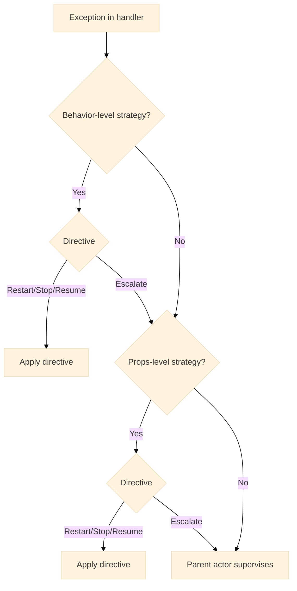
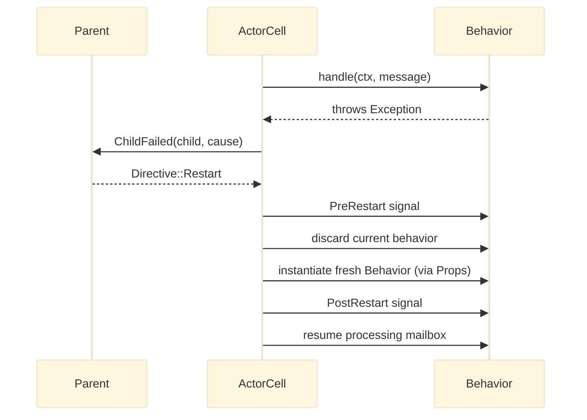
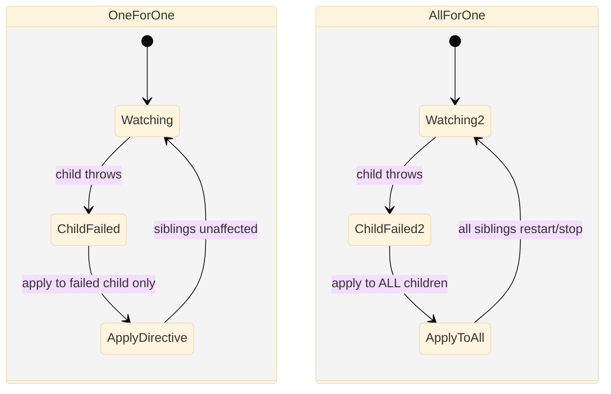

# Supervision

Supervision is the mechanism by which Nexus keeps partial failures from cascading. Every actor has a parent — its supervisor. When a child actor throws an exception, the parent's supervision strategy decides what happens next: restart the failed child, stop it, resume it as if nothing happened, or escalate the failure up the hierarchy.

## The design

Exception handling is not scattered across handlers. It is centralized in a `SupervisionStrategy` that the parent declares. The child never catches its own failures — it crashes, and the parent decides.

### Exception propagation

When a handler throws, Nexus walks the strategy chain before the exception reaches application code.



_Figure 1: Exception propagation through the supervision chain. Behavior-level strategies run first; escalation falls through to Props-level, then to the parent actor._

### Restart lifecycle sequence

A `Restart` directive does not create a brand-new actor cell. The mailbox is preserved and the behavior is replaced with a fresh instance produced by `Props`.



_Figure 2: The restart sequence. The mailbox is preserved; a fresh behavior instance handles all subsequent messages._

### OneForOne vs AllForOne

Both strategies use the same retry window and decider. The difference is scope: which children are acted upon when one fails.



_Figure 3: OneForOne applies the directive only to the failed child; AllForOne applies it to every child under the same parent._

## SupervisionStrategy

`SupervisionStrategy` is a `final readonly class`. Instances come from named constructors.

### One-for-one

Only the failed child is acted upon. Siblings continue running undisturbed.

```php title="src/Supervision/OneForOneExample.php"
use Monadial\Nexus\Core\Supervision\SupervisionStrategy;
use Monadial\Nexus\Runtime\Duration;

$strategy = SupervisionStrategy::oneForOne(
    maxRetries: 5,
    window: Duration::seconds(120),
);
```

When `$window` is `null`, it defaults to `Duration::seconds(60)`. When `$decider` is `null`, the strategy always returns `Directive::Restart`.

### All-for-one

When one child fails, all siblings are acted upon. Use this when children depend on each other and a degraded sibling breaks the group.

```php title="src/Supervision/AllForOneExample.php"
use Monadial\Nexus\Core\Supervision\SupervisionStrategy;
use Monadial\Nexus\Runtime\Duration;

$strategy = SupervisionStrategy::allForOne(
    maxRetries: 3,
    window: Duration::seconds(60),
);
```

### Exponential backoff

Restarts the failed child with increasing delays. Useful for transient failures like network timeouts or rate limits where immediate retries make the problem worse.

```php title="src/Supervision/BackoffExample.php"
use Monadial\Nexus\Core\Supervision\SupervisionStrategy;
use Monadial\Nexus\Runtime\Duration;

$strategy = SupervisionStrategy::exponentialBackoff(
    initialBackoff: Duration::millis(100),
    maxBackoff: Duration::seconds(30),
    maxRetries: 5,
    multiplier: 2.0,
);
```

The delay before the _n_th restart is `min(initialBackoff * multiplier^n, maxBackoff)`.

## Directive

The `Directive` enum defines the four outcomes when a child fails.

| Directive | Effect |
|---|---|
| `Directive::Restart` | Stop the child and start a fresh instance with the same props. The mailbox is preserved. |
| `Directive::Stop` | Permanently stop the child. No restart. |
| `Directive::Resume` | Ignore the failure and continue with the current state. |
| `Directive::Escalate` | Pass the failure to the supervisor's own parent. |

## Custom deciders

The `$decider` closure inspects the thrown exception and returns a `Directive`. This lets you vary the response per exception type.

```php title="src/Supervision/CustomDecider.php"
use Monadial\Nexus\Core\Supervision\Directive;
use Monadial\Nexus\Core\Supervision\SupervisionStrategy;

$strategy = SupervisionStrategy::oneForOne(
    maxRetries: 5,
    decider: fn (Throwable $e) => match (true) {
        $e instanceof TransientError => Directive::Restart,
        $e instanceof FatalError     => Directive::Stop,
        $e instanceof Overloaded     => Directive::Resume,
        default                      => Directive::Escalate,
    },
);
```

## Applying a strategy

### Props-level supervision

Attach a strategy through `Props::withSupervision()`. This governs how the actor supervises its children.

```php title="src/Supervision/PropsLevelSupervision.php"
use Monadial\Nexus\Core\Actor\Behavior;
use Monadial\Nexus\Core\Actor\Props;
use Monadial\Nexus\Core\Supervision\SupervisionStrategy;
use Monadial\Nexus\Runtime\Duration;

$props = Props::fromBehavior($behavior)->withSupervision(
    SupervisionStrategy::exponentialBackoff(
        initialBackoff: Duration::millis(200),
        maxBackoff: Duration::seconds(10),
    ),
);

$ref = $system->spawn($props, 'my-actor');
```

### Behavior-level supervision

Wrap a behavior with `Behavior::supervise()` to co-locate the strategy with the behavior definition.

```php title="src/Supervision/BehaviorLevelSupervision.php"
use Monadial\Nexus\Core\Actor\Behavior;
use Monadial\Nexus\Core\Supervision\SupervisionStrategy;
use Monadial\Nexus\Core\Supervision\Directive;

$behavior = Behavior::supervise(
    Behavior::receive(
        fn (ActorContext $ctx, object $msg): Behavior => handleMessage($ctx, $msg),
    ),
    SupervisionStrategy::oneForOne(
        maxRetries: 5,
        decider: fn (Throwable $e) => match (true) {
            $e instanceof TransientError => Directive::Restart,
            default => Directive::Escalate,
        },
    ),
);
```

When both behavior-level and Props-level strategies exist, the behavior-level strategy runs first. `Escalate` from the behavior-level falls through to the Props-level, then to the parent actor.

## Failure modes

Supervision failures almost always trace to retry exhaustion or misconfigured escalation chains. Check these first.

| Symptom | Cause | Recovery |
|---|---|---|
| `MaxRetriesExceededException` thrown; child permanently stopped | The child failed more times than `maxRetries` within `window` | Increase `maxRetries`, widen the `window`, or fix the root cause in the child |
| Exception propagates to the top-level actor and crashes the system | All strategies in the chain returned `Escalate`; no handler claimed the failure | Add a terminating decider at the root level that returns `Stop` or `Restart` instead of `Escalate` |
| Sibling actors stop unexpectedly alongside the failing child | `AllForOne` strategy is in use — one failure restarts all children | Switch to `OneForOne` if siblings are independent; verify the strategy choice matches the dependency model |
| Child restarts immediately loop with no delay | `Restart` directive without exponential backoff on a persistent transient failure | Switch to `exponentialBackoff` so the child has time to recover between attempts |
| `ChildFailed` signal is never delivered to the parent | Parent has no `onSignal` handler attached to its behavior | Attach a signal handler via `->onSignal(...)` and dispatch on `ChildFailed` |

## Next steps

- [Lifecycle](./lifecycle.md) — the state machine actors follow during restart and stop
- [Behaviors](./behaviors.md) — `Behavior::supervise()` for behavior-level strategies
- [Props](./props.md) — `Props::withSupervision()` for Props-level strategies
