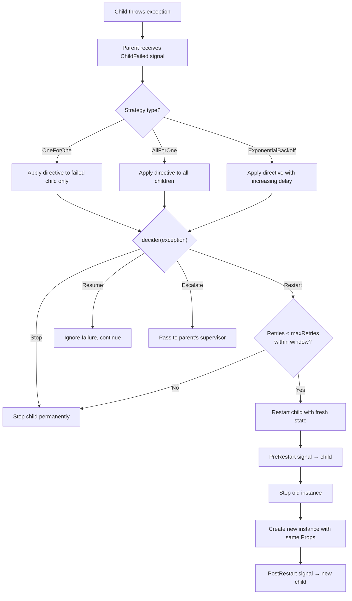
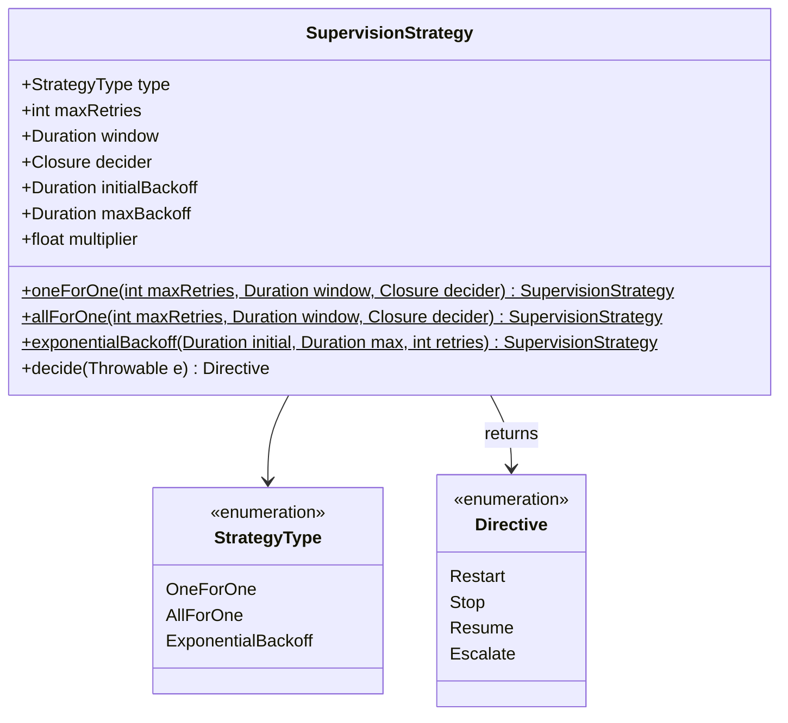

# Supervision

Every actor in Nexus has a supervisor -- its parent. When a child actor throws an
exception, the parent's supervision strategy decides what happens next: restart
the failed child, stop it, resume it as if nothing happened, or escalate the
failure further up the hierarchy.

## How supervision works

When a child actor throws an exception, the following decision process occurs:



## SupervisionStrategy

`SupervisionStrategy` is a `final readonly class` that encapsulates the failure
handling policy. Instances are created through named constructors -- the class
constructor is private.



### One-for-one

Only the failed child is acted upon. Siblings continue running undisturbed.

```php
use Monadial\Nexus\Core\Supervision\SupervisionStrategy;
use Monadial\Nexus\Core\Duration;

// Default: 3 retries within 60 seconds, always restart
$strategy = SupervisionStrategy::oneForOne();

// Custom limits
$strategy = SupervisionStrategy::oneForOne(
    maxRetries: 5,
    window: Duration::seconds(120),
);
```

**Signature:**

```php
public static function oneForOne(
    int $maxRetries = 3,
    ?Duration $window = null,
    ?Closure $decider = null,
): SupervisionStrategy
```

When `$window` is `null`, it defaults to `Duration::seconds(60)`. When `$decider`
is `null`, the default decider always returns `Directive::Restart`.

### All-for-one

When one child fails, all siblings are acted upon. Use this when children depend
on each other and cannot function correctly if one of them is in a degraded state.

```php
$strategy = SupervisionStrategy::allForOne(
    maxRetries: 3,
    window: Duration::seconds(60),
);
```

**Signature:**

```php
public static function allForOne(
    int $maxRetries = 3,
    ?Duration $window = null,
    ?Closure $decider = null,
): SupervisionStrategy
```

### Exponential backoff

Restarts the failed child with increasing delays between attempts. Useful for
transient failures like network timeouts or rate limits where immediate retries
would make the problem worse.

```php
$strategy = SupervisionStrategy::exponentialBackoff(
    initialBackoff: Duration::millis(100),
    maxBackoff: Duration::seconds(30),
    maxRetries: 5,
    multiplier: 2.0,
);
```

**Signature:**

```php
public static function exponentialBackoff(
    Duration $initialBackoff,
    Duration $maxBackoff,
    int $maxRetries = 3,
    float $multiplier = 2.0,
    ?Closure $decider = null,
): SupervisionStrategy
```

The delay between the *n*th and *(n+1)*th restart is
`min(initialBackoff * multiplier^n, maxBackoff)`.

## Directive

The `Directive` enum defines the four possible outcomes when a child fails:

| Directive | Effect |
|---|---|
| `Directive::Restart` | Stop the child and start a fresh instance with the same props. The mailbox is preserved. |
| `Directive::Stop` | Permanently stop the child. No restart. |
| `Directive::Resume` | Ignore the failure and continue processing the next message with the current state. |
| `Directive::Escalate` | The supervisor cannot handle this failure. Pass it to the supervisor's own parent. |

```php
use Monadial\Nexus\Core\Supervision\Directive;
```

## Custom deciders

The `$decider` parameter accepts a closure that inspects the thrown exception and
returns a `Directive`. This lets you vary the response based on exception type.

```php
use Monadial\Nexus\Core\Supervision\Directive;
use Monadial\Nexus\Core\Supervision\SupervisionStrategy;

$strategy = SupervisionStrategy::oneForOne(
    maxRetries: 5,
    decider: fn(Throwable $e) => match (true) {
        $e instanceof TransientError => Directive::Restart,
        $e instanceof FatalError     => Directive::Stop,
        $e instanceof Overloaded     => Directive::Resume,
        default                      => Directive::Escalate,
    },
);
```

When no decider is provided, the default always returns `Directive::Restart`:

```php
static fn(Throwable $_): Directive => Directive::Restart
```

You can call `decide()` on a strategy to invoke the decider directly:

```php
$directive = $strategy->decide($exception);
```

## Applying a strategy

Attach a supervision strategy to an actor through `Props::withSupervision()`:

```php
use Monadial\Nexus\Core\Actor\Behavior;
use Monadial\Nexus\Core\Actor\Props;
use Monadial\Nexus\Core\Supervision\SupervisionStrategy;
use Monadial\Nexus\Core\Duration;

$behavior = Behavior::receive(
    fn(ActorContext $ctx, object $msg): Behavior => Behavior::same(),
);

$props = Props::fromBehavior($behavior)->withSupervision(
    SupervisionStrategy::exponentialBackoff(
        initialBackoff: Duration::millis(200),
        maxBackoff: Duration::seconds(10),
    ),
);

$ref = $system->spawn($props, 'my-actor');
```

The strategy governs how this actor supervises its children. If the actor itself
fails, its parent's strategy applies.

## Strategy properties

Every `SupervisionStrategy` exposes its configuration as public readonly
properties:

| Property | Type | Description |
|---|---|---|
| `type` | `StrategyType` | `OneForOne`, `AllForOne`, or `ExponentialBackoff` |
| `maxRetries` | `int` | Maximum restart attempts before giving up |
| `window` | `Duration` | Time window for counting retries (one-for-one and all-for-one) |
| `decider` | `Closure` | `fn(Throwable): Directive` |
| `initialBackoff` | `Duration` | First delay (exponential backoff only) |
| `maxBackoff` | `Duration` | Ceiling delay (exponential backoff only) |
| `multiplier` | `float` | Growth factor (exponential backoff only) |
