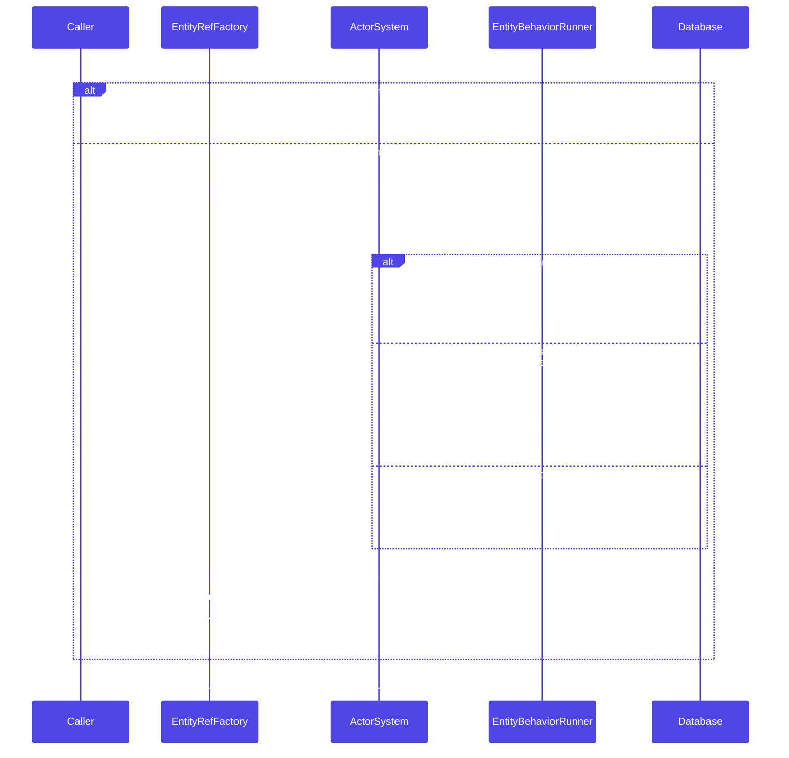
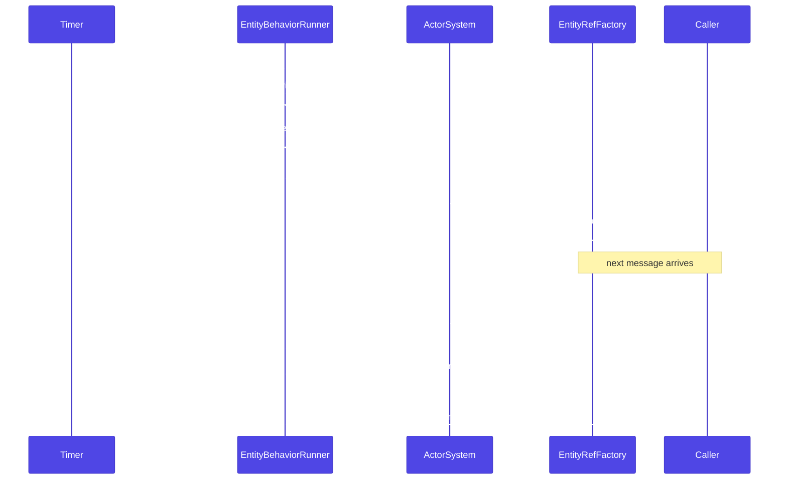

# EntityBehavior DSL

`EntityBehavior` turns a Doctrine entity into the state of an aggregate actor — no event sourcing required. The entity loads from the database on `PreStart`, processes commands serially, and persists when the command handler returns `EntityEffect::persist()`.

## Why it exists

Doctrine entities are natural aggregates: they encapsulate invariants, have a clear identity, and Doctrine provides the persistence machinery. The problem is concurrency — two requests modifying the same entity interleave, and optimistic locking forces clients to retry.

`EntityBehavior` solves this by making the actor the single writer. Exactly one actor exists per `(entityClass, id)`, messages are processed serially, and the entity is the actor's state. Optimistic locking remains as a defense against external writers, but inside the actor system it is not the primary concurrency control.

## Quick start

```php title="src/Actors/OrderBehavior.php"
use Monadial\Nexus\Doctrine\Orm\Behavior\EntityBehavior;
use Monadial\Nexus\Doctrine\Orm\Behavior\EntityEffect;
use Monadial\Nexus\Doctrine\Orm\Behavior\ReplayPolicy\CreateIfMissing;
use Monadial\Nexus\Doctrine\Orm\Pool\DefaultEntityManagerFactory;

$behavior = EntityBehavior::create(
    entityClass: Order::class,
    id: $orderId,
    commandHandler: static fn($ctx, object $cmd, Order $order): EntityEffect =>
        match (true) {
            $cmd instanceof AddLineItem => $order->tryAdd($cmd->sku, $cmd->qty)
                ? EntityEffect::persist()->thenReply($cmd->replyTo, fn($o) => new LineAdded($o->total()))
                : EntityEffect::reply($cmd->replyTo, new LineRejected('out of stock')),
            $cmd instanceof Cancel       => EntityEffect::remove()
                ->thenReply($cmd->replyTo, fn($o) => new OrderCancelled()),
            default                      => EntityEffect::same(),
        },
)
    ->withEntityManagerFactory(new DefaultEntityManagerFactory($ormConfig))
    ->withReplayPolicy(new CreateIfMissing(static fn($id): Order => new Order($id)))
    ->withDirectConnection(['driver' => 'pdo_mysql', 'url' => '...'])
    ->toBehavior();

$ref = $system->spawn(Props::fromBehavior($behavior), 'order-' . $orderId);
$ref->tell(new AddLineItem('SKU-42', 2, $replyTo));
```

## `EntityEffect`

The return type of your command handler. Tells the runner what to do after the handler returns.

### Terminal effects

| Effect | Behavior |
|---|---|
| `EntityEffect::same()` | No database operation. UoW untouched. State stays. |
| `EntityEffect::persist()` | `$em->flush()`. UoW commits whatever you mutated on the entity. |
| `EntityEffect::remove()` | `$em->remove($entity); $em->flush()`. Actor stops. |
| `EntityEffect::stop()` | Actor stops. **No flush** — pending changes discarded. |
| `EntityEffect::stash()` | Stash current message via `$ctx->stash()` for later unstash. |

### Reply effects

Send a reply composable with any terminal effect:

```php title="src/Actors/OrderBehavior.php"
$cmd instanceof GetTotal => EntityEffect::reply($cmd->replyTo, new Total($order->total()))
```

Replies fire **before** the flush — useful when the reply does not depend on the post-write state.

### `thenRun` and `thenReply`

Post-flush hooks fire after `$em->flush()` so the entity has its post-write state (generated IDs, bumped version columns):

```php title="src/Actors/OrderBehavior.php"
EntityEffect::persist()
    ->thenRun(fn(Order $o) => $logger->info('persisted', ['id' => $o->getId()]))
    ->thenReply($cmd->replyTo, fn(Order $o) => new LineAdded(id: $o->getId(), total: $o->total()))
```

Hooks are skipped for `stop()` (no flush, entity may be inconsistent) but fire for `remove()` (flush did happen).

## `EntityReplayPolicy`

How the runner loads the entity on `PreStart`.

| Policy | Behavior |
|---|---|
| `FailIfMissing` (default) | `$em->find()` — throws `EntityNotFoundException` if absent → `ActorInitializationException` propagates from `spawn()`. |
| `CreateIfMissing(fn(mixed $id): T $factory)` | `$em->find()`, fall back to `$factory($id)` + `$em->persist($entity)` on miss. |
| `OnDemand` | Skip load on start; runner uses `$em->find()` on the first command instead. |

Choosing between them:

- **`FailIfMissing`** — for aggregates created by an explicit command elsewhere (e.g. a `CreateOrder` use case). Prevents silently creating an Order when a stale message references a deleted one.
- **`CreateIfMissing`** — for "spawn on first access": user sessions, shopping carts, per-entity counters.
- **`OnDemand`** — for very-many-rarely-used entities where spawning is cheap but loading rows is expensive. The database row must already exist when the first command arrives.

## `EntityRefFactory` lifecycle

`EntityRefFactory` enforces single-writer per `(entityClass, id)`. It caches actor refs and handles respawn transparently when a passivated actor dies.



_Figure 1: `EntityRefFactory.of($id)` returns a cached ref on a cache hit. On a miss or dead ref, it spawns a new actor, which runs the `EntityReplayPolicy` on `PreStart` before becoming ready._

## Passivation sequence



_Figure 2: After `withReceiveTimeout` elapses, the runner self-terminates, releasing its EM and connection. The factory prunes the dead ref automatically. The next `of($id)` call triggers a transparent respawn._

## Two connection modes

Each `EntityBehavior` actor gets a **dedicated** `EntityManager` constructed from `EntityManagerFactory` — never a pooled one. Swapping EMs mid-lifecycle would lose UoW tracking. The connection is what you choose:

**Dedicated mode** — the runner owns the connection and calls `close()` on `PostStop`:

```php title="src/Actors/OrderBehavior.php"
$behavior
    ->withConnectionSource(static fn(): Connection => DriverManager::getConnection($params))
    ->toBehavior();
```

**Pool-backed mode** — the runner borrows from your `ConnectionPool` and returns the slot on `PostStop`:

```php title="src/Actors/OrderBehavior.php"
$behavior
    ->withConnectionLifecycle(
        acquire: static fn() => $connPool->take(),
        release: static fn(Connection $c) => $connPool->release($c),
    )
    ->toBehavior();
```

With pool-backed mode, a passivated actor returns its connection slot to the pool, so idle entity actors do not pin slots forever.

## Passivation

`EntityBehavior` actors hold their EM and connection for their whole lifetime. For hot entities that is fine; for the long tail it is expensive. Opt into idle-passivation via `withReceiveTimeout`:

```php title="src/Actors/OrderBehavior.php"
use Monadial\Nexus\Doctrine\Orm\Behavior\EntityBehavior;
use Monadial\Nexus\Runtime\Duration;

$behavior = EntityBehavior::create(Order::class, $id, $handler)
    ->withEntityManagerFactory($emFactory)
    ->withConnectionSource($connSource)
    ->withReceiveTimeout(Duration::seconds(120))
    ->toBehavior();
```

After 120 seconds without messages, the actor self-terminates. The runner's `PostStop` handler closes the EM and connection automatically. The next `EntityRefFactory::of($id)` call notices the cached ref is dead, spawns a fresh actor, reloads the entity from the database, and processes the incoming message — transparent to the caller.

:::caution In-flight messages during passivation go to dead letters
Messages sent to a terminating actor are dropped to dead letters. For most write paths this is acceptable — clients retry. For high-stakes commands, use `ask()` so the per-message timeout surfaces the failure rather than dropping it silently.
:::

`EntityRefFactoryBuilder` has a matching `withReceiveTimeout(Duration)` that forwards the timeout to every spawned actor:

```php title="src/Actors/OrderBehavior.php"
use Monadial\Nexus\Core\Duration;
use Monadial\Nexus\Doctrine\Orm\Behavior\ActorSystemSpawner;
use Monadial\Nexus\Doctrine\Orm\Behavior\EntityRefFactory;

$factory = EntityRefFactory::for(new ActorSystemSpawner($system), Order::class)
    ->using($emFactory)
    ->withConnectionSource($connSource)
    ->withReceiveTimeout(Duration::seconds(120))
    ->handle($commandHandler)
    ->build();
```

## `EntityRefFactory`

Spawn-once-and-cache by entity id. Enforces single-writer per `(entityClass, id)` within an `ActorSystem`.

```php title="src/Actors/OrderFactory.php"
use Monadial\Nexus\Doctrine\Orm\Behavior\ActorSystemSpawner;
use Monadial\Nexus\Doctrine\Orm\Behavior\EntityRefFactory;

$factory = EntityRefFactory::for(new ActorSystemSpawner($system), Order::class)
    ->using($emFactory)
    ->withConnectionSource(fn() => DriverManager::getConnection($connParams))
    ->withReplayPolicy(new CreateIfMissing(fn($id) => new Order($id)))
    ->handle($commandHandler)
    ->build();

// First call spawns the actor; subsequent calls return the cached ref.
$factory->of(42)->tell(new AddLineItem(...));
$factory->of(42)->ask(fn($r) => new GetTotal($r), Duration::seconds(2));
```

Derived actor names use `--` as separator: `App.Order--42`. The pattern is deterministic and stable — combined with the actor system's `ActorNameExistsException` on duplicate spawns, you get a real single-writer guarantee.

Under `nexus-worker-pool-swoole`, `Order--42` routes through the `ConsistentHashRing` to a specific worker thread, so single-writer holds cluster-wide.

## `EntityConflictException`

Wraps Doctrine's `OptimisticLockException`. The runner catches the lock exception during `$em->flush()` and rethrows as `EntityConflictException` with the entity class and id pre-populated.

Default supervision behavior: restart with reload. On restart the runner opens a fresh EM, calls the replay policy again, and reprocesses the message. Configure your supervision strategy at `Props::withSupervision(...)` for different retry or backoff semantics.

## Worked example

A counter aggregate — schema created out-of-band, actor loads state on start, persists on each `Add`:

```php title="src/Actors/CounterBehavior.php"
use Doctrine\ORM\Mapping\Column;
use Doctrine\ORM\Mapping\Entity;
use Doctrine\ORM\Mapping\Id;
use Doctrine\ORM\Mapping\Table;
use Monadial\Nexus\Doctrine\Orm\Behavior\EntityBehavior;
use Monadial\Nexus\Doctrine\Orm\Behavior\EntityEffect;
use Monadial\Nexus\Doctrine\Orm\Behavior\ReplayPolicy\CreateIfMissing;
use Monadial\Nexus\Doctrine\Orm\Pool\DefaultEntityManagerFactory;

#[Entity]
#[Table(name: 'counters')]
final class Counter
{
    #[Id] #[Column] public string $id;
    #[Column] public int $value = 0;

    public function tryAdd(int $delta): bool
    {
        $this->value += $delta;
        return true;
    }
}

final readonly class Add { public function __construct(public int $delta) {} }

$behavior = EntityBehavior::create(
    entityClass: Counter::class,
    id: 'c-1',
    commandHandler: static fn($ctx, object $msg, Counter $c): EntityEffect =>
        $msg instanceof Add && $c->tryAdd($msg->delta)
            ? EntityEffect::persist()
            : EntityEffect::same(),
)
    ->withEntityManagerFactory(new DefaultEntityManagerFactory($ormConfig))
    ->withReplayPolicy(new CreateIfMissing(fn(string $id): Counter => new Counter($id)))
    ->withConnectionSource(fn(): Connection => DriverManager::getConnection($connParams))
    ->toBehavior();
```

## Psalm hooks

Two Psalm rules in `nexus-psalm` keep this safe at type-check time:

- **`EntityBehaviorReturnTypeProvider`** — infers `EntityBehaviorBuilder<T, C>` from `EntityBehavior::create($entityClass, $id, $closure)` so your command handler's closure params type-check.
- **`MissingTransactionalDeclarationRule`** — flags `#[Transactional]` handlers that do not declare a `Connection` or `EntityManagerInterface` parameter.

See [`nexus-psalm`](../packages/psalm.md) for the full hook list.

## Failure modes

| Scenario | Behavior |
|---|---|
| Entity not found + `FailIfMissing` | `ActorInitializationException` from `spawn()` — fail-fast. |
| Database unavailable on `PreStart` | `ActorInitializationException` — wrap with `exponentialBackoff` supervision. |
| Connection lost mid-message | Handler throws → message goes to dead letters → supervision triggers restart. |
| Optimistic-lock conflict | `EntityConflictException` → restart with reload (default). |
| EM closes after flush failure | Actor restart mandatory — Doctrine closes the EM on flush failure regardless of supervision directive. |

## See also

- [Doctrine Overview](./overview.md) — choosing between pool injection and `EntityBehavior`
- [EntityManager Pool](./entity-manager-pool.md) — pooled EM for HTTP handlers
- [Persistence Overview](../persistence/overview.md) — event-sourced and durable-state alternatives
