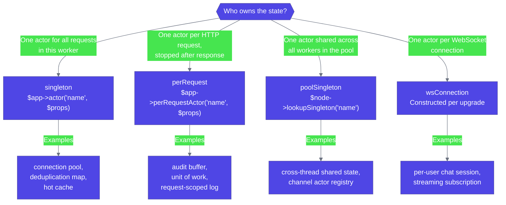

# Actors in HTTP

Nexus HTTP is designed to put actors next to your routes without extra ceremony. This page covers the integration patterns: where actors come from, how they are injected, how to await replies, and how to bridge the request/response shape onto the asynchronous actor model.

## Actor modes

Four modes determine an actor's scope relative to the HTTP server:



_Figure 1: Actor mode selection tree — pick the scope that matches the state lifetime._

## Registering actors

```php title="server.php"
// Singleton — one instance per worker (or thread)
$app->actor('orders', Props::fromFactory(fn() => new OrderActor($store)));

// Per-request — fresh instance per HTTP request, stopped at response time
$app->perRequestActor('audit', Props::fromFactory(fn() => new AuditBufferActor()));
```

Singletons are spawned at boot, ready to serve requests immediately. Per-request actors are spawned on first injection inside a request and stopped after the response is written.

## Injection

Inject the `ActorRef` directly into your handler:

```php title="src/Http/Handler/ShowOrderHandler.php"
final class ShowOrderHandler
{
    public function __construct(
        #[FromActor('orders')] private readonly ActorRef $orders,
    ) {}

    public function __invoke(ServerRequestInterface $req): ResponseInterface
    {
        $id = (string) $req->getAttribute('id');
        $this->orders->tell(new IncrementViewCount($id));
        // …
    }
}
```

`#[FromActor('name')]` matches a registered actor name. The framework resolves it at request time:

- **Singleton** → the cached `ActorRef`, allocated once at boot.
- **Per-request** → a freshly spawned actor; auto-stopped via `PerRequestActorScope::dispose()` in the router's `finally` block.

The two are interchangeable from the handler's perspective — the type is `ActorRef` either way.

## Tell vs ask

### Tell — fire-and-forget

```php title="src/Http/Handler/PlaceOrderHandler.php"
$this->orders->tell(new PlaceOrder($dto));
return Response::created();
```

The handler returns immediately. The message lands in the actor's mailbox; the actor processes it on its next turn. There is no reply and no error path — exceptions inside the actor are caught by supervision, not by the handler.

Use `tell` for:

- Write commands where the response is "accepted, processing".
- Event publishing (subscribers process asynchronously).
- Audit and instrumentation messages.
- Anything where the actor is the source of truth and the HTTP response should not wait.

### Ask — request-response with timeout

```php title="src/Http/Handler/ShowOrderHandler.php"
$order = $this->orders
    ->ask(new GetOrder($id), Duration::seconds(2))
    ->await();

return JsonResponse::ok($order->toArray());
```

`ask()` returns a `Future` immediately; `await()` suspends the fiber or coroutine until the actor sends a reply or the timeout expires. Other requests on the same thread keep running — this is cooperative suspension, not a system-thread block.

| Path | Tell or ask |
|---|---|
| Reads where the actor holds the data | `ask` |
| Reads where the actor is a cache and a miss should fall through | `ask`, with a fallback in the timeout handler |
| Writes where the client must wait for persistence to confirm | `ask` (return `201`/`202` after reply) |
| Writes where the client does not need confirmation | `tell` (return `202` immediately) |
| Fire-and-forget side effects (audit, metrics) | `tell` |

## Handling ask timeouts

`ask` raises `AskTimeoutException` if no reply arrives within the deadline. Map it globally:

```php title="server.php"
$app->onException(AskTimeoutException::class, static fn() => Response::gatewayTimeout());
```

Or catch it locally when you have a fallback:

```php title="src/Http/Handler/CachedOrderHandler.php"
try {
    $cached = $this->cache->ask(new Get($key), Duration::millis(50))->await();
    return JsonResponse::ok($cached->value);
} catch (AskTimeoutException) {
    $fresh = $this->repo->fetch($key);
    $this->cache->tell(new Set($key, $fresh));
    return JsonResponse::ok($fresh);
}
```

Pick the timeout per call. There is no global default.

## Future-returning handlers

The router supports handlers that return `Future<ResponseInterface>` directly. The dispatcher awaits the future before serialising; the handler does not block on `await`:

```php title="src/Http/Handler/ShowOrderHandler.php"
use Monadial\Nexus\Runtime\Async\Future;

public function __invoke(ServerRequestInterface $req): Future
{
    $id = (string) $req->getAttribute('id');

    return $this->orders
        ->ask(new GetOrder($id), Duration::seconds(2))
        ->map(static fn(Order $order) => JsonResponse::ok($order->toArray()));
}
```

### Combining futures

For true fan-out, where multiple actors can work in parallel:

```php title="src/Http/Handler/UserDashboardHandler.php"
public function __invoke(ServerRequestInterface $req): Future
{
    $userId = (string) $req->getAttribute('id');

    return Future::all([
        'user'   => $this->users->ask(new GetUser($userId), Duration::seconds(2)),
        'orders' => $this->orders->ask(new ListByUser($userId), Duration::seconds(2)),
    ])->map(static fn(array $parts) => JsonResponse::ok([
        'user'   => $parts['user']->toArray(),
        'orders' => array_map(fn($o) => $o->toArray(), $parts['orders']),
    ]));
}
```

`Future::all` resolves when every future resolves. If any rejects, the resulting future rejects with the first error — caught by the exception middleware like any other thrown exception.

| Style | Pick when |
|---|---|
| `$ref->ask(...)->await()` | Single-actor reads; you want `try`/`catch` semantics |
| `$ref->ask(...)->map(...)` | Composing two or more async steps; you want the chain to read top-to-bottom |
| `Future::all([...])` | True fan-out where multiple actors work in parallel |

## Per-request state

Per-request actors give you per-turn workspace without globals:

```php title="src/Http/Handler/CreateOrderHandler.php"
final class CreateOrderHandler
{
    public function __construct(
        #[FromActor('uow')]    private readonly ActorRef $uow,
        #[FromActor('orders')] private readonly ActorRef $orders,
    ) {}

    public function __invoke(ServerRequestInterface $req, #[FromBody] CreateOrderDto $dto): ResponseInterface
    {
        $this->uow->tell(new BeginTransaction());
        $orderId = $this->orders->ask(new Place($dto, $this->uow), Duration::seconds(2))->await();
        $this->uow->ask(new Commit(), Duration::seconds(2))->await();

        return JsonResponse::ok(['id' => $orderId]);
    }
}
```

The `uow` actor is spawned at the start of the request and stopped after the response — `PostStop` runs cleanly, so you can flush in-flight state to a log there. If the handler throws, the per-request actor is still stopped; the router's `finally` block guarantees disposal regardless of outcome.

## Per-request scope reuse

Multiple handlers and middleware on the same request all see the same per-request actor instance. The framework keys them by request, not by injection point:

```php title="server.php"
$app->perRequestActor('audit', Props::fromFactory(fn() => new AuditBufferActor()));
$app->middleware(AccessLogMiddleware::class);   // also injects 'audit'

// Both AccessLogMiddleware and the handler get the same AuditBufferActor
// for one request. Different requests get different instances.
```

This is what makes per-request actors useful for cross-cutting state — middleware records context, the handler adds business events, and `PostStop` flushes the merged buffer.

## Crossing worker boundaries

For multi-thread deployments, `tell` and `ask` work seamlessly across threads via the worker pool:

```php title="server.php"
$ordersRef = $node->lookupSingleton('orders');   // shared singleton on thread N
$ordersRef->tell(new PlaceOrder($dto));
```

The message is delivered to whichever thread owns the actor instance via `Swoole\Thread\Queue` — no serialisation. See [Scaling](../scaling/overview.md) for the pool-singleton pattern.

In worker-mode Swoole, every worker is isolated — actors are per-worker and there is no cross-worker dispatch. Use thread mode when you need shared state.

## See also

- [Handlers](./handlers.md) — `#[FromActor]` and the parameter resolver pipeline.
- [Servers](./servers.md) — worker mode vs thread mode and the `WorkerNode` API.
- [Ask pattern](../core-concepts/ask-pattern.md) — the underlying `Future` and reply mechanics.
