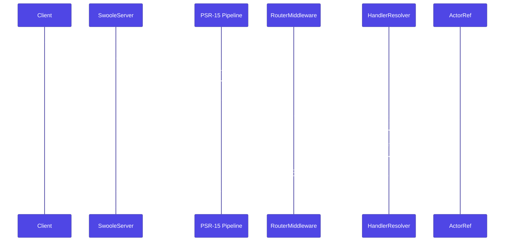

# HTTP Overview

The Nexus HTTP stack puts actors next to your routes — same PSR-7/15 primitives you already know, extended with actor injection, WebSocket channel actors, and two Swoole adapters that share one runtime-agnostic application model.

## Request lifecycle

Every inbound request travels through a fixed sequence: middleware chain, router, handler construction, parameter resolution, and response serialisation.



_Figure 1: The request lifecycle from client to actor and back._

## The stack

Four packages collaborate. Depend on whichever combination matches your target runtime.

```
nexus-http               (primitives)
  Routing, dispatcher, middleware, responses, attributes,
  error modes, route cache. PSR-7/15. Runtime-agnostic.

nexus-http-ws            (builder DSL + WebSocket)
  HttpApplication, WsApplication, CompiledApplication,
  WebSocketHandler, WebSocketChannelActor,
  WebSocketContext, WebSocketFrame.

nexus-http-server-swoole          nexus-http-server-swoole-threads
  Worker-mode runner.               Thread-mode runner.
  Per-worker ActorSystem.           Channel actors. ZTS
  No ZTS requirement.               + Swoole 6 required.
```

The split mirrors the rest of Nexus: a foundation package that knows nothing about transports, a runtime-agnostic builder layer, and thin runtime-specific adapters.

## What you write

A typical application boots in one expression:

```php title="server.php"
<?php

declare(strict_types=1);

use Monadial\Nexus\Core\Actor\ActorSystem;
use Monadial\Nexus\Http\Response\JsonResponse;
use Monadial\Nexus\Http\Server\Swoole\Threads\Server\{SwooleThreadConfig, SwooleThreadServer};
use Monadial\Nexus\Http\Ws\{CompiledApplication, WsApplication};
use Monadial\Nexus\WorkerPool\WorkerNode;

SwooleThreadServer::run(
    SwooleThreadConfig::bind('0.0.0.0', 8080)->threads(8),
    static function (ActorSystem $system, WorkerNode $node): CompiledApplication {
        return WsApplication::create($system)
            ->get('/health', static fn() => JsonResponse::ok(['ok' => true]))
            ->get('/orders/{id}', ShowOrderHandler::class)
            ->ws('/ws/echo', EchoHandler::class)
            ->compile();
    },
);
```

Three layers in one call:

1. **Adapter** (`SwooleThreadServer::run`) — runtime-specific entry point.
2. **Builder DSL** (`WsApplication::create($system)->...->compile()`) — runtime-agnostic routes, middleware, handlers.
3. **Compiled application** (`CompiledApplication`) — immutable bundle of routes and behaviour. The runner consumes this and never touches the builder again.

## Design principles

### Runtime-agnostic application code

`HttpApplication` and `WsApplication` know nothing about Swoole. They produce a `CompiledApplication` — an immutable artefact any adapter can serve. Swap `SwooleWorkerServer` for `SwooleThreadServer` without touching a single route.

### PSR-everything

- **PSR-7** for HTTP messages.
- **PSR-15** for middleware and the request handler chain.
- **PSR-11** for dependency injection into handler constructors.
- **PSR-14** for system events.
- **PSR-3** for logging.
- **PSR-16** for the route cache.

### Attribute-driven dependency injection

Handlers declare dependencies via constructor parameters annotated with `#[FromActor]`, `#[FromService]`, `#[FromBody]`, or `#[FromContext]`. The framework resolves them at request time from the actor registry, the PSR-11 container, the request body, or the WebSocket context.

```php title="src/Http/Handler/CreateOrderHandler.php"
final class CreateOrderHandler
{
    public function __construct(
        #[FromActor('orders')] private readonly ActorRef $orders,
        #[FromService(LoggerInterface::class)] private readonly LoggerInterface $log,
    ) {}

    public function __invoke(ServerRequestInterface $req, #[FromBody] CreateOrderDto $dto): ResponseInterface
    {
        // actors, services, and body all resolved before __invoke fires
    }
}
```

## Where to go next

| You want to… | Read |
|---|---|
| Boot a server in 20 lines | [Getting Started](./getting-started.md) |
| Understand path matching, groups, attributes | [Routing](./routing.md) |
| Inject actors into handlers; per-request scopes | [Handlers](./handlers.md) |
| Compose PSR-15 middleware | [Middleware](./middleware.md) |
| Return JSON, streams, redirects | [Responses](./responses.md) |
| Translate domain exceptions to HTTP | [Error Handling](./error-handling.md) |
| Add WebSocket routes and broadcast actors | [WebSockets](./websockets.md) |
| Bridge HTTP requests to actor systems | [Actors in HTTP](./actors-in-http.md) |
| Pick worker mode vs thread mode | [Servers](./servers.md) |

Package reference pages: [`nexus-http`](../packages/http.md), [`nexus-http-ws`](../packages/http-ws.md), [`nexus-http-server-swoole`](../packages/http-server-swoole.md), [`nexus-http-server-swoole-threads`](../packages/http-server-swoole-threads.md).
