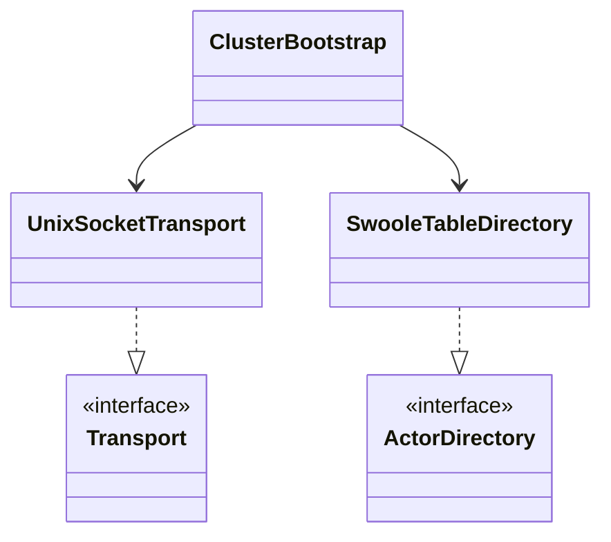

# nexus-cluster-swoole

Swoole-specific implementations for `nexus-cluster` interfaces. Provides
Unix domain socket transport, shared-memory actor directory, and the
`ClusterBootstrap` entry point.

**Composer:** `nexus-actors/cluster-swoole`

**Namespace:** `Monadial\Nexus\Cluster\Swoole\`

<details>
<summary>View class diagram</summary>



</details>

**Requires:** Swoole PHP extension 6.0+

## Classes

### ClusterBootstrap

Entry point for starting a multi-process cluster. Creates a
`Swoole\Process\Pool` and manages the lifecycle of all worker processes.

```php
final class ClusterBootstrap
{
    public static function create(ClusterConfig $config): self;
    public function onWorkerStart(callable $callback): self;
    public function withSerializer(ClusterSerializer $serializer): self;
    public function run(): void;
}
```

Usage:

```php
ClusterBootstrap::create(ClusterConfig::withWorkers(8))
    ->onWorkerStart(function (ClusterNode $node): void {
        $node->spawn(Props::fromBehavior($behavior), 'my-actor');
    })
    ->run();
```

`run()` blocks until the process pool exits. Each worker process runs
independently with its own `SwooleRuntime`, `ActorSystem`, `UnixSocketTransport`,
and `ClusterNode`.

### UnixSocketTransport

Implements `Monadial\Nexus\Cluster\Transport\Transport`.

AF_UNIX domain socket transport for inter-worker IPC. Each worker creates a
server socket at `{socketDir}/worker-{id}.sock` and connects as a client to
all other workers.

Wire format: `[4 bytes: payload length (network byte order)][N bytes: payload]`

All reads and writes are non-blocking via Swoole coroutines.

```php
final class UnixSocketTransport implements Transport
{
    public function __construct(int $workerId, int $workerCount, string $socketDir);
    public function bind(): void;
    public function connectToPeers(): void;
    public function send(int $targetWorker, string $data): void;
    public function listen(callable $onMessage): void;
    public function close(): void;
}
```

Lifecycle: `bind()` creates the server socket and starts an accept coroutine.
After all workers bind, `connectToPeers()` establishes client connections to
every other worker. `listen()` registers the message callback. `close()` shuts
down all connections and removes the socket file.

### SwooleTableDirectory

Implements `Monadial\Nexus\Cluster\Directory\ActorDirectory`.

Shared-memory actor directory backed by `Swoole\Table`. The table is created
in the master process before forking and is shared across all worker processes
via shared memory -- no IPC overhead for directory lookups.

```php
final readonly class SwooleTableDirectory implements ActorDirectory
{
    public static function createTable(int $size): Table;
    public function __construct(Table $table);
    public function register(string $path, int $workerId): void;
    public function lookup(string $path): ?int;
    public function remove(string $path): void;
    public function has(string $path): bool;
}
```

`createTable()` creates a `Swoole\Table` with a single `worker_id` column.
Pass the same `Table` instance to each worker's `SwooleTableDirectory`.

### CompactClusterSerializer

Implements `Monadial\Nexus\Cluster\Serialization\ClusterSerializer`.

Compact binary format that sends actor paths as raw UTF-8 strings and only
calls PHP `serialize()` on the message object. ~6x smaller wire format than
full PHP serialization. Benchmarked at 1.13M serialize+deserialize cycles/sec.

This is the default serializer used by `ClusterBootstrap`.

### PhpNativeClusterSerializer

Implements `Monadial\Nexus\Cluster\Serialization\ClusterSerializer`.

Uses PHP's native `serialize()` / `unserialize()` on the full `Envelope`.
Available as an alternative when full object graph serialization is needed.

## Static analysis

See [nexus-psalm](./psalm.md) for Psalm rules that apply to clustered actors:

- **NonSerializableClusterMessage** -- Catches messages missing `#[MessageType]`
  before they cause runtime serialization failures.
- **NonReadonlyMessage** -- Ensures all actor messages are immutable.
- **BlockingCallInHandler** -- Flags blocking calls (`sleep`, `file_get_contents`,
  etc.) that would starve the Swoole coroutine runtime.
