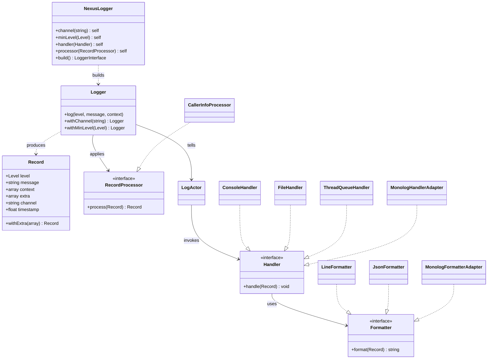

# nexus-logger

Async actor-backed PSR-3 logger. Calls return as soon as the record is
enqueued — formatting and I/O happen on a dedicated LogActor turn, off the
request path. Supports MDC (mapped diagnostic context), record processors
captured on the caller's thread, and full Monolog interop for handlers and
formatters.

**Composer:** `nexus-actors/logger`

**Namespace:** `Monadial\Nexus\Logger\`

<details>
<summary>View class diagram</summary>



</details>

## Architecture

A log call follows this path:

```
$logger->info(...)
   │  (caller's thread)
   ├── Level filter (cheap int compare; below-threshold calls cost ~nothing)
   ├── Mdc::getAll()           — ambient metadata into Record.extra
   ├── Record::create()        — PSR-3 placeholder interpolation
   ├── RecordProcessor chain   — runs synchronously here (call-site capture)
   └── ActorRef::tell(Record)  — enqueue and return
   ─────────────────────────────────────────
        ▼  (LogActor turn, no shared state)
        Handler::handle(Record) → Formatter::format(Record) → I/O
```

The split is deliberate: anything that needs **caller-side state**
(`debug_backtrace()`, coroutine context, MDC snapshot) must run before
`tell()`, because by the time the LogActor dequeues, the calling stack is
gone. Anything that does **I/O** belongs on the actor turn so it stays off
the request path.

## Quick Start

```php
use Monadial\Nexus\Logger\Handler\ConsoleHandler;
use Monadial\Nexus\Logger\Formatter\LineFormatter;
use Monadial\Nexus\Logger\Level;
use Monadial\Nexus\Logger\NexusLogger;

$logger = NexusLogger::create($system, 'app')
    ->minLevel(Level::Debug)
    ->handler(new ConsoleHandler(STDOUT, new LineFormatter()))
    ->build();

$logger->info('user {name} logged in', ['name' => 'tomas', 'userId' => 42]);
// → [2026-06-14T13:50:01.234Z] app.INFO: user tomas logged in {"userId":42}
```

`NexusLogger` is a fluent builder that spawns a `LogActor` on the given
`ActorSystem` and returns a PSR-3 `LoggerInterface`.

## Record

Immutable value object carried from the façade through the actor's mailbox
to the handlers. Two metadata buckets, Monolog/SLF4J-style:

- **`context`** — per-call arguments the caller passed in (PSR-3 placeholder
  source).
- **`extra`** — ambient process/thread/request metadata (populated from MDC
  and processors).

Placeholder interpolation happens at construction so the actor never
re-renders the message. Consumed keys are stripped from `context`; everything
else stays for handlers to render.

```php
$record = Record::create(
    Level::Info,
    'user {name} logged in',
    ['name' => 'tomas', 'userId' => 42],
    'app',
);
// $record->message  → 'user tomas logged in'
// $record->context  → ['userId' => 42]   ('name' consumed)
// $record->extra    → []
```

## MDC (Mapped Diagnostic Context)

`Mdc` provides Logback/SLF4J-style ambient metadata: write once, every
subsequent log call on that thread/coroutine picks it up. Two tiers:

- **`Mdc::putStatic(key, value)`** — thread-wide, survives across coroutines.
  Set once at thread boot (host, pid, threadId).
- **`Mdc::put(key, value)`** — coroutine-scoped (Swoole) or fiber-scoped
  (Fiber). Set per-request (requestId, route, userId).

```php
// At thread boot:
Mdc::putStatic('host', gethostname());
Mdc::putStatic('threadId', $node->workerId());

// Inside a route handler:
Mdc::put('requestId', bin2hex(random_bytes(4)));
Mdc::put('route', 'GET /hello/{name}');
$logger->info('greeting {name}', ['name' => $name]);
// → extra contains: host, threadId, requestId, route
```

MDC values land in `Record.extra`, never in `Record.context` — so they don't
collide with caller-supplied placeholder data.

## Handlers

Run on the LogActor turn. Multiple handlers run in registration order; an
exception in one handler is caught and logged to `STDERR` so it doesn't
block the rest.

### ConsoleHandler

Writes to a stream resource (`STDOUT`, `STDERR`, or any seekable stream).

```php
$logger->handler(new ConsoleHandler(STDOUT, new LineFormatter()));
```

### FileHandler

Appends to a file. Opens the descriptor once at construction; no per-write
open/close.

```php
$logger->handler(new FileHandler('/var/log/app.log', new JsonFormatter()));
```

### ThreadQueueHandler (Swoole)

Pushes the formatted string onto a `Swoole\Thread\Queue`, which a dedicated
writer thread drains and writes to a file. Single writer, single fd, no
locks. Use when you have multiple worker threads and want a single sink.

```php
use Monadial\Nexus\Logger\Swoole\ThreadQueueHandler;
use Swoole\Thread\Queue;

$logQueue = new Queue();
// Spawn a writer thread that drains $logQueue → file
$writer = new Swoole\Thread(__DIR__ . '/logger-writer.php', $logQueue, $logFile, $shutdown);

// In each worker:
$logger->handler(new ThreadQueueHandler($logQueue, new LineFormatter()));
```

See `examples/logger-writer.php` for the writer-thread script.

### MonologHandlerAdapter

Drops any Monolog `HandlerInterface` into the nexus pipeline. Soft-depends
on `monolog/monolog ^3` — install separately when used.

```php
use Monadial\Nexus\Logger\Monolog\MonologHandlerAdapter;
use Monolog\Handler\RotatingFileHandler;

$logger->handler(new MonologHandlerAdapter(
    new RotatingFileHandler('/var/log/app.log', 7),
));
```

Because we bypass `Monolog\Logger`, Monolog's stock processors
(`HostnameProcessor`, `ProcessIdProcessor`, `MemoryUsageProcessor`,
`GitProcessor`, …) don't run automatically. Pass them as a second argument:

```php
use Monolog\Processor\HostnameProcessor;
use Monolog\Processor\MemoryUsageProcessor;

$logger->handler(new MonologHandlerAdapter(
    new RotatingFileHandler('/var/log/app.log', 7),
    [new HostnameProcessor(), new MemoryUsageProcessor()],
));
```

## Formatters

### LineFormatter (native)

Single-line Monolog-style output:

```
[2026-06-14T13:50:01.234Z] app.INFO: user logged in {"userId":42,"requestId":"abc"}
```

Plain string interpolation + JSON tail for context+extra. Fixed layout.

### JsonFormatter (native)

One JSON object per record:

```json
{"timestamp":"2026-06-14T13:50:01.234Z","channel":"app","level":"INFO","message":"user logged in","context":{"userId":42},"extra":{"requestId":"abc"}}
```

### MonologFormatterAdapter

Drops any Monolog `FormatterInterface` into the nexus pipeline. Gives you
access to `LineFormatter`'s `%token%` templating, `JsonFormatter`,
`GelfMessageFormatter`, `LogstashFormatter`, `ElasticsearchFormatter`, etc.

```php
use Monadial\Nexus\Logger\Monolog\MonologFormatterAdapter;
use Monolog\Formatter\LineFormatter as MonologLineFormatter;

$template = "[%datetime%] thread-%extra.threadId%@%extra.host% "
    . "%channel%.%level_name% %extra.class%::%extra.function%:%extra.line% "
    . "— %message% %context%\n";

$logger->handler(new ThreadQueueHandler(
    $logQueue,
    new MonologFormatterAdapter(new MonologLineFormatter($template, 'Y-m-d H:i:s.v', true, true)),
));
```

## Processors

`RecordProcessor` runs **synchronously on the caller's thread**, between
record construction and the actor enqueue. Use it for anything that needs
the live call stack or coroutine context.

```php
interface RecordProcessor
{
    public function process(Record $record): Record;
}
```

### CallerInfoProcessor

Walks `debug_backtrace()`, skips PSR-3 and nexus-logger infrastructure
frames, and writes `class`/`function`/`file`/`line` of the actual
`$logger->...()` call site into `Record.extra`. Mirrors Monolog's
`IntrospectionProcessor` semantics: `class`/`function` come from the user
frame; `file`/`line` from the previous frame (the AbstractLogger call site).

```php
use Monadial\Nexus\Logger\Processor\CallerInfoProcessor;

$logger = NexusLogger::create($system, 'app')
    ->processor(new CallerInfoProcessor())
    ->handler(...)
    ->build();
```

#### Level gate

`debug_backtrace()` shows up in **request latency** (it runs on your
thread). For high-volume info logs you usually don't need the call site;
for debug/error/critical you do. Use the static factory to restrict:

```php
$logger->processor(
    CallerInfoProcessor::onlyFor(Level::Debug, Level::Error, Level::Critical),
);
```

Info-level records skip the backtrace walk entirely.

## Performance

Measured on a Swoole 8-thread server in Docker (1 vCPU container, mid-2020
M-series host) with `wrk -t8 -c100 -d15s` on `GET /hello/load`:

| Configuration | Req/s | Avg latency | Overhead |
|---|---|---|---|
| `NullLogger` (no logging) | **84,767** | 34 ms | — |
| Queue + native `LineFormatter`, gated processor | **82,073** | 36 ms | **−3.2% RPS** |
| Queue + Monolog `LineFormatter`, gated processor | 78,560 | 34 ms | −7.3% RPS |
| Queue + Monolog `LineFormatter`, always-on processor | 78,836 | **48 ms** | −7.0% RPS, **+41% latency** |

### Where the cost lives

- **Native vs Monolog formatter (~4% RPS):** Monolog `LineFormatter` does
  regex token expansion (`%datetime%`, `%channel%`, `%extra.*%`). The
  native `LineFormatter` is `sprintf` + a single `json_encode` for the
  context+extra tail. Same wire shape, half the formatter cost.
- **Always-on CallerInfoProcessor (~14 ms avg latency):** `debug_backtrace()`
  is the only non-trivial work that runs on the request thread. Level gate
  this to debug/error and the latency disappears for the hot info path.
- **Remaining ~3% baseline overhead:** Monolog adapter or not, every record
  pays for `Record::create()` placeholder interpolation, MDC snapshot, and
  the `Swoole\Thread\Queue::push()`.

### When to choose which

| Need | Recommendation |
|---|---|
| Maximum throughput, fixed output layout | Native `LineFormatter` + gated processor |
| `%token%` templates, custom layouts | `MonologFormatterAdapter` + `MonologLineFormatter` |
| Existing Monolog handlers (Sentry, Loggly, GELF, …) | `MonologHandlerAdapter` wraps anything |
| Capture call site on errors only | `CallerInfoProcessor::onlyFor(Level::Error, Level::Critical)` |

We keep both formatters supported. The performance gap is real but small —
pick based on whether you need Monolog's template DSL or formatter
ecosystem. The hot path (PSR-3 façade → Record → actor enqueue) is
identical either way.

## Levels

`Level` is an enum aligned with PSR-3 `LogLevel`:

| `Level` case | PSR-3 string |
|---|---|
| `Emergency` | `emergency` |
| `Alert` | `alert` |
| `Critical` | `critical` |
| `Error` | `error` |
| `Warning` | `warning` |
| `Notice` | `notice` |
| `Info` | `info` |
| `Debug` | `debug` |

`Level::isAtLeast(Level $threshold)` does the cheap int compare used by
`Logger::log()` to drop below-threshold calls before any allocation.

## Builder API

```php
NexusLogger::create($system, channel: 'app')
    ->channel('http')                                      // rename
    ->minLevel(Level::Info)                                // filter floor
    ->processor(CallerInfoProcessor::onlyFor(Level::Error))
    ->handler(new ConsoleHandler(STDOUT, new LineFormatter()))
    ->handler(new FileHandler('/var/log/app.log', new JsonFormatter()))
    ->build();   // returns PSR-3 LoggerInterface
```

`Logger::withChannel(string)` and `Logger::withMinLevel(Level)` fork a
new façade sharing the same sink and processors — useful for per-subsystem
tagging without spawning a second LogActor:

```php
$httpLogger = $logger->withChannel('http');
$dbLogger = $logger->withChannel('db')->withMinLevel(Level::Warning);
```

## Full Production Example

Eight Swoole worker threads, one shared `Swoole\Thread\Queue`, one
dedicated writer thread, MDC populated at boot and per-request,
level-gated `CallerInfoProcessor`, native `LineFormatter`. Matches the
configuration measured in [Performance](#performance) above.

```php
use Monadial\Nexus\Core\Actor\ActorSystem;
use Monadial\Nexus\Http\Server\Swoole\Threads\Server\{SwooleThreadConfig, SwooleThreadServer};
use Monadial\Nexus\Http\Ws\{CompiledApplication, WsApplication};
use Monadial\Nexus\Logger\Formatter\LineFormatter;
use Monadial\Nexus\Logger\{Level, Mdc, NexusLogger};
use Monadial\Nexus\Logger\Processor\CallerInfoProcessor;
use Monadial\Nexus\Logger\Swoole\ThreadQueueHandler;
use Monadial\Nexus\Runtime\Duration;
use Monadial\Nexus\WorkerPool\WorkerNode;
use Swoole\Thread;
use Swoole\Thread\{Atomic, Queue};

$logQueue = new Queue();
$shutdown = new Atomic(0);

$writer = new Thread(
    __DIR__ . '/logger-writer.php',
    $logQueue,
    '/var/log/app.log',
    $shutdown,
);

SwooleThreadServer::run(
    SwooleThreadConfig::bind('0.0.0.0', 8080)
        ->threads(8)
        ->withLogQueue($logQueue)
        ->shutdownTimeout(Duration::seconds(5)),
    static function (ActorSystem $system, WorkerNode $node) use ($logQueue): CompiledApplication {
        // Static MDC: written once per thread, attached to every record.
        Mdc::putStatic('host', gethostname() ?: 'unknown');
        Mdc::putStatic('threadId', $node->workerId());
        Mdc::putStatic('service', 'orders-api');

        $logger = NexusLogger::create($system, "thread-{$node->workerId()}")
            ->minLevel(Level::Info)
            ->processor(CallerInfoProcessor::onlyFor(Level::Error, Level::Critical))
            ->handler(new ThreadQueueHandler($logQueue, new LineFormatter()))
            ->build();

        return WsApplication::create($system)
            ->withLogger($logger)
            ->get('/orders/{id}', static function ($req) use ($logger) {
                // Coroutine-local MDC: scoped to this request.
                Mdc::put('requestId', bin2hex(random_bytes(4)));
                Mdc::put('route', 'GET /orders/{id}');
                $logger->info('fetching order {id}', ['id' => $req->getAttribute('id')]);

                return JsonResponse::ok(['id' => $req->getAttribute('id')]);
            })
            ->compile();
    },
);

$shutdown->set(1);
$writer->join();
```

The writer-thread script (`logger-writer.php`) and the actual annotated
8-thread server live at `examples/logger-writer.php` and
`examples/thread-server-q.php` in the repository.

## Cookbook

### Multi-handler routing by level

Errors go to a file, everything goes to stdout:

```php
$logger = NexusLogger::create($system, 'app')
    ->handler(new ConsoleHandler(STDOUT, new LineFormatter()))
    ->handler(
        (new FileHandler('/var/log/errors.log', new JsonFormatter()))
            ->withMinLevel(Level::Error),
    )
    ->build();
```

### Per-subsystem channels sharing one sink

```php
$root = NexusLogger::create($system, 'app')
    ->handler(new ConsoleHandler(STDOUT, new LineFormatter()))
    ->build();

$httpLog = $root->withChannel('http');
$dbLog = $root->withChannel('db')->withMinLevel(Level::Warning);
$workerLog = $root->withChannel('worker');
```

All three share the same `LogActor` (one ordered queue, one set of
handlers) but produce records tagged with different channels.

### Monolog handler for an external sink

Reuse the Sentry / Loggly / Bugsnag / GELF handler you already have:

```php
use Monadial\Nexus\Logger\Monolog\MonologHandlerAdapter;
use Monolog\Handler\StreamHandler;
use Monolog\Processor\HostnameProcessor;
use Monolog\Processor\ProcessIdProcessor;

$sentryHandler = (new MyMonologSentryHandler(...))->setLevel(Logger::ERROR);

$logger = NexusLogger::create($system, 'app')
    ->handler(new ConsoleHandler(STDOUT, new LineFormatter()))
    ->handler(new MonologHandlerAdapter(
        $sentryHandler,
        [new HostnameProcessor(), new ProcessIdProcessor()],
    ))
    ->build();
```

The second `MonologHandlerAdapter` argument is a list of Monolog
processors that run on the converted `LogRecord` before the wrapped
handler — needed because we bypass Monolog's own `Logger` class.

### Templated console output

Mix nexus runtime metadata with Monolog's `%token%` formatter:

```php
use Monadial\Nexus\Logger\Monolog\MonologFormatterAdapter;
use Monolog\Formatter\LineFormatter as MonologLineFormatter;

$template = "[%datetime%] thread-%extra.threadId%@%extra.host% "
    . "%channel%.%level_name% %extra.class%::%extra.function%:%extra.line% "
    . "— %message% %context%\n";

$logger = NexusLogger::create($system, 'app')
    ->processor(CallerInfoProcessor::onlyFor(Level::Debug, Level::Error))
    ->handler(new ConsoleHandler(
        STDOUT,
        new MonologFormatterAdapter(new MonologLineFormatter($template, 'Y-m-d H:i:s.v', true, true)),
    ))
    ->build();
```

Renders like:
```
[2026-06-14 14:21:05.206] thread-3@my-host app.INFO Acme\Orders\Handler::__invoke:42 — greeting tomas {"requestId":"abc"}
```
