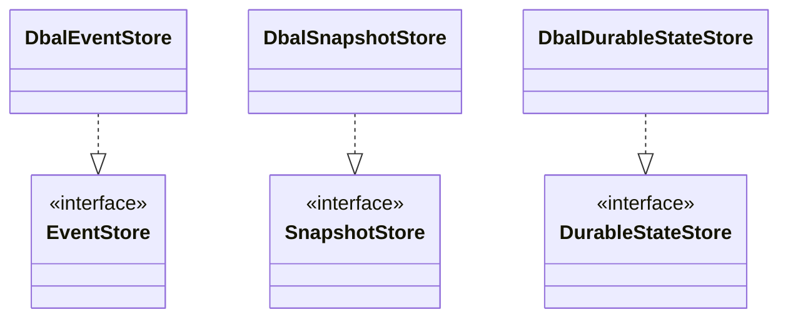

# nexus-persistence-dbal

Doctrine DBAL adapter for Nexus persistence -- SQL-backed stores using
parameterized queries. Supports any database supported by DBAL (SQLite,
PostgreSQL, MySQL, etc.).

**Composer:** `nexus-actors/persistence-dbal`

**Namespace:** `Monadial\Nexus\Persistence\Dbal\`

<details>
<summary>View class diagram</summary>



</details>

**Dependencies:** `doctrine/dbal ^4.0`

## Classes

| Class | Description |
|---|---|
| `DbalEventStore` | `EventStore` implementation using DBAL. Constructor: `Connection`, `MessageSerializer` (default: `PhpNativeSerializer`). Throws `ConcurrentModificationException` on duplicate sequence numbers. Stores `writer_id` (ULID) per event. |
| `DbalSnapshotStore` | `SnapshotStore` implementation using DBAL. Constructor: `Connection`, `MessageSerializer` (default: `PhpNativeSerializer`). Stores `writer_id` (ULID) per snapshot. |
| `DbalDurableStateStore` | `DurableStateStore` implementation using DBAL. Constructor: `Connection`, `MessageSerializer` (default: `PhpNativeSerializer`). Uses optimistic locking via `WHERE version = ?` on updates. Stores `writer_id` (ULID). |
| `PersistenceSchemaManager` | Creates and drops database tables. Constructor: `Connection`. Methods: `createSchema()`, `dropSchema()`. Lives in `Schema\` sub-namespace. |

## Table schema

The `PersistenceSchemaManager` creates the following tables:

### nexus_event_journal

| Column | Type | Notes |
|---|---|---|
| `persistence_id` | `VARCHAR(255)` | Primary key (composite) |
| `sequence_nr` | `BIGINT` | Primary key (composite) |
| `event_type` | `VARCHAR(255)` | |
| `event_data` | `TEXT` | |
| `metadata` | `TEXT` | Nullable |
| `writer_id` | `VARCHAR(26)` | ULID of the writing ActorSystem |
| `timestamp` | `DATETIME` | Immutable |

Index: `idx_event_journal_pid` on `persistence_id`.

### nexus_snapshot_store

| Column | Type | Notes |
|---|---|---|
| `persistence_id` | `VARCHAR(255)` | Primary key (composite) |
| `sequence_nr` | `BIGINT` | Primary key (composite) |
| `state_type` | `VARCHAR(255)` | |
| `state_data` | `TEXT` | |
| `writer_id` | `VARCHAR(26)` | ULID of the writing ActorSystem |
| `timestamp` | `DATETIME` | Immutable |

### nexus_durable_state

| Column | Type | Notes |
|---|---|---|
| `persistence_id` | `VARCHAR(255)` | Primary key |
| `version` | `BIGINT` | Optimistic lock version |
| `state_type` | `VARCHAR(255)` | |
| `state_data` | `TEXT` | |
| `writer_id` | `VARCHAR(26)` | ULID of the writing ActorSystem |
| `timestamp` | `DATETIME` | Immutable |

## Usage

```php
use Doctrine\DBAL\DriverManager;
use Monadial\Nexus\Persistence\Dbal\DbalEventStore;
use Monadial\Nexus\Persistence\Dbal\DbalSnapshotStore;
use Monadial\Nexus\Persistence\Dbal\DbalDurableStateStore;
use Monadial\Nexus\Persistence\Dbal\Schema\PersistenceSchemaManager;

$connection = DriverManager::getConnection(['driver' => 'pdo_sqlite', 'path' => 'nexus.db']);

// Create tables (idempotent -- skips existing tables)
(new PersistenceSchemaManager($connection))->createSchema();

$eventStore = new DbalEventStore($connection);
$snapshotStore = new DbalSnapshotStore($connection);
$durableStateStore = new DbalDurableStateStore($connection);

// With a custom serializer
use Monadial\Nexus\Serialization\MessageSerializer;

$eventStore = new DbalEventStore($connection, $customSerializer);
$durableStateStore = new DbalDurableStateStore($connection, $customSerializer);
```
