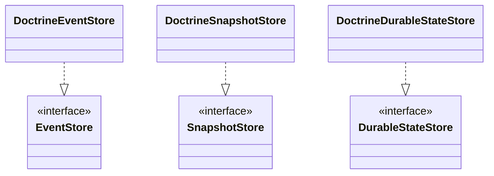

# nexus-persistence-doctrine

Doctrine ORM adapter for Nexus persistence -- entity-based stores that use
`EntityManager` for all database operations. Shares the same table schema as
`nexus-persistence-dbal`.

**Composer:** `nexus-actors/persistence-doctrine`

**Namespace:** `Monadial\Nexus\Persistence\Doctrine\`

<details>
<summary>View class diagram</summary>



</details>

**Dependencies:** `doctrine/orm ^3.0`

## Store classes

| Class | Description |
|---|---|
| `DoctrineEventStore` | `EventStore` implementation using `EntityManagerInterface`. Constructor: `EntityManagerInterface`, `MessageSerializer` (default: `PhpNativeSerializer`). Throws `ConcurrentModificationException` on duplicate sequence numbers. Stores `writer_id` (ULID) per event. |
| `DoctrineSnapshotStore` | `SnapshotStore` implementation using `EntityManagerInterface`. Constructor: `EntityManagerInterface`, `MessageSerializer` (default: `PhpNativeSerializer`). Stores `writer_id` (ULID) per snapshot. |
| `DoctrineDurableStateStore` | `DurableStateStore` implementation using `EntityManagerInterface`. Constructor: `EntityManagerInterface`, `MessageSerializer` (default: `PhpNativeSerializer`). Uses Doctrine's `#[ORM\Version]` for optimistic locking. Stores `writer_id` (ULID). |

## ORM entities

`Monadial\Nexus\Persistence\Doctrine\Entity\`

| Class | Description |
|---|---|
| `EventEntry` | ORM entity mapped to `nexus_event_journal`. Properties: `persistenceId`, `sequenceNr`, `eventType`, `eventData`, `metadata`, `writerId`, `timestamp`. |
| `SnapshotEntry` | ORM entity mapped to `nexus_snapshot_store`. Properties: `persistenceId`, `sequenceNr`, `stateType`, `stateData`, `writerId`, `timestamp`. |
| `DurableStateEntry` | ORM entity mapped to `nexus_durable_state`. Properties: `persistenceId`, `version` (with `#[ORM\Version]`), `stateType`, `stateData`, `writerId`, `timestamp`. |

## Usage

```php
use Doctrine\DBAL\DriverManager;
use Doctrine\ORM\EntityManager;
use Doctrine\ORM\ORMSetup;
use Monadial\Nexus\Persistence\Doctrine\DoctrineEventStore;
use Monadial\Nexus\Persistence\Doctrine\DoctrineSnapshotStore;
use Monadial\Nexus\Persistence\Doctrine\DoctrineDurableStateStore;

$config = ORMSetup::createAttributeMetadataConfiguration(
    paths: [__DIR__ . '/vendor/nexus-actors/persistence-doctrine/src/Entity'],
    isDevMode: true,
);

$connection = DriverManager::getConnection(['driver' => 'pdo_sqlite', 'path' => 'nexus.db']);
$em = new EntityManager($connection, $config);

$eventStore = new DoctrineEventStore($em);
$snapshotStore = new DoctrineSnapshotStore($em);
$durableStateStore = new DoctrineDurableStateStore($em);

// With a custom serializer
use Monadial\Nexus\Serialization\MessageSerializer;

$eventStore = new DoctrineEventStore($em, $customSerializer);
$durableStateStore = new DoctrineDurableStateStore($em, $customSerializer);

```
