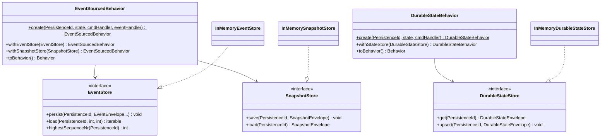

# nexus-persistence

Core persistence abstractions for Nexus actors -- event sourcing, durable state,
effects, and in-memory stores for testing. Defines the interfaces that backend
packages (`nexus-persistence-dbal`, `nexus-persistence-doctrine`) implement.

**Composer:** `nexus-actors/persistence`

View class diagram

## Root namespace

`Monadial\Nexus\Persistence\`

| Class | Description |
|---|---|
| `PersistenceId` | Value object identifying a persistent entity. Factory: `of(string $entityType, string $entityId)`, `fromString(string)`. Properties: `entityType`, `entityId`. Methods: `toString()`, `equals()`. Implements `Stringable`. |

## EventSourced namespace

`Monadial\Nexus\Persistence\EventSourced\`

| Class | Description |
|---|---|
| `EventSourcedBehavior` | Functional builder for event-sourced actors. `create(PersistenceId, object, Closure, Closure)` &rarr; `withEventStore()` &rarr; `withSnapshotStore()` &rarr; `withSnapshotStrategy()` &rarr; `withRetention()` &rarr; `withWriterId()` &rarr; `withReplayFilter()` &rarr; `toBehavior()`. |
| `AbstractEventSourcedActor` | Class-based API. Abstract methods: `persistenceId()`, `emptyState()`, `handleCommand()`, `applyEvent()`. Methods: `withSnapshotStore()`, `withSnapshotStrategy()`, `withRetention()`, `withWriterId()`, `withReplayFilter()`, `toBehavior()`, `toProps()`. |
| `PersistenceEngine` | Internal engine wrapping user behaviors with recovery and persistence. Users do not call this directly. |
| `Effect` | Immutable effect type. Factories: `persist(object...)`, `none()`, `unhandled()`, `stash()`, `stop()`, `reply(ActorRef, object)`. Chaining: `thenReply(ActorRef, Closure)`, `thenRun(Closure)`. |
| `EffectType` | Enum: `Persist`, `None`, `Unhandled`, `Stash`, `Stop`, `Reply`. |
| `SnapshotStrategy` | Snapshot trigger configuration. Factories: `everyN(int)`, `never()`, `predicate(Closure)`. Method: `shouldSnapshot(object, object, int): bool`. |
| `RetentionPolicy` | Retention configuration. Factories: `none()`, `snapshotAndEvents(int, bool)`. Properties: `keepSnapshots`, `deleteEventsToSnapshot`. |

## Event namespace

`Monadial\Nexus\Persistence\Event\`

| Class / Interface | Description |
|---|---|
| `EventStore` | Interface: `persist(PersistenceId, EventEnvelope...)`, `load(PersistenceId, int, int): iterable`, `deleteUpTo(PersistenceId, int)`, `highestSequenceNr(PersistenceId): int`. |
| `EventEnvelope` | Readonly wrapper. Properties: `persistenceId`, `sequenceNr`, `event`, `eventType`, `timestamp`, `writerId` (Ulid), `metadata`. Method: `withMetadata(array)`. |
| `InMemoryEventStore` | In-memory `EventStore` implementation for testing. |

## Snapshot namespace

`Monadial\Nexus\Persistence\Snapshot\`

| Class / Interface | Description |
|---|---|
| `SnapshotStore` | Interface: `save(PersistenceId, SnapshotEnvelope)`, `load(PersistenceId): ?SnapshotEnvelope`, `delete(PersistenceId, int)`. |
| `SnapshotEnvelope` | Readonly wrapper. Properties: `persistenceId`, `sequenceNr`, `state`, `stateType`, `timestamp`, `writerId` (Ulid). |
| `InMemorySnapshotStore` | In-memory `SnapshotStore` implementation for testing. |

## State namespace

`Monadial\Nexus\Persistence\State\`

| Class / Interface | Description |
|---|---|
| `DurableStateBehavior` | Functional builder for durable-state actors. `create(PersistenceId, object, Closure)` &rarr; `withStateStore()` &rarr; `withWriterId()` &rarr; `withReplayFilter()` &rarr; `toBehavior()`. |
| `AbstractDurableStateActor` | Class-based API. Abstract methods: `persistenceId()`, `emptyState()`, `handleCommand()`. Methods: `withWriterId()`, `withReplayFilter()`, `toBehavior()`, `toProps()`. |
| `DurableStateEngine` | Internal engine for durable state actors. Users do not call this directly. |
| `DurableEffect` | Immutable effect type. Factories: `persist(object)`, `none()`, `unhandled()`, `stash()`, `stop()`, `reply(ActorRef, object)`. Chaining: `thenReply(ActorRef, Closure)`, `thenRun(Closure)`. |
| `DurableEffectType` | Enum: `Persist`, `None`, `Unhandled`, `Stash`, `Stop`, `Reply`. |
| `DurableStateStore` | Interface: `get(PersistenceId): ?DurableStateEnvelope`, `upsert(PersistenceId, DurableStateEnvelope)`, `delete(PersistenceId)`. |
| `DurableStateEnvelope` | Readonly wrapper. Properties: `persistenceId`, `version`, `state`, `stateType`, `timestamp`, `writerId` (Ulid). |
| `InMemoryDurableStateStore` | In-memory `DurableStateStore` implementation for testing. |

## Recovery namespace

`Monadial\Nexus\Persistence\Recovery\`

| Class / Interface | Description |
|---|---|
| `ReplayFilter` | Validates writer consistency during event replay. Constructor: `ReplayFilterMode`, `?LoggerInterface`. Method: `filter(iterable $events, Ulid $currentWriter): iterable`. |
| `ReplayFilterMode` | Enum: `Fail`, `Warn`, `RepairByDiscardOld`, `Off`. |

## Exception namespace

`Monadial\Nexus\Persistence\Exception\`

| Class | Description |
|---|---|
| `RecoveryException` | Thrown on recovery failure. Property: `persistenceId`. |
| `ConcurrentModificationException` | Thrown on version conflict during persistence. Properties: `persistenceId`, `expectedVersion`. |
| `WriterConflictException` | Thrown when a store detects a different writer than expected. Properties: `persistenceId`, `expectedWriter` (Ulid), `actualWriter` (Ulid), `sequenceNr`. |
