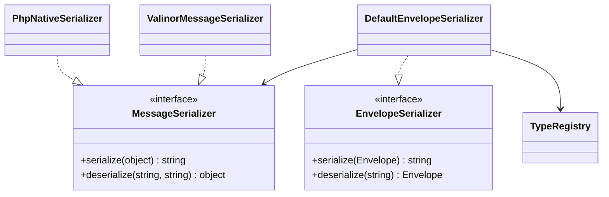

# nexus-serialization

Message serialization and deserialization for Nexus. Provides two serializer
implementations and a type registry for mapping between class names and
wire-format identifiers.

**Composer:** `nexus-actors/serialization`

**Namespace:** `Monadial\Nexus\Serialization\`

<details>
<summary>View class diagram</summary>



</details>

## Interfaces

### MessageSerializer

```php
interface MessageSerializer
{
    public function serialize(object $message): string;

    public function deserialize(string $data, string $type): object;
}
```

Serializes message objects to strings and deserializes them back. The `$type`
parameter in `deserialize()` identifies which class to reconstruct. Both
methods are annotated with `#[NoDiscard]`.

### EnvelopeSerializer

```php
interface EnvelopeSerializer
{
    public function serialize(Envelope $envelope): string;

    public function deserialize(string $data): Envelope;
}
```

Serializes and deserializes complete `Envelope` instances, including sender
path, target path, and metadata.

## Serializer implementations

### PhpNativeSerializer

Uses PHP's built-in `serialize()` and `unserialize()` functions. Fast and
efficient for same-process or same-deployment scenarios where both sides share
the same class definitions.

```php
use Monadial\Nexus\Serialization\PhpNativeSerializer;

$serializer = new PhpNativeSerializer();
$data = $serializer->serialize($message);
$message = $serializer->deserialize($data, MyMessage::class);
```

Characteristics:

- Fastest serialization option -- delegates directly to PHP internals.
- Output is PHP-specific and not interoperable with other languages.
- Requires identical class definitions on both serialization and
  deserialization sides.
- Does not require a `TypeRegistry`.

### ValinorMessageSerializer

Uses JSON encoding for serialization and [Valinor](https://valinor.cuyz.io/)
for type-safe deserialization. Produces structured, human-readable JSON output
that is compatible with external systems.

```php
use Monadial\Nexus\Serialization\ValinorMessageSerializer;
use Monadial\Nexus\Serialization\TypeRegistry;

$registry = new TypeRegistry();
$registry->register(MyMessage::class, 'my-message');

$serializer = new ValinorMessageSerializer($registry);
$data = $serializer->serialize($message);       // JSON string
$message = $serializer->deserialize($data, 'my-message');
```

Characteristics:

- JSON output is interoperable and human-readable.
- Valinor provides strict type reconstruction with validation.
- Requires a `TypeRegistry` with registered type mappings.
- Accepts an optional `MapperBuilder` for customizing Valinor's behavior.

### DefaultEnvelopeSerializer

Wraps a `MessageSerializer` to handle full `Envelope` serialization. The
envelope structure (sender path, target path, metadata, message type) is
encoded as JSON, with the inner message delegated to the wrapped serializer.

```php
use Monadial\Nexus\Serialization\DefaultEnvelopeSerializer;

$envelopeSerializer = new DefaultEnvelopeSerializer($messageSerializer);
$data = $envelopeSerializer->serialize($envelope);
$envelope = $envelopeSerializer->deserialize($data);
```

## TypeRegistry

Bidirectional mapping between message class names and their wire-format type
identifiers. Used by `ValinorMessageSerializer` to resolve types during
serialization and deserialization.

```php
use Monadial\Nexus\Serialization\TypeRegistry;

$registry = new TypeRegistry();

// Manual registration
$registry->register(OrderPlaced::class, 'order.placed');

// Automatic registration from #[MessageType] attribute
$registry->registerFromAttribute(OrderPlaced::class);

// Lookups
$registry->nameForClass(OrderPlaced::class);  // Option<string>
$registry->classForName('order.placed');       // Option<string>
```

## MessageType

PHP attribute for declaring a stable type name on a message class. Used by
`TypeRegistry::registerFromAttribute()`.

```php
use Monadial\Nexus\Serialization\MessageType;

#[MessageType('order.placed')]
final readonly class OrderPlaced
{
    public function __construct(
        public string $orderId,
        public float $total,
    ) {}
}
```

## Exceptions

All serialization exceptions live in `Monadial\Nexus\Serialization\Exception\`:

| Class | Description |
|---|---|
| `SerializationException` | Base exception for serialization errors. |
| `MessageSerializationException` | Thrown when serializing a message fails. |
| `MessageDeserializationException` | Thrown when deserializing a message fails. |
