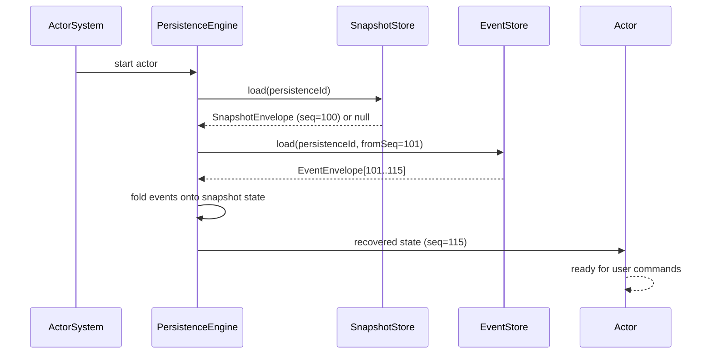
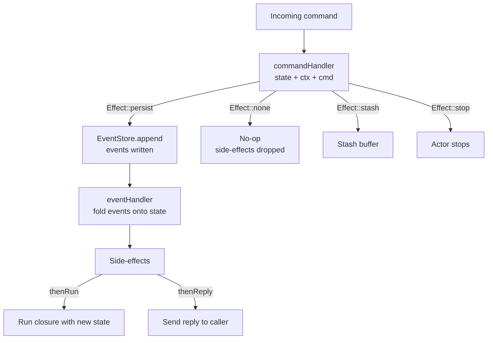
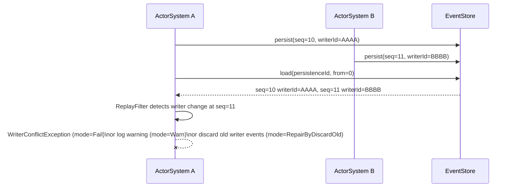
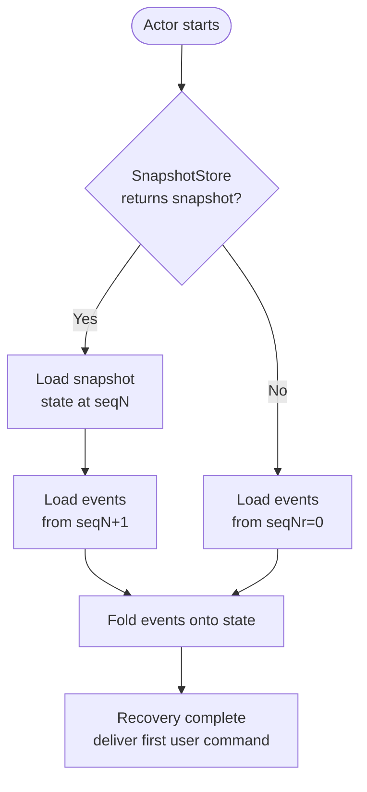

# Event sourcing

Event sourcing records every state change as an immutable domain event rather than overwriting the current state. On restart, the actor replays its event history to reconstruct the exact state it had when it stopped.

## The design

`EventSourcedBehavior` wires together four components: a command handler that returns `Effect` values, an event handler that folds events onto state, an `EventStore`, and optional snapshot and retention policies.

```php title="src/Aggregates/OrderActor.php"
<?php

declare(strict_types=1);

use Monadial\Nexus\Core\Actor\ActorContext;
use Monadial\Nexus\Persistence\EventSourced\Effect;
use Monadial\Nexus\Persistence\EventSourced\EventSourcedBehavior;
use Monadial\Nexus\Persistence\EventSourced\SnapshotStrategy;
use Monadial\Nexus\Persistence\EventSourced\RetentionPolicy;
use Monadial\Nexus\Persistence\PersistenceId;

$behavior = EventSourcedBehavior::create(
    PersistenceId::of('Order', $orderId),
    new OrderState(),
    static fn (OrderState $state, ActorContext $ctx, object $cmd): Effect => match (true) {
        $cmd instanceof PlaceOrder   => Effect::persist(new OrderPlaced($cmd->items)),
        $cmd instanceof CancelOrder  => Effect::persist(new OrderCancelled()),
        $cmd instanceof GetOrder     => Effect::reply($cmd->replyTo, $state),
        default => Effect::unhandled(),
    },
    static fn (OrderState $state, object $event): OrderState => match (true) {
        $event instanceof OrderPlaced    => $state->withItems($event->items),
        $event instanceof OrderCancelled => $state->cancel(),
        default => $state,
    },
)
    ->withEventStore($eventStore)
    ->withSnapshotStore($snapshotStore)
    ->withSnapshotStrategy(SnapshotStrategy::everyN(50))
    ->withRetention(RetentionPolicy::snapshotAndEvents(3, deleteEventsTo: true))
    ->toBehavior();
```

### Command handler and `Effect`

The command handler receives the current projected state, the `ActorContext`, and the incoming command — in that order: `($state, $ctx, $cmd)`. It returns an `Effect`:

- `Effect::persist(...$events)` — write one or more events to the store, then apply them via the event handler.
- `Effect::none()` — acknowledge the command without persisting; any chained side-effects are dropped.
- `Effect::reply($to, $message)` — send a reply as the sole effect (use this for read queries).
- `Effect::stash()` — buffer the command for later; replay after `$ctx->unstashAll()`.
- `Effect::stop()` — stop the actor after the effect completes.
- `Effect::unhandled()` — route to dead letters.

Chain side-effects after persistence using `->thenRun(fn($state) => ...)` and `->thenReply($to, fn($state) => $msg)`. These closures execute only after events are durably written, and only on the persist path — chained on any other effect (including `Effect::none()`) they are silently dropped. They run at most once: recovery replay folds events onto state and never re-executes them.

### Event handler

The event handler is a pure function: `(State, Event): State`. It receives the event and the current state, and returns the new state. It must be free of side-effects — the engine calls it both during live command processing and during recovery replay.

### `PersistenceId`

Every persistent actor needs a stable identity:

```php title="src/Aggregates/OrderActor.php"
use Monadial\Nexus\Persistence\PersistenceId;

$id = PersistenceId::of('Order', 'order-42');
// serialises to "Order|order-42"
```

The `entityType` and `entityId` together form the event stream key. Choose IDs that are stable across restarts — typically a domain entity's UUID.

## Recovery sequence

On actor startup, the `PersistenceEngine` loads the latest snapshot and replays events written after that snapshot before accepting user commands. Recovery happens synchronously inside the actor's setup phase: it folds events onto state only — it does not re-run `thenRun`/`thenReply` side-effects or reissue commands.



_Figure 1: Recovery sequence — snapshot load → event replay → accepting commands._

## Command-path flowchart

Once recovered, each incoming command travels through the command handler to the event store before side-effects fire.



_Figure 2: Command-path flow from incoming command through the event store to side-effects._

## Writer-conflict sequence

Each `EventSourcedBehavior` stamps a ULID `writerId` on every `EventEnvelope` it persists. The behavior mints a fresh ULID per instance unless you set one explicitly via `withWriterId()` — the `ActorSystem`'s own `writerId()` is not propagated to persistence. If two writers append to the same stream, the `ReplayFilter` can detect the interleave during recovery (when enabled; the default mode is `Off`).



_Figure 3: Two actor systems write to the same stream — ReplayFilter detects the writer conflict on recovery._

## Replay decision flow

Recovery chooses between full replay and snapshot-accelerated replay based on what is stored.



_Figure 4: Snapshot-and-events vs replay-from-zero decision at actor startup._

## `EventStore`

The `EventStore` interface exposes four operations:

- `persist(PersistenceId, EventEnvelope...)` — append atomically; throws `ConcurrentModificationException` on sequence conflict.
- `load(PersistenceId, from, to)` — load the event range for replay.
- `deleteUpTo(PersistenceId, seqNr)` — called by retention policy after a snapshot is confirmed.
- `highestSequenceNr(PersistenceId)` — used to detect conflicts and set the next sequence number.

See [stores](./stores.md) for the available implementations.

## `SnapshotStore`

The `SnapshotStore` interface saves and loads `SnapshotEnvelope` objects:

- `save(PersistenceId, SnapshotEnvelope)` — persist a state snapshot with its sequence number.
- `load(PersistenceId)` — return the latest snapshot, or `null` if none exists.
- `delete(PersistenceId, maxSequenceNr)` — prune snapshots older than the retention limit.

See [snapshots](./snapshots.md) for snapshot strategies and retention policies.

## Failure modes

Persistence failures surface as exceptions during actor startup or command processing.

| Symptom | Cause | Recovery |
|---|---|---|
| Actor never starts, `RecoveryException` logged | `EventStore` unreachable or corrupted during replay | Verify store connectivity; restart the actor system after the store is healthy |
| `WriterConflictException` on startup | Two `ActorSystem` instances wrote to the same event stream | Run a single writer per stream; use `ReplayFilter::repairByDiscardOld()` for migration scenarios |
| `ConcurrentModificationException` on persist | Duplicate sequence number — optimistic lock violation | A single actor is the only writer; this indicates an implementation bug; inspect the store |
| Command silently discarded | `Effect::unhandled()` returned; no match in command handler | Add the missing match branch or return `Effect::none()` for intentional no-ops |
| Stash never drained | `$ctx->unstashAll()` not called after recovery | Call `$ctx->unstashAll()` in the command handler branch that completes the stash condition |

## See also

- [Durable state](./durable-state.md) — simpler model: persist the full state snapshot, no event history.
- [Snapshots](./snapshots.md) — accelerate recovery with periodic state checkpoints.
- [Single-writer guarantee](./single-writer.md) — how `writerId` and `ReplayFilter` prevent data corruption.
- [Testing event-sourced actors](./testing.md) — deterministic testing with `StepRuntime` and in-memory stores.
