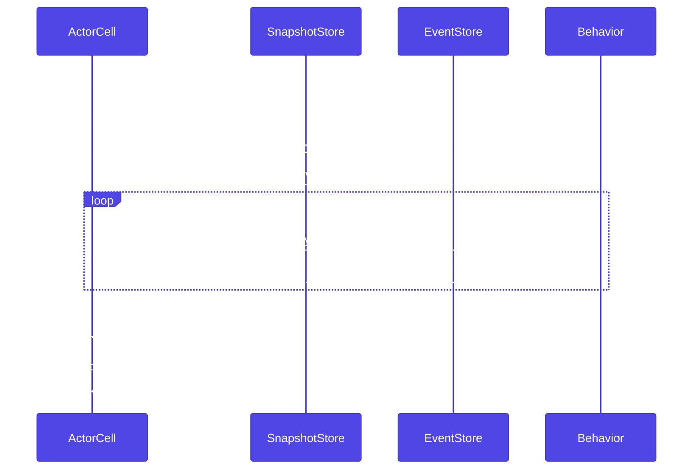
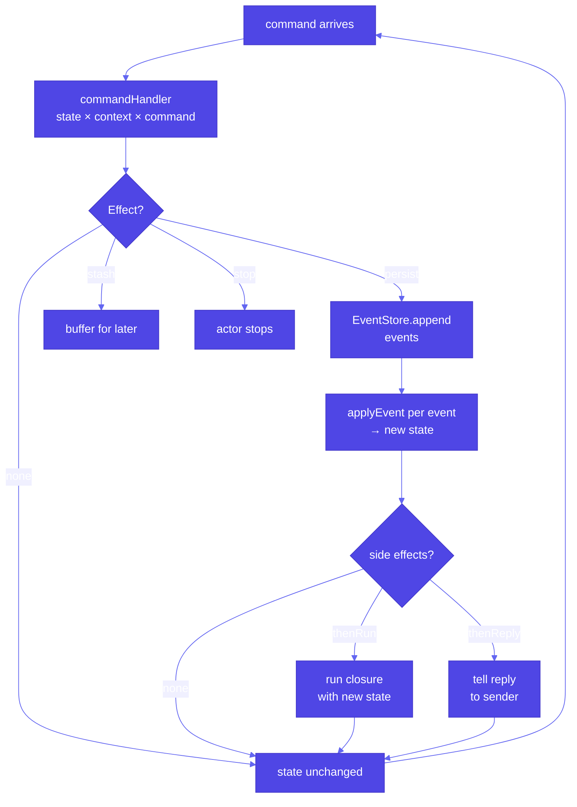
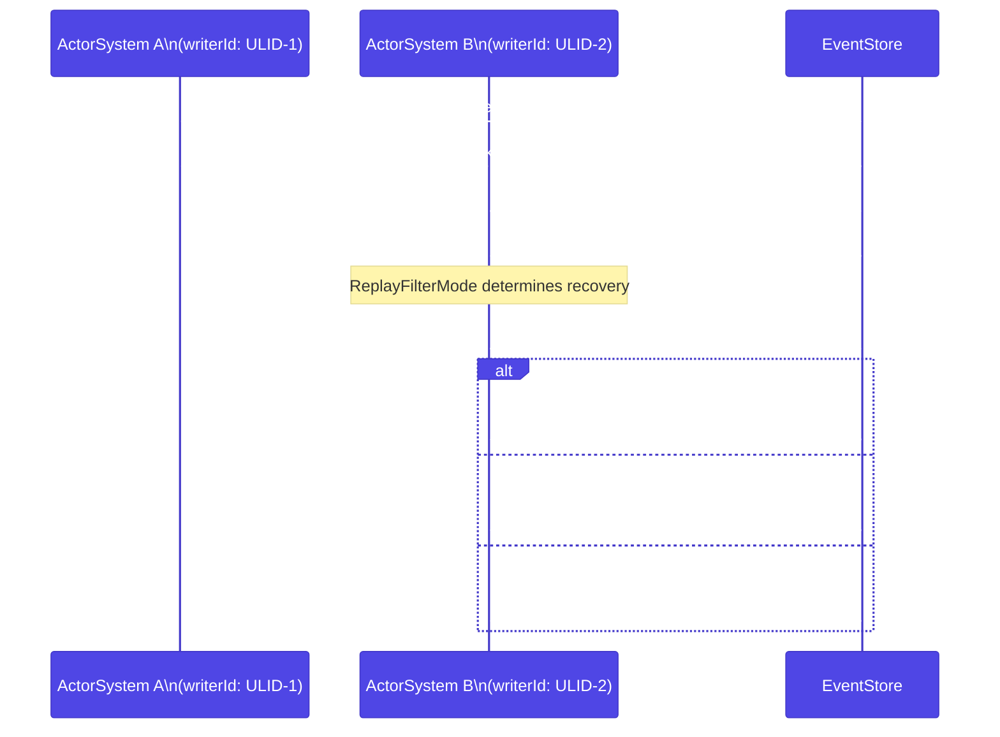
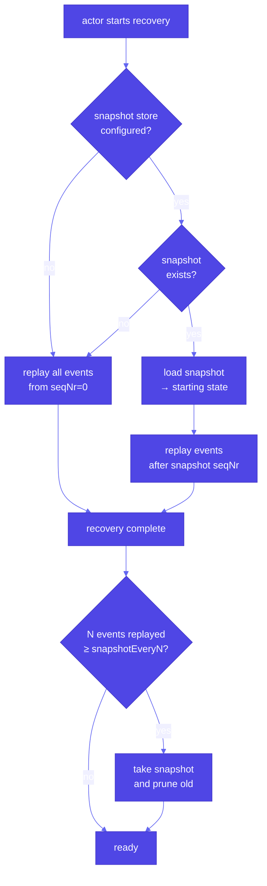

# Persistence

:::warning Experimental
The persistence layer is experimental and pre-1.0. APIs and storage formats may change in breaking ways between releases.
:::

Actors are stateless across restarts. When an actor stops — due to a failure, a deployment, or a system shutdown — its in-memory state is lost. Persistence solves this by automatically saving and recovering state so that an actor picks up exactly where it left off.

## Choosing a persistence model

- **Use event-sourced behavior when** you need a complete audit trail, want to replay history, or build CQRS read-model projections.
- **Use durable state when** you need persistence without history — the latest state is what matters (user profiles, shopping carts, configuration).
- **Use `EntityBehavior` when** you have an existing Doctrine entity you want to wrap as a single-writer aggregate with optional passivation.

## The design

Nexus supports three persistence models. `EventSourcedBehavior` persists a sequence of events and rebuilds state by replaying them. `DurableStateBehavior` persists the current state directly as a single value. `EntityBehavior` uses a Doctrine entity as the actor's state and persists via the Doctrine ORM. The first two share the same `PersistenceId` addressing scheme, storage backend abstraction, and recovery lifecycle. `EntityBehavior` is documented separately under [Doctrine / EntityBehavior DSL](../doctrine/entity-behavior.md).

### Recovery sequence

When a persistent actor starts, it recovers before accepting commands:



_Figure 1: Recovery loads the latest snapshot then replays only events that follow it. Recovery runs synchronously inside the actor's setup phase and only folds events onto state — side-effect hooks are not re-executed._

### Command path flowchart



_Figure 2: The command path from handler through `Effect` to `EventStore`, event application, and optional side-effect hooks._

### Writer-conflict sequence

Each persistent behavior (`EventSourcedBehavior` / `DurableStateBehavior`) mints a fresh ULID as its `writerId` — override it with `withWriterId()` when you need a deterministic identity. Every persisted envelope carries that ULID. If a second writer appends to the same persistence stream, the conflict can be detected:



_Figure 3: Two actor systems targeting the same persistence stream. The `ReplayFilter` mode governs whether recovery fails hard, repairs by discarding older-writer events, or logs a warning and continues._

### Snapshot vs full-replay decision



_Figure 4: Recovery path with and without snapshots. Snapshots reduce replay time for long-lived aggregates. `SnapshotStrategy::everyN(N)` triggers a new snapshot automatically after N events._

## Event Sourcing

Event Sourcing follows this pattern: commands arrive, the command handler produces effects, effects persist events, and events are applied to the state. The actor's state is never persisted directly — it is always derived by replaying the event log from the beginning, or from a snapshot.

```php title="src/Actors/ShoppingCartActor.php"
use Monadial\Nexus\Persistence\EventSourced\EventSourcedBehavior;
use Monadial\Nexus\Persistence\EventSourced\Effect;
use Monadial\Nexus\Persistence\Event\InMemoryEventStore;
use Monadial\Nexus\Persistence\PersistenceId;
use Monadial\Nexus\Core\Actor\ActorContext;
use Monadial\Nexus\Core\Actor\Props;

readonly class AddItem
{
    public function __construct(public string $item) {}
}

readonly class ItemAdded
{
    public function __construct(public string $item) {}
}

readonly class ShoppingCart
{
    public function __construct(public array $items = []) {}
}

$behavior = EventSourcedBehavior::create(
    PersistenceId::of('cart', 'cart-1'),
    new ShoppingCart(),
    static function (object $state, ActorContext $ctx, object $command): Effect {
        if ($command instanceof AddItem) {
            return Effect::persist(new ItemAdded($command->item));
        }
        return Effect::none();
    },
    static function (object $state, object $event): object {
        if ($event instanceof ItemAdded) {
            return new ShoppingCart([...$state->items, $event->item]);
        }
        return $state;
    },
)
->withEventStore(new InMemoryEventStore())
->toBehavior();

$ref = $system->spawn(Props::fromBehavior($behavior), 'cart');
$ref->tell(new AddItem('apple'));
```

The command handler must be pure — it inspects the current state and the incoming command, then returns an `Effect` describing what should happen. The event handler is also pure: it takes the current state and an event, and returns the new state. Side effects belong in `thenRun` callbacks.

## Effects

`Effect` describes what the actor system does after a command is handled. Effects are composable — you can chain persistence with replies and side effects.

| Effect | Description |
|---|---|
| `Effect::persist(new Event1(), new Event2())` | Persist one or more events, then apply them to the state |
| `Effect::none()` | Do nothing |
| `Effect::reply($ref, new Response())` | Send a reply without persisting |
| `Effect::stash()` | Buffer the current message for later replay |
| `Effect::stop()` | Stop the actor |

Effects chain with `thenReply` and `thenRun`:

```php title="src/Actors/OrderActor.php"
// Persist events, then reply with the updated state
Effect::persist(new OrderPlaced($orderId))
    ->thenReply($replyTo, fn(object $state) => new OrderConfirmation($state->id));

// Persist events, then run a side effect
Effect::persist(new PaymentReceived($amount))
    ->thenRun(fn(object $state) => $ctx->log()->info("Payment processed: {$state->total}"));
```

## Durable State

Durable State persists the actor's entire current state as a single value. On recovery, the latest state is loaded directly — no replay step.

```php title="src/Actors/UserPreferencesActor.php"
use Monadial\Nexus\Persistence\State\DurableStateBehavior;
use Monadial\Nexus\Persistence\State\DurableEffect;
use Monadial\Nexus\Persistence\State\InMemoryDurableStateStore;
use Monadial\Nexus\Persistence\PersistenceId;
use Monadial\Nexus\Core\Actor\ActorContext;

readonly class UpdateTheme
{
    public function __construct(public string $theme) {}
}

readonly class UserPreferences
{
    public function __construct(
        public string $theme = 'light',
        public string $language = 'en',
    ) {}
}

$behavior = DurableStateBehavior::create(
    PersistenceId::of('prefs', 'user-42'),
    new UserPreferences(),
    static function (object $state, ActorContext $ctx, object $command): DurableEffect {
        if ($command instanceof UpdateTheme) {
            return DurableEffect::persist(
                new UserPreferences($command->theme, $state->language),
            );
        }
        return DurableEffect::none();
    },
)
->withStateStore(new InMemoryDurableStateStore())
->toBehavior();
```

`DurableEffect` supports the same chaining as `Effect` — `thenReply`, `thenRun`, `stash`, and `stop` all work the same way.

## Class-based API

For an object-oriented style, extend `AbstractEventSourcedActor` or `AbstractDurableStateActor` and override the handler methods.

```php title="src/Actors/OrderActor.php"
use Monadial\Nexus\Persistence\EventSourced\AbstractEventSourcedActor;
use Monadial\Nexus\Persistence\EventSourced\Effect;
use Monadial\Nexus\Persistence\Event\EventStore;
use Monadial\Nexus\Persistence\PersistenceId;
use Monadial\Nexus\Core\Actor\ActorContext;

final class OrderActor extends AbstractEventSourcedActor
{
    public function __construct(
        EventStore $eventStore,
        private readonly string $orderId,
    ) {
        parent::__construct($eventStore);
    }

    public function persistenceId(): PersistenceId
    {
        return PersistenceId::of('order', $this->orderId);
    }

    public function emptyState(): object
    {
        return new OrderState();
    }

    public function handleCommand(object $state, ActorContext $ctx, object $command): Effect
    {
        // handle commands here
        return Effect::none();
    }

    public function applyEvent(object $state, object $event): object
    {
        return $state;
    }
}
```

## Snapshots

For actors with long event histories, replaying every event on recovery can be slow. Snapshots periodically save the full state alongside the event log. On recovery, the actor loads the latest snapshot and replays only events that follow it.

```php title="src/Actors/AccountActor.php"
use Monadial\Nexus\Persistence\EventSourced\SnapshotStrategy;
use Monadial\Nexus\Persistence\EventSourced\RetentionPolicy;

$behavior = EventSourcedBehavior::create(
    PersistenceId::of('account', 'acc-1'),
    new AccountState(),
    $commandHandler,
    $eventHandler,
)
->withEventStore($eventStore)
->withSnapshotStore($snapshotStore)
->withSnapshotStrategy(SnapshotStrategy::everyN(100))
->withRetention(RetentionPolicy::snapshotAndEvents(
    keepSnapshots: 2,
    deleteEventsTo: true,
))
->toBehavior();
```

`SnapshotStrategy::everyN(100)` takes a snapshot every 100 events. `RetentionPolicy::snapshotAndEvents()` controls cleanup — the system keeps the two most recent snapshots and deletes all events that precede the oldest retained snapshot.

## Storage backends

Nexus ships several storage backend implementations:

| Store | Use case |
|---|---|
| `InMemoryEventStore` / `InMemorySnapshotStore` / `InMemoryDurableStateStore` | Testing and prototyping |
| `DbalEventStore` / `DbalSnapshotStore` / `DbalDurableStateStore` | Doctrine DBAL — works with any SQL database |
| `DoctrineEventStore` / `DoctrineSnapshotStore` / `DoctrineDurableStateStore` | Doctrine ORM |

All stores implement the same interfaces (`EventStore`, `SnapshotStore`, `DurableStateStore`), so you can swap backends without changing actor code.

## Single-writer guarantee

Each persistent behavior mints a fresh ULID as its writer identity (override with `withWriterId()`), and every persisted envelope is stamped with it. The `ActorSystem` also exposes a `writerId()` ULID, but it is not propagated to persistence. The stamped writer identity makes it possible to detect when two writers accidentally target the same persistence ID.

Every `EventEnvelope`, `SnapshotEnvelope`, and `DurableStateEnvelope` carries a `writerId` field. Stores record this value in a `writer_id` column. If a store detects a write from a different writer than expected, it throws `WriterConflictException`.

### Replay filtering

During recovery, the `ReplayFilter` checks that replayed events come from a consistent writer. If events from multiple writers are detected — due to a split-brain or misconfiguration — the filter mode determines what happens:

| Mode | Behavior |
|---|---|
| `ReplayFilterMode::Fail` | Throw `WriterConflictException` on writer interleave |
| `ReplayFilterMode::Warn` | Log a warning and continue |
| `ReplayFilterMode::RepairByDiscardOld` | Keep only events from the latest writer (filters the replayed list in memory; nothing is deleted from the store) |
| `ReplayFilterMode::Off` | Skip filtering entirely (the default) |

```php title="src/Actors/OrderActor.php"
use Monadial\Nexus\Persistence\Recovery\ReplayFilter;

$behavior = EventSourcedBehavior::create(/* ... */)
    ->withEventStore($eventStore)
    ->withReplayFilter(ReplayFilter::fail())
    ->toBehavior();
```

## Tradeoffs

| | Event Sourcing | Durable State |
|---|---|---|
| **Audit trail** | Full history of every change | Only the current state |
| **Temporal queries** | Query state at any point in time | Not possible |
| **Storage** | Grows with every event (mitigated by snapshots) | Fixed size per actor |
| **Complexity** | Higher — two handlers (command + event) | Lower — one handler |
| **Recovery** | Replay events (or snapshot + tail) | Load single value |
| **Best for** | Domains where history matters (finance, ordering, compliance) | Domains where only current state matters (preferences, caches, sessions) |

When in doubt, start with `DurableStateBehavior`. Migrating to event-sourced behavior is possible later when you need the audit trail or temporal query capabilities.

## See also

- [EntityBehavior DSL](../doctrine/entity-behavior.md) — Doctrine entity as aggregate actor
- [Doctrine Overview](../doctrine/overview.md) — connection pools, HTTP injection, and entity actors
- [Core Concepts: Actors](../core-concepts/actors.md) — actor lifecycle and messaging model
