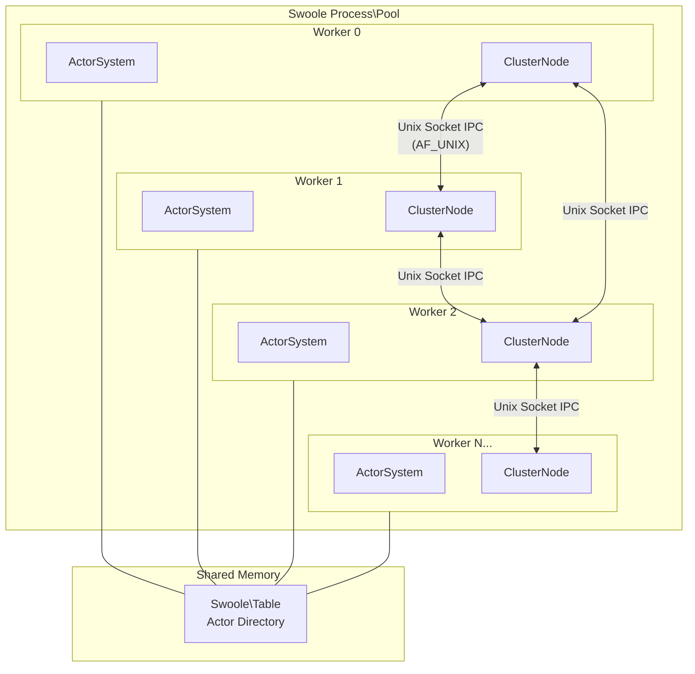
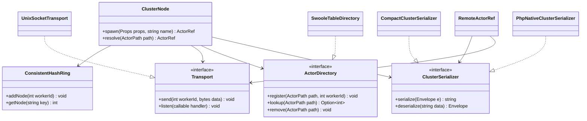
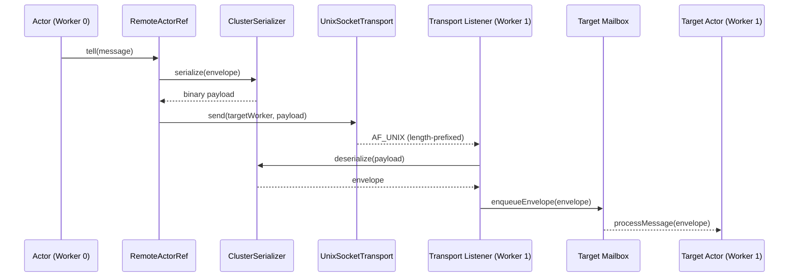

# Multi-Process Scaling

:::caution Work in Progress
Nexus is under active development and **not production-ready**. APIs may change
without notice.
:::

Nexus scales actors across multiple worker processes on a single machine,
utilizing all available CPU cores. Each worker runs an independent `ActorSystem`
with its own `SwooleRuntime`, while a shared directory and Unix socket transport
enable transparent cross-worker messaging.

This is **single-machine scaling** via Swoole's `Process\Pool` -- not
distributed clustering across multiple servers. True multi-server clustering
(TCP transport, distributed directory) is a [planned future feature](../contributing/roadmap.md).

## Architecture



### Key components



- **`ClusterNode`** -- Per-worker coordinator. Routes messages locally or via
  transport based on a consistent hash ring. Each worker has exactly one.
- **`ConsistentHashRing`** -- Deterministic mapping from actor names to worker
  IDs using crc32 with 150 virtual nodes. Same output on all workers, no
  coordination needed.
- **`RemoteActorRef`** -- Implements `ActorRef<T>` for cross-worker messaging.
  Actor code never knows if a reference is local or remote.
- **`UnixSocketTransport`** -- AF_UNIX domain sockets with length-prefixed
  binary framing. Non-blocking via Swoole coroutines.
- **`SwooleTableDirectory`** -- Shared-memory actor directory backed by
  `Swoole\Table`. O(1) lookups across all worker processes.

## Location transparency

The `ActorRef<T>` interface is identical for local and remote actors:

```php
// This code works regardless of where the actor lives
$ref->tell(new ProcessOrder($orderId));
```

When `ClusterNode::spawn()` is called, the hash ring determines which worker
owns the actor. If the actor belongs to the current worker, a `LocalActorRef`
is returned and the actor runs locally. If it belongs to another worker, a
`RemoteActorRef` is returned that serializes messages and sends them over Unix
sockets to the owning worker.

## Message flow



1. Actor calls `$ref->tell($message)` on a `RemoteActorRef`.
2. The message is wrapped in an `Envelope` and serialized by `ClusterSerializer`.
3. The serialized bytes are sent via `UnixSocketTransport` to the target worker.
4. The target worker's transport listener deserializes the envelope.
5. The envelope is delivered to the local actor's mailbox via `enqueueEnvelope()`.
6. The actor processes the message as if it were sent locally.

## Performance

See the [full performance benchmarks](../architecture/performance.mdx) for
detailed numbers across all runtimes. Highlights for multi-process scaling:

| Metric | Result |
|---|---|
| Cross-worker throughput | **260K** msgs/sec per worker pair |
| Cross-worker round-trip latency | **20 us**/roundtrip |
| Serialization throughput | **1.18M** cycles/sec |

## Scaling vs clustering

| | Multi-process scaling | Multi-server clustering |
|---|---|---|
| **Status** | Implemented | Planned |
| **Scope** | Single machine, multiple CPU cores | Multiple machines over network |
| **Transport** | Unix domain sockets (AF_UNIX) | TCP (future) |
| **Directory** | Shared memory (`Swoole\Table`) | Distributed directory (future) |
| **Use case** | Utilize all cores on one server | Horizontal scale-out |

The pure PHP abstractions in `nexus-cluster` (`Transport`, `ActorDirectory`,
`ClusterSerializer`) are designed to support both. Future multi-server
clustering will provide new transport and directory implementations without
changes to actor code.

## Package split

Scaling is split across two packages:

| Package | Purpose |
|---|---|
| **nexus-cluster** | Pure PHP interfaces and abstractions. No Swoole dependency. |
| **nexus-cluster-swoole** | Swoole implementations: `UnixSocketTransport`, `SwooleTableDirectory`, `ClusterBootstrap`. |

The packages are named `nexus-cluster` (not `nexus-scaling`) because the same
abstractions will power both single-machine scaling and future multi-server
clustering.
