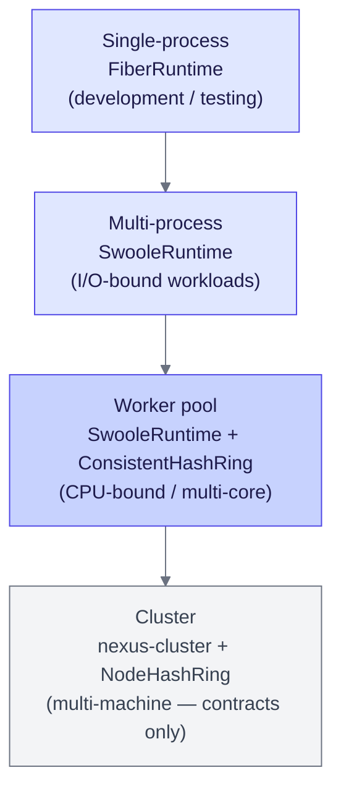
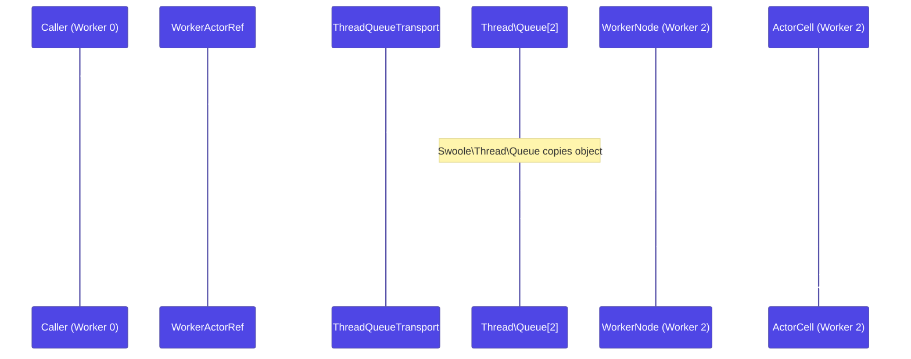

# Scaling overview

Nexus scales to multiple CPU cores on a single machine using a thread-based worker pool: each worker thread runs an independent `ActorSystem`, and actors are distributed across workers via a consistent hash ring.

## The design

The worker pool model gives you true parallelism without changing actor code. The same `Props`, `Behavior`, and `ActorRef` abstractions you use in a single-process `FiberRuntime` deploy work identically inside a worker pool — `WorkerNode.spawn()` returns an `ActorRef<T>` that routes correctly whether the actor lives on this worker or another.

The scaling progression from development to production:



_Figure 1: Scaling progression from a single-process fiber runtime through worker-pool multi-core to multi-machine cluster contracts. The same actor code runs at every level._

### Worker pool internals

```
WorkerPoolBootstrap (main thread)
  Thread\Map (shared directory)   Thread\Queue[0..N-1] (per-worker inboxes)
        │
        │  Thread\Pool spawns N threads
   ┌────┼────┐
   ▼    ▼    ▼
Worker 0  Worker 1  Worker 2
ActorSystem ActorSystem ActorSystem
WorkerNode  WorkerNode  WorkerNode
```

Key components:

- **`WorkerNode`** — Coordinator for one worker. On `spawn()`, consults the hash ring to decide whether the actor lives locally or on another worker, then registers the result in the shared `WorkerDirectory`.
- **`ConsistentHashRing`** — Maps actor names to worker IDs via CRC32 with 150 virtual nodes per worker, giving statistically uniform distribution.
- **`WorkerActorRef`** — Implements `ActorRef<T>`. For actors on other workers, `tell()` wraps the message in an `Envelope` and pushes it to the target worker's `Swoole\Thread\Queue`. No serializer; `Thread\Queue` handles the internal copy.
- **`ThreadQueueTransport`** — One `Swoole\Thread\Queue` per worker as inbox. A coroutine-based receive loop with adaptive backoff polls the queue and delivers incoming envelopes to local actor mailboxes.
- **`ThreadMapDirectory`** — Shared `Swoole\Thread\Map` mapping actor path strings to worker IDs. All threads read and write the same map; `Thread\Map` handles synchronization internally.

## Cross-worker message flow

When an actor on Worker 0 sends a message to an actor on Worker 2:



_Figure 2: Cross-worker `tell()` path. `WorkerActorRef` routes via `ThreadQueueTransport` to the target worker's queue. No serialization step — `Swoole\Thread\Queue` copies the object across thread boundaries._

For local delivery (actor on the same worker), `tell()` goes directly to a `LocalActorRef` and into the actor's mailbox — the `Thread\Queue` hop is skipped entirely.

## Location transparency

`WorkerNode.spawn()` returns an `ActorRef<T>`. Whether the actor lives on this worker or another, the caller uses the same interface:

<!-- verify:skip: illustrates location transparency at runtime — requires a running worker pool -->
```php title="src/App/OrderApp.php" verify:skip
$ref = $node->spawn(Props::fromBehavior($behavior), 'orders');
$ref->tell(new PlaceOrder($items));  // identical regardless of which worker owns 'orders'
```

The hash ring assigns `'orders'` to one worker deterministically. Every other worker that calls `spawn()` with the same name gets a `WorkerActorRef` pointing to that worker — the routing is transparent.

## Ask protocol (cross-worker request/response)

`WorkerActorRef::ask()` supports request-response across threads using a reservation slot on the sending worker:

1. The caller enqueues a `WorkerAskRequest` to the target worker's queue.
2. The target actor processes the request and sends a `WorkerAskReply` back to the sender's queue.
3. The sending `WorkerNode` resolves the reservation slot and returns the result.

If no reply arrives within the configured timeout, `AskTimeoutException` is thrown on the calling coroutine.

## Performance characteristics

| Metric | Value |
|---|---|
| Cross-worker throughput | ~260K messages/sec per worker pair |
| Cross-worker latency | ~20 µs round-trip |
| Optimal worker count | `swoole_cpu_num()` for CPU-bound workloads |

No serialization overhead exists because `Swoole\Thread\Queue` copies PHP objects across thread boundaries using Swoole's internal object transfer — the same `Envelope` object arrives on the target worker without a serialize/unserialize round-trip.

## Prerequisites

- ZTS (Zend Thread Safety) PHP 8.5+
- Swoole 6.0+ compiled with `--enable-swoole-thread`

## Multi-machine clustering

For distributing actors across multiple machines over a network, see the `nexus-cluster` package. It provides the `ClusterTransport`, `NodeDirectory`, and `NodeHashRing` contracts — the same interface shape as `WorkerTransport` and `WorkerDirectory`, but addressed by `NodeAddress` (cluster/datacenter/application/node) rather than worker ID. A TCP transport implementation is not yet available.

## See also

- [Configuration](./configuration.md) — `WorkerPoolConfig`, hash ring parameters, and actor placement
- [Bootstrap](./bootstrap.md) — `WorkerPoolApp`, `WorkerPoolBootstrap`, and `WorkerStartHandler` patterns
- [Worker Pool Swoole package](../packages/worker-pool-swoole.md) — full API reference
